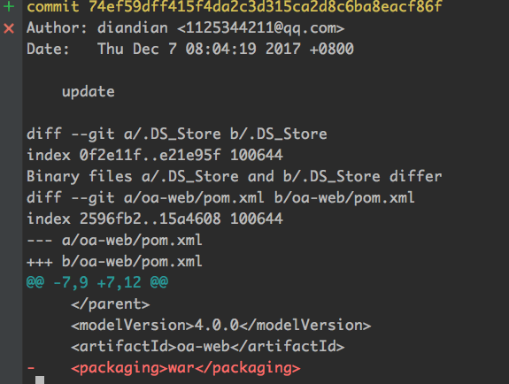

## 第一讲

#### git config

* git config，专门用来对你的git环境进行各种配置。

  ```
  （1）/etc/gitconfig，对当前机器上所有的用户和git项目都生效，使用git config --system，即可对这个配置文件进行操作，也不是很重要，因为我们一般很少去配置这个文件，因为git的配置一般都是对某个用户和项目的范围去生效的
   
  （2）~/.gitconfig，当前用户主目录的.gitconfig文件，对当前用户有效，使用git config --global，即可对这个配置文件进行操作，windows的话，是在这里：/c/Documents and Settings/All Users/Application Data/Git
   
  （3）项目的.git目录下的config文件，仅仅对当前git管理的这个项目有效，直接git config操作的就是这个文件
  ```

  ​

```
git config --global user.name "lihao"
git config --global user.email "lihao@163.com"
```


* git config --global 设置当前用户范围内的配置，对机器上的其他用户是无效的
* git config --system，就是对当前机器上所有用户都生效
* git config  —local，就是对当前所在的git项目本身生效
* git config --list , 查看所有的配置项
* git config user.name，查看某个配置项


## 第五讲

#### git 本地仓库结构

```
git 项目有3个主要组成：
	1，工作区(working directory / working tree)
	2，暂存区(staging area)
	3，版本库(git directory / repository)
```


* git directory / repository：git版本库，其实就是git用于存储自己的元数据，以及文档数据库的地方，默认就是在项目的.git隐藏目录中。
* working directory / working tree：工作区，保存的是一个项目当前的一个版本对应的所有文件，这些文件是从git版本仓库中的压缩后的数据库中提取出来，然后放到我们的磁盘上去。
* staging area：暂存区，就是一个文件，包含在git版本库中，主要是保存了下一次要提交到的那些文件信息。在git中，对暂存区有另外一个名称，叫做index,也就是索引。


如果这个文件修改了，还没有加入暂存区，那么就是modified状态。

如果这个被修改了，同时被加入了暂存区，那么就是staged状态；

如果一个文件，已经有一个版本被保存到了版本库，那么就是committed状态；


## 第六讲

```
代码文件分成两种，一种是tracked,一种是untracked.tracked文件就是已经提交到gitb版本库中的文件，后面可以出去modified或者staged状态；untracked文件，就是从来没有提交到git版本库中的代码文件(也从来没有放入暂存区)
```


#### git add —all  .  和 git add . 区别

```
git add . 就是将当前新增或者是修改过的文件，加入暂存区。

git add --all . 如果文件被删除，也会将文件删除的状态加入暂存区中。
```


#### 执行流程

* 1，新建文件刚创建；untracked,此时仅仅停留在工作区中。
* 2，git add 新文件： new file，此时已经被追踪了，放入暂存区中。
* 3，git commit 新文件：committed  已经被追踪了，放入git 仓库中。
* 4，修改那个文件： modified,changes not staged to be committed 没有加入暂存区，被修改的内容仅仅停留在工作区中。
* 5，git add 修改文件： modified，changes to be committed,修改的文件版本已经加入暂存区
* 6，git commit 修改文件： commited,修改后的新版本提交到git仓库中。


#### git 管理文件状态

```
提交状态(committed)

修改状态(modified)

暂存状态(staged)
```


* 暂存状态： 将修改后的文件标记为即将通过下一次提交，保存到git数据库中去。
* 修改状态：我们修改了文件，但是还没有提交到git数据库中去.
* 提交状态：我们的文件已经安全的保存在git 本地数据库中了。


## 第七讲

#### git log 查看提交历史

```
git log --patch -2
```

—path 可以显示每次提交之间的diff,同时-n 可以指定显示最近几个commit.这个很有用，可以看最近两次commit之间的代码差异，进行code review 是比较方便的。




```
git log --stat
```

可以显示每次commit的统计信息，包括修改了几个文件，有多少行插入，多少行删除。


```
git log --pretty=format:"%h - %an, %ar : %s"
```

可以显示短hash,作者，多长时间以前，提交说明


```
git log --oneline --abbrev-commit --graph
```

这是最有用的，可以看到整个commit树结构，包括如何合并的，就显示每个commit的SHA-1和提交说明，同时SHA-1显示短值。

—oneline : 显示一行，不要显示多行那么多东西，一行里，就显示commit的标识符，SHA-1 hash值，40位的；提交备注；显示分支和HEAD指向哪个commit。


—abbrev-commit: commit的标识符，每一次commit，都有一个唯一的标识符，就是一个SHA-1 hash值，40位，显示一个短值，默认显示前7位，就是说前7位就可以唯一定位这个commit了，不需要完整的40位。


—graph: 显示图形化的commit历史，如果有分支的话，commit历史会形成一棵树的形状，这个时候用--graph可以看清楚这颗commit树长什么样子，很有的.


## 第八讲

#### 版本回退

```
git reset -- hard HEAD^  //回退到上一个版本
git reset -- hard HEAD^^ //回退到上两个版本
git reset -- hard HEAD~2 //回退到指定第几个版本
git reset -- hard commit_id //回退到指定的版本
```


git reset -- hard HEAD^ 就是将仓库，暂存区，工作区，全部恢复到一个commit对应的状态


#### 查看远程日志

```
git reflog
```

可以根据 git reset —hart commit_id 回退到任意提交的版本.


## 第十讲

#### 安装git

```
git --version
yum install -y git

```


#### 创建git 用户

```
groupadd git
adduser git -g git
```


#### 添加key

```
把公钥导入到git服务器上的/home/git/.ssh/authorized_keys文件里，一行一个。
```


#### 初始化仓库

```
使用/srv/oa-parent.git目录作为远程仓库，在/srv目录下输入命令：

git init --bare oa-parent.git

```

Git会创建一个裸仓库，裸仓库没有工作区。因为服务器上的Git仓库就是为了共享，不会让用户直接登录到服务器上去修改工作区的，而且服务器上的Git仓库通常都以.git结尾。然后，把owner改为git：

```
chown -R git:git oa-parent.git
```


#### 禁用shell 登录

一般出于安全考虑，第二步创建的git用户是不允许使用shell的，我们可以编辑/etc/passwd文件。

```
找到类似下面的一行：
git:x:1001:1001:,,,:/home/git:/bin/bash

改为：
git:x:1001:1001:,,,:/home/git:/usr/bin/git-shell
```

这样，git用户可以正常通过ssh使用git推送和下载代码，但是无法通过shell登录的，因为我们为git用户指定的git-shell是每次一登录就自动退出。


#### 下载上传代码

```
git remote add origin ssh://git@192.168.31.244:/srv/oa-parent.git

将本地仓库和git服务器上的远程仓库关联起来

git push -u origin master
```


## 第十一讲


#### git 重要组成部分

* 3个区域，6中状态，提交历史
* 分支（背后的原理，合并的原理，解决冲突的原理，远程分支的原理）


#### 分支的基础知识

```
所谓的分支功能，就是可以同时拉出来多个代码副本，然后在不同的代码副本上，可以进行对应功能的开发。完成开发之后，可以将多个分支合并在一起，形成最终的代码。
```

每个分支，其实就指向一个指针而已，分支就指向了提交历史中的某个commit object.

每个commit object 就代表了这个项目的所有代码在那次提交的时候一个完整的快照版本，包含了以前没有变更的代码文件，也包括了这次提交的最新的修改/新增/删除的代码文件。


#### commit object 与分支的原理

* 实际上每次我们执行一次commit，git 都会存储一个commit object，这个commit object 中会包含一个指针，执行这次提交文件的快照。这个commit object 同事也包含作者的姓名和邮箱，提交说明，已经对上一次commit object 的指针。
* 将一个文件版本仿佛暂存区的时候，就会计算一个校验和，然后提交的时候会将文件的内容以blob的方式放入版本库中，同时在暂存区放入这个文件版本的校验和。截止git 会创建一个 commit object,包含元数据，以及一个指针指向版本库中的文件快照。
* 每次commit 都会包含这个东西：
  * 一个blob，用于存储每个文件的这次提交的一个快照。
  * 一个tree,这个tree包含对本次提交的所有文件的blob的指针。
  * 一个commit object,指向了tree的指针，作者，等信息


#### 分支

```
分支就是一个轻量级的指针，默认的分支是master 每次提交master分支的指针默认就是指向最新的那个commit object的，每次提交一次master 指针就会挪动，继续执行最新的commit object.
git 还维护了一个特殊的指针，HEAD 这个指针指向master 分支，HEAD指针永远都会指向当前的分支。
```


##### 创建分支

```
git branche 分支名称
```

新创建的分支会指向当前你所在的分支指向的commit object 上.

查看各个分支的commit object 

```
git log --oneline --decorate --graph
```

##### 切换分支

```
git checkout 分支名称
```


#### 远程分支

刚开始在本地分支上开发代码，代码开发完毕将本地分支推送到远程仓库里面的

```
git push  -u origin 分支名称
```

* -u 表示将本地分支和远程分支关联起来

下次再修改了这个分支的代码 直接执行 git push orign 分支名称，就可以了


##### 基于远程分支创建分支

```
git checkout -b 本地分支  origin/远程分支
```

用这个命令，origin/远程分支，就代表了远程仓库里的那个分支，然后这个命令一个执行，就是在本地创建一个远程分支对应的本地分支，互相关联起来


## 第二十三讲 对本地不规范的提交历史进行修改和调整


#### 修改上一次commit的备注

```
git commit --amend
```


#### 对上一次commit 加入几行遗漏的代码

修改代码后，先放入暂存区

```
git  add .
git commit --amend
```


#### 对历史上的多个commit 进行备注修改

```
git rebase -i HEAD~3  
```


把 pick 修改成edit,然后

```
git commit --amend
```

修改备注

```
git rebase --continue
```


#### 删除commit

```
git rebase -i HEAD~3
```

把pick 那一行删除即可


#### 多个commit 合成一个commit


把pick 修改成squash 然后

```
git rebase --continue
```


#### 将一个commit切分为多个commit

先把pick 修改成edit，然后执行

```
git reset -- hard HEAD^  //回退到上一个版本
```

再提交


## 第二十四将 对本地刚做出的修改，暂存和提交进行撤回

#### reset 撤回已经commit 的文件

```
git reset --soft HEAD^   撤回上次一次提交的代码

git reset --soft commit_id  撤回到指定的commit_id
```

* 在仓库中，将master 分支指向上一个commit
* 暂存区和工作去是没有变化的


#### 撤回暂存区的文件

```
git reset HEAD <file>
```

把加入到暂存区的文件撤回,工作去内容不会改变


#### 撤回工作区,暂存区,版本库中提交的文件

```
git reset --hard HEAD^
```


## 第二十五讲 远程和本地同时撤回合并操作

（1）如果是要撤回已经push到远程仓库的merge操作

 

（2）在本地执行gitrevert -m 1 HEAD，再执行git push origin master，此时本地和远程的提交历史都会多一个commit出来，该commit的内容和合并之前的master指向的那个commit是一样的，同时master此时指向最新的那个commit

 

（3）但是后面，如果要再次将release分支和master分支进行合并，此时是需要特殊处理的，再次在本地执行：git revertHEAD，git push origin master。就是再次将master还原到指向一个新的commit，该commit的内容与上一次merge后的那个commit一样，包含merge的内容

 

（4）最后再次将release分支与master分支进行合并，此时可以保证release分支所有的内容，都是合并到master分支的


如果在本地做了commit，同时还推送到了远程仓库，此时要撤回

比撤回merge简单多了，直接git
revert HEAD，不就回到了上一个commit的状态，然后再次git push origin master，完美同步撤回远程仓库的commit操作了


