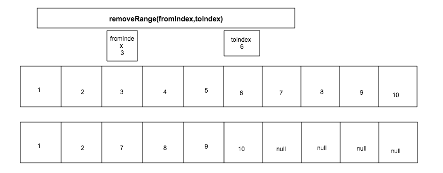

## ArrayList 源码解析
* Arralist 内部就是对Object[] elementData 进行增删改查的维护。
* Arralist 线程非安全 安全的ArrayList 使用 List list = Collections.synchronizedList(new ArrayList(...));。
* Arralist 每次扩容是1.5倍，默认元素的个数是10个。
* 注意源码里面的 equals 判断 如果传入的对象没有重写equals  则直接是比较的是 == 。
* 删除 插入指定位置的元素 代价比较高，这个位置以后的元素都要移动位置。
* 源码中大量运用了System.arraycopy

## 以下是基于jdk8 的部部分源码
     public class ArrayList<E> extends AbstractList<E>
             implements List<E>, RandomAccess, Cloneable, java.io.Serializable
     {
    private static final long serialVersionUID = 8683452581122892189L;

    /**
     * 默认初始容量
     */
    private static final int DEFAULT_CAPACITY = 10;

    /**
     * 空的数组对象
     */
    private static final Object[] EMPTY_ELEMENTDATA = {};

    /**
     * 
     * 默认容量的空数组
     * 
     */
    private static final Object[] DEFAULTCAPACITY_EMPTY_ELEMENTDATA = {};

    /**
     * 
     * ArraysList主要维护的对象所有的增删改查都是操作这个数组
     * 
     * 
     */
    transient Object[] elementData; // non-private to simplify nested class access

    /**
     * The size of the ArrayList (the number of elements it contains).
     *
     * @serial
     */
    private int size;

    /**
     * 初始容量大于0 创建一个用户指定的容量大小的数组
     * 等于 创建一个空数组
     * 小于0 抛出异常
     * 
     * 
     */
    public ArrayList(int initialCapacity) {
        if (initialCapacity > 0) {
            this.elementData = new Object[initialCapacity];
        } else if (initialCapacity == 0) {
            this.elementData = EMPTY_ELEMENTDATA;
        } else {
            throw new IllegalArgumentException("Illegal Capacity: "+
                                               initialCapacity);
        }
    }

  
    public ArrayList() {
        this.elementData = DEFAULTCAPACITY_EMPTY_ELEMENTDATA;
    }

    public ArrayList(Collection<? extends E> c) {
        elementData = c.toArray();
        if ((size = elementData.length) != 0) {
            // c.toArray might (incorrectly) not return Object[] (see 6260652)
            if (elementData.getClass() != Object[].class)
                elementData = Arrays.copyOf(elementData, size, Object[].class);
        } else {
            // replace with empty array.
            this.elementData = EMPTY_ELEMENTDATA;
        }
    }

    /**
     * 
     * 可以将数组的长度调整为size.
     * 调整数组的大小
     */
    public void trimToSize() {
        modCount++;
        if (size < elementData.length) {
            elementData = (size == 0)
              ? EMPTY_ELEMENTDATA
              : Arrays.copyOf(elementData, size);
        }
    }

   
    /**
    * 确保数组的内容容量够用
    * 内部数组 elementData == DEFAULTCAPACITY_EMPTY_ELEMENTDATA
    * 来确保 扩容的元素大于等于10
    */
    private void ensureCapacityInternal(int minCapacity) {
        if (elementData == DEFAULTCAPACITY_EMPTY_ELEMENTDATA) {
            minCapacity = Math.max(DEFAULT_CAPACITY, minCapacity);
        }

        ensureExplicitCapacity(minCapacity);
    }

    /**
    * 
    * 如果扩容的长度大于内部数组elementData的长度 就要进行扩容
    * 
    */
    private void ensureExplicitCapacity(int minCapacity) {
        modCount++;

        // overflow-conscious code
        if (minCapacity - elementData.length > 0)
            grow(minCapacity);
    }

    /**
     * 
     * 
     * 数组最大的容量
     * 
     */
    private static final int MAX_ARRAY_SIZE = Integer.MAX_VALUE - 8;

    /**
     * 
     * newCapacity = elementData.length + elementData.length/2 
     * newCapacity 是原来数组长度的1.5倍
     *  通过 Arrays.copyOf扩容
     */
    private void grow(int minCapacity) {
        // overflow-conscious code
        int oldCapacity = elementData.length;
        int newCapacity = oldCapacity + (oldCapacity >> 1);
        if (newCapacity - minCapacity < 0)
            newCapacity = minCapacity;
        if (newCapacity - MAX_ARRAY_SIZE > 0)
            newCapacity = hugeCapacity(minCapacity);
        // minCapacity is usually close to size, so this is a win:
        elementData = Arrays.copyOf(elementData, newCapacity);
    }

    private static int hugeCapacity(int minCapacity) {
        if (minCapacity < 0) // overflow
            throw new OutOfMemoryError();
        return (minCapacity > MAX_ARRAY_SIZE) ?
            Integer.MAX_VALUE :
            MAX_ARRAY_SIZE;
    }

    /**
     * 
     * 返回ArrayList的大小
     *
     */
    public int size() {
        return size;
    }

    /**
     * 
     * 判断ArrayList 是否为空
     */
    public boolean isEmpty() {
        return size == 0;
    }

    /**
     * 
     * 判断ArrayList 是否包含o
     * 
     * 
     */
    public boolean contains(Object o) {
        return indexOf(o) >= 0;
    }

    /**
     * 查找 o 在elementData 当中的索引，如果查找到返回索引，否则返回-1
     * 
     * 1，如果包含多个o 只返回第一个索引
     * 2，这里使用的equals 比较， 如果o对象 没有重写equals  则是 == 比较
     * 
     */
    public int indexOf(Object o) {
        if (o == null) {
            for (int i = 0; i < size; i++)
                if (elementData[i]==null)
                    return i;
        } else {
            for (int i = 0; i < size; i++)
                if (o.equals(elementData[i]))
                    return i;
        }
        return -1;
    }

    /**
     * 查找 o 在elementData 当中的最后的索引，如果查找到返回索引，否则返回-1
     * 
     * 1，如果包含多个o 只返回最后一个索引
     * 2，这里使用的equals 比较， 如果o对象 没有重写equals  则是 == 比较
     * 
     * 
     */
    public int lastIndexOf(Object o) {
        if (o == null) {
            for (int i = size-1; i >= 0; i--)
                if (elementData[i]==null)
                    return i;
        } else {
            for (int i = size-1; i >= 0; i--)
                if (o.equals(elementData[i]))
                    return i;
        }
        return -1;
    }

    /**
     *
     *克隆对象 
     *
     *
     */
    public Object clone() {
        try {
            ArrayList<?> v = (ArrayList<?>) super.clone();
            v.elementData = Arrays.copyOf(elementData, size);
            v.modCount = 0;
            return v;
        } catch (CloneNotSupportedException e) {
            // this shouldn't happen, since we are Cloneable
            throw new InternalError(e);
        }
    }

    /**
     * 转换成数组
     * 这里没有直接返回elementData
     */
    public Object[] toArray() {
        return Arrays.copyOf(elementData, size);
    }

    /**
     * 转换成指定类型的数组
     */
    @SuppressWarnings("unchecked")
    public <T> T[] toArray(T[] a) {
        if (a.length < size)
            // Make a new array of a's runtime type, but my contents:
            return (T[]) Arrays.copyOf(elementData, size, a.getClass());
        System.arraycopy(elementData, 0, a, 0, size);
        if (a.length > size)
            a[size] = null;
        return a;
    }

    // Positional Access Operations

    @SuppressWarnings("unchecked")
    E elementData(int index) {
        return (E) elementData[index];
    }

    /**
     * 
     * 获取指定位置上的元素数据
     * 1，验证index索引是否合法
     * 2，返回元素
     * 
     */
    public E get(int index) {
        rangeCheck(index);

        return elementData(index);
    }

    /**
     * 
     * 设置指定位置的元素数据
     *
     * 返回没有设置前 index 的数据
     * 
     */
    public E set(int index, E element) {
        rangeCheck(index);

        E oldValue = elementData(index);
        elementData[index] = element;
        return oldValue;
    }

    /**
     * 
     *元素的末尾添加一个元素
     * 
     * 1.先验证数组是否要扩容
     * 2.在elementData数组末尾添加元素
     */
    public boolean add(E e) {
        ensureCapacityInternal(size + 1);  // Increments modCount!!
        elementData[size++] = e;
        return true;
    }

    /**
     * 在指定位置上添加元素
     * 1，检查插入的位置是否合法
     * 2，扩容处理
     * 3，指定位置之后的元素都要往后移动（这个地方耗时）
     * 4，在elementData指定的位置上插入元素
     * 
     * 
     */
    public void add(int index, E element) {
        rangeCheckForAdd(index);

        ensureCapacityInternal(size + 1);  // Increments modCount!!
        System.arraycopy(elementData, index, elementData, index + 1,
                         size - index);
        elementData[index] = element;
        size++;
    }

    /**
     * 删除指定位置上的元素 并且返回
     * 1，判断要删除的index 是否合法。
     * 2，从index+1 的位置往前移动数据  
     * 3，elementData 最后一个元素设置为null
     * 
     */
    public E remove(int index) {
        rangeCheck(index);

        modCount++;
        E oldValue = elementData(index);

        int numMoved = size - index - 1;
        if (numMoved > 0)
            System.arraycopy(elementData, index+1, elementData, index,
                             numMoved);
        elementData[--size] = null; // clear to let GC do its work

        return oldValue;
    }

    /**
     * 删除元素 成功返回ture 否则返回null
     * 
     * 1，如果传入的对象是null 把elementData中所有的元素数据是null的删除
     * 2，非null，删除 elementData中所有的元素数据是o 的对象
     * 3，注意这里判断是 使用的equals 方法，如果o对象没有重写equals 方法
     *    则使用的 == 比较。如果要使用remove 删除对象时 建议从写对象的equals方法
     *    和hashCode
     * 
     */
    public boolean remove(Object o) {
        if (o == null) {
            for (int index = 0; index < size; index++)
                if (elementData[index] == null) {
                    fastRemove(index);
                    return true;
                }
        } else {
            for (int index = 0; index < size; index++)
                if (o.equals(elementData[index])) {
                    fastRemove(index);
                    return true;
                }
        }
        return false;
    }

    /*
     * 删除指定位置上的元素，index后面的所有的元素往前移动一位（比较耗时）
     * elementData 数组的最后一个元素 设置为null
     */
    private void fastRemove(int index) {
        modCount++;
        int numMoved = size - index - 1;
        if (numMoved > 0)
            System.arraycopy(elementData, index+1, elementData, index,
                             numMoved);
        elementData[--size] = null; // clear to let GC do its work
    }

    /**
     * 删除所有的元素
     * 所有的elementData 元素设置为null
     * 设置size = 0
     */
    public void clear() {
        modCount++;

        // clear to let GC do its work
        for (int i = 0; i < size; i++)
            elementData[i] = null;

        size = 0;
    }

    /**
     * 在elementData数组末尾添加  c 集合，如果添加的结合不为空返回false
     * 
     * 1，先把c集合转换为数组
     * 2，验证elementData是否需要扩容
     * 3，使用System.arraycopy 把c集合添加到elementData 数组中
     * 
     * 
     *c 如果是null 则会抛出NullPointerException异常
     * 
     * 
     * 
     */
    public boolean addAll(Collection<? extends E> c) {
        Object[] a = c.toArray();
        int numNew = a.length;
        ensureCapacityInternal(size + numNew);  // Increments modCount
        System.arraycopy(a, 0, elementData, size, numNew);
        size += numNew;
        return numNew != 0;
    }

    /**
     * 在elementData数组的index后添加  c 集合，如果添加的结合不为空返回false
     * 1，验证index 是否合法
     * 2，集合c 转换为 Object[] 
     * 3，elementData验证是否需要扩容
     * 4，把elementData 数组从index 位置 移动numMoved位 使elementData
     *    空出numNew个位置
     * 5，把c集合插入上面空出的位置
     * 
     * 
     * 有可能抛出IndexOutOfBoundsException  NullPointerException
     * 
     * 
     * 
     */
    public boolean addAll(int index, Collection<? extends E> c) {
        rangeCheckForAdd(index);

        Object[] a = c.toArray();
        int numNew = a.length;
        ensureCapacityInternal(size + numNew);  // Increments modCount

        int numMoved = size - index;
        if (numMoved > 0)
            System.arraycopy(elementData, index, elementData, index + numNew,
                             numMoved);

        System.arraycopy(a, 0, elementData, index, numNew);
        size += numNew;
        return numNew != 0;
    }

    /**
     * 删除elementData数组 fromIndex到toIndex的元素
     * 
     * 1,用 toIndex+1 的位置的元素 往前移动。
     * 2，把 size - (toIndex-fromIndex) 开始到 size位置的元素置为null
     * 3,修改size的值
     *
     * 
     * 
     * 如果 romIndex < 0 || fromIndex >= size() 
     * || toIndex > size() || toIndex < fromIndex
     * 会抛出IndexOutOfBoundsException 
     * 
     * 
     */
    protected void removeRange(int fromIndex, int toIndex) {
        modCount++;
        int numMoved = size - toIndex;
        System.arraycopy(elementData, toIndex, elementData, fromIndex,
                         numMoved);

        // clear to let GC do its work
        int newSize = size - (toIndex-fromIndex);
        for (int i = newSize; i < size; i++) {
            elementData[i] = null;
        }
        size = newSize;
    }

    /**
     * 
     * 查看index 是否越界
     * 
     * 
     */
    private void rangeCheck(int index) {
        if (index >= size)
            throw new IndexOutOfBoundsException(outOfBoundsMsg(index));
    }

    

    /**
     * 
     * 删除 传入集合里面包含的数据
     * 只要删除一个及以上返回true
     * false 表示没有元素删除
     */
    public boolean removeAll(Collection<?> c) {
        Objects.requireNonNull(c);
        return batchRemove(c, false);
    }

    /**
     * 
     * 返回ArrayList 中包含c 集合的元素
     * 1，执行retainAll 会把其他的元素删除掉，只剩 Arralist 和c 集合共同包含的元素
     *  Arralist  =  1，2，3，4
     *  c = 2,3
     *  执行retainAll后  Arralist = 1，4
     * 使用此方法注意ArrayList的变化
     */
    public boolean retainAll(Collection<?> c) {
        Objects.requireNonNull(c);
        return batchRemove(c, true);
    }

    /**
    *
    * 此算法很精妙
    *
    * 尤其
    * if (c.contains(elementData[r]) == complement)
    *               elementData[w++] = elementData[r];
    */
    private boolean batchRemove(Collection<?> c, boolean complement) {
        final Object[] elementData = this.elementData;
        int r = 0, w = 0;
        boolean modified = false;
        try {
            for (; r < size; r++)
                if (c.contains(elementData[r]) == complement)
                    elementData[w++] = elementData[r];
        } finally {
            // Preserve behavioral compatibility with AbstractCollection,
            // even if c.contains() throws.
            if (r != size) {
                System.arraycopy(elementData, r,
                                 elementData, w,
                                 size - r);
                w += size - r;
            }
            if (w != size) {
                // clear to let GC do its work
                for (int i = w; i < size; i++)
                    elementData[i] = null;
                modCount += size - w;
                size = w;
                modified = true;
            }
        }
        return modified;
    }
     
     }

 