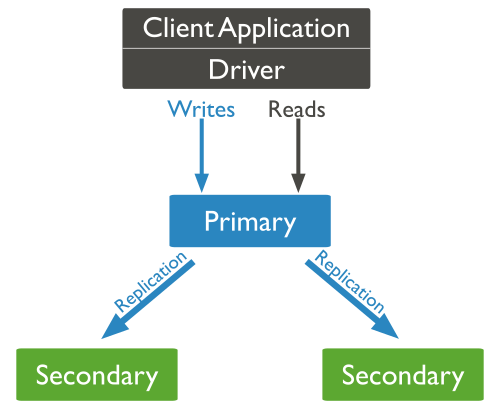
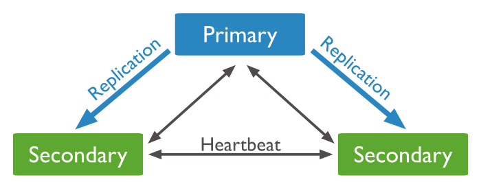
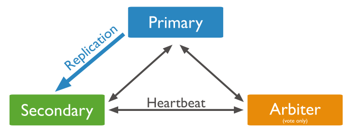
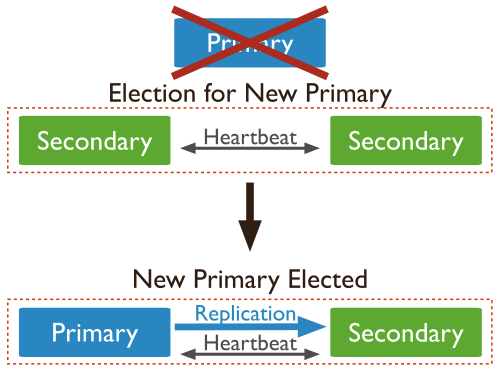
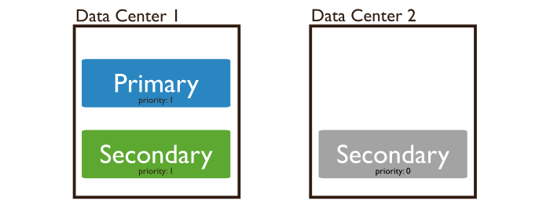
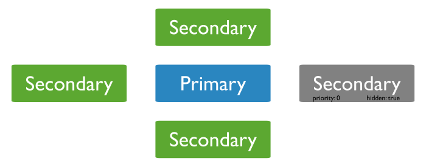
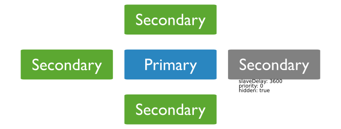

MongoDB Replica Set 副本集

## Replica Set功能

* 1, Replica Set是指一组服务器的集群，其中有一个主服务器，用于处理用户的请求；
	其余为备份服务器，用于保存主服务的数据副本。如果主服务器崩溃了，会自动将一个
	备份服务器升级为新的主服务器，从而保证服务器的进行。

* 2，MongoDB提供复制的功能，用来将数据保存到多台服务器上，在实际生产环境中，强烈建议集群并使用
	复制的功能，以实现故障转移和健壮服务器。


## 创建副本集
包含以下步骤：

* 1，在mongodb 文件夹下创建dbs文件夹，在dbs文件夹下面创建 db1 db2 db3 三个文件夹来存放数据。
     在mongodb 文件夹下创建logs文件夹,在logs文件夹西面创建文件 log1 log2 log3 三个文件用来存放日志。

* 2, 在启动MongoDB服务器的时候，使用 “--replSet 副本集名称” 选项 启动mongod

```
./mongod --dbpath ../dbs/db1 --logpath ../logs/log1 --port 20001 --fork --replSet myrep

./mongod --dbpath ../dbs/db2 --logpath ../logs/log2 --port 20002 --fork --replSet myrep

./mongod --dbpath ../dbs/db3 --logpath ../logs/log3 --port 20003 --fork --replSet myrep

```

* 3, 副本集进行初始化

```
./mongo 127.0.0.1:20001

rs.initiate({_id:"rep",members:[
	{_id:0,host:'127.0.0.1:20001'},
	{_id:1,host:'127.0.0.1:20002'},
	{_id:2,host:'127.0.0.1:20003}
	]
})

```
以上就可以创建出副本集(Replica Set) 

## 副本集(Replica Set)成员
* 1，Primary 主节点
	接收所有的读写操作。

* 2，Secondaries	 副节点
	主要从Primar(主节点) 复制数据，不接收写操作

* 3,Arbiter 仲裁者
	只负责选举不报错数据 ，不接收客户端的读写操作

#### 示意图

* 1，在以下三个成员副本集中，Primary接受所有写入操作。 然后，Secondaries复制oplog以应用于其数据集。



* 2，以下三个成员副本集有两个副成员。 副节点复制主节点的oplog并将操作应用于其数据集。



* 3，以下三个成员副本集有一个副节点，一个主节点，一个仲裁者，仲裁者只是起到选择主节点的作用，不存储数据



* 4，当主节点挂掉后，副节点会有10秒的时间选举出副节点升级为主节点，有很强的容错能力。



## 查看副本集(Replica Set)状态
rs是辅助函数，其中包含了与复制相关的辅助函数，可以通过rs.help() 查看。
```
rs.help()
```

|    函数      |  描述  |
| ------------- |:-------------|
| rs.status()          | 查看副本集状态 | 
| rs.initiate(cfg)     | 副本集进行初始化 | 
| rs.conf()          | local.system.replset 中获取配置信息 | 
| rs.reconfig(cfg)     | 更新副本集配置 | 
| rs.add(hostportstr)  | 添加一个成员 | 
| rs.addArb(hostportstr) | 添加一个选举者 arbiterOnly:true | 
| rs.stepDown([stepdownSecs, catchUpSecs]) | 主服务器变为备份服务器 | 
| rs.syncFrom(hostportstr) | 备份服务器指定hostportstr中同步数据 | 
| rs.freeze(secs)  | 使不能成为主节点的节点可以成为主节点 | 
| rs.remove(hostportstr) | 从副本集删除一个节点 | 
| rs.slaveOk() | 允许副节点查询数据 | 
| rs.printReplicationInfo() | 查看oplog 的大小时间 | 
| rs.printSlaveReplicationInfo() | 查看副本集成员同步情况 | 
| db.isMaster() | 查看是否为主节点 | 


#### rs.status()说明
```
rs.status()
{
	"set" : "myrep",
	"date" : ISODate("2017-08-17T09:12:34.724Z"),
	"myState" : 1,
	"term" : NumberLong(181),
	"heartbeatIntervalMillis" : NumberLong(2000),
	"members" : [
		{
			"_id" : 0,
			"name" : "127.0.0.1:20001",
			"health" : 1,
			"state" : 1,
			"stateStr" : "PRIMARY",
			"uptime" : 20690,
			"optime" : {
				"ts" : Timestamp(1502950202, 10),
				"t" : NumberLong(181)
			},
			"optimeDate" : ISODate("2017-08-17T06:10:02Z"),
			"electionTime" : Timestamp(1502940488, 1),
			"electionDate" : ISODate("2017-08-17T03:28:08Z"),
			"configVersion" : 2,
			"self" : true
		},
		{
			"_id" : 1,
			"name" : "127.0.0.1:20002",
			"health" : 1,
			"state" : 2,
			"stateStr" : "SECONDARY",
			"uptime" : 20671,
			"optime" : {
				"ts" : Timestamp(1502950202, 10),
				"t" : NumberLong(181)
			},
			"optimeDate" : ISODate("2017-08-17T06:10:02Z"),
			"lastHeartbeat" : ISODate("2017-08-17T09:12:33.315Z"),
			"lastHeartbeatRecv" : ISODate("2017-08-17T09:12:33.315Z"),
			"pingMs" : NumberLong(37),
			"syncingTo" : "127.0.0.1:20001",
			"configVersion" : 2
		},
		{
			"_id" : 2,
			"name" : "127.0.0.1:20003",
			"health" : 1,
			"state" : 2,
			"stateStr" : "SECONDARY",
			"uptime" : 20651,
			"optime" : {
				"ts" : Timestamp(1502950202, 10),
				"t" : NumberLong(181)
			},
			"optimeDate" : ISODate("2017-08-17T06:10:02Z"),
			"lastHeartbeat" : ISODate("2017-08-17T09:12:33.315Z"),
			"lastHeartbeatRecv" : ISODate("2017-08-17T09:12:33.314Z"),
			"pingMs" : NumberLong(37),
			"syncingTo" : "127.0.0.1:20001",
			"configVersion" : 2
		}
	],
	"ok" : 1
}
```

* 1, self：这个字段只会出现在运行rs.status函数的成员信息中。

* 2, stateStr: 服务器状态PRIMARY，SECONDARY，ARBITER。

* 3, uptime: 从成员可达一直到现在所经历的时间，单位是秒。

* 4，optimeDate: 每个成员的oplog中最后一个操作发生的时间。
	注意:这里的状态是每个成员通过心跳报告上来的状态,所以optime跟实际时间可能会有 几秒钟的偏差。

* 5，lastHeartbeat:当前服务器最后一次收到其他成员心跳的时间,如果网络故障,
	或者是当前服务器比较繁忙,这个时间可能会是2秒钟之前。

* 6，pingMs:心跳从当前服务器到达某个成员所花费的平均时间。

* 7，errmsg:成员在心跳请求中返回的状态信息,通常是一些状态信息,而不是错误信息。

* 8，state:也表示服务器的状态,state是内部表示,而stateStr是适合阅读的表示。	

* 9，optime:和optimeDate也是一样的,只是optimeDate更适合阅读。

* 10，syncingTo:表示当前成员正在从哪个成员处进行复制。

## 修改副本集配置

* 1，从副本集中删除成员
```
rs.remove("ip:port")
rs.remove("127.0.0.1:20003")

```

* 2，为副本集添加成员
```
rs.add(“ip:port”);
rs.add("127.0.0.1:20003")
```

## 副本集中主节点的确认
	是通过选举机制，要大多数节点同意的节点才能成为主节点。

#### 成员配置选项——选举仲裁者
	所谓仲裁者，就是不保存数据，专门用来投票选举主节点的副本，以解决副本个数为偶数的情况。

	

* 1，启动仲裁者和普通的副本方式一样。
* 2， 只是配置该节点的时候，设置：arbiterOnly:true   ,如果用rs来加入的话应该是：rs.addArb("ip:port")
```
rs.initiate({_id:"rep",members:[
	{_id:0,host:'127.0.0.1:20001'},
	{_id:1,host:'127.0.0.1:20002'},
	{_id:2,host:'127.0.0.1:20003,arbiterOnly:true }
	]
})
```
* 3,最多只能有一个仲裁者。

* 4，尽量使用奇数个成员，而不是采用仲裁者

#### 成员配置选项priority——优先级
	优先级用来表示一个成员渴望成为主节点的程度，可以在0-100之间，默认是1.

```
查看priority
 rs.config()
{
	"_id" : "myrep",
	"version" : 4,
	"protocolVersion" : NumberLong(1),
	"members" : [
		{
			"_id" : 0,
			"host" : "127.0.0.1:20001",
			"arbiterOnly" : false,
			"buildIndexes" : true,
			"hidden" : false,
			"priority" : 1,
			"tags" : {

			},
			"slaveDelay" : NumberLong(0),
			"votes" : 1
		},
		{
			"_id" : 1,
			"host" : "127.0.0.1:20002",
			"arbiterOnly" : false,
			"buildIndexes" : true,
			"hidden" : true,
			"priority" : 0,
			"tags" : {

			},
			"slaveDelay" : NumberLong(0),
			"votes" : 1
		},
		{
			"_id" : 2,
			"host" : "127.0.0.1:20003",
			"arbiterOnly" : true,
			"buildIndexes" : true,
			"hidden" : false,
			"priority" : 1,
			"tags" : {

			},
			"slaveDelay" : NumberLong(0),
			"votes" : 1
		}
	],
	"settings" : {
		"chainingAllowed" : true,
		"heartbeatIntervalMillis" : 2000,
		"heartbeatTimeoutSecs" : 10,
		"electionTimeoutMillis" : 10000,
		"getLastErrorModes" : {

		},
		"getLastErrorDefaults" : {
			"w" : 1,
			"wtimeout" : 0
		}
	}
}

```



* 1:如果优先级为0的话,表示这个成员永远不能够成为主节点。


* 2:拥有最高优先级的成员会优先选举为主节点,只要它能得到“大多数”的票,并且数据是
最新的,就可以了。

* 3:如果一个高优先级的成员,数据又是最新的,通常会使得当前的主节点自动退位,让这个
优先级高的做主节点。


#### 成员配置选项hidden——隐藏成员
	对于设置为隐藏的成员，客户端不能发送请求，也不会作为复制源，通常用来做备份服务器，



* 1：在配置这个节点的时候，设置hidden:true

* 2: 只有优先级为0的成员才能被隐藏。

* 3:可以通过rs.config()或者rs.status()查看到

```
var config = rs.config();
config.members[1].hidden=true;
config.members[1].priority=0;
rs.reconfig(config);

查看配置
rs.config() 
```

####  成员配置选项slaveDelay——延迟备份节点
	可以通过slaveDelay设置一个延迟的备份节点，以在主节点的数据不小心被破坏后，
	能从备份中恢复回来。要求该备份节点的优先级为0.




```
var config = rs.config();
config.members[1].hidden=true;
config.members[1].priority=0;
config.members[1].slaveDelay=1000; 秒
rs.reconfig(config);

查看配置
rs.config() 
```

#### 成员配置选项buildIndexes——创建索引
	如果不需要备份节点与主节点拥有一样的索引,可以设置:buildIndexes:false。

* 1:这是一个永久选项,一旦指定了,就无法恢复为创建索引的正常的节点了。

* 2:如果要恢复,只能删掉,重新再创建节点了。

* 3:同样要求该节点的优先级为0。

```
var config = rs.config();
config.members[1].priority=0;
config.members[1].buildIndexes=false; 
rs.reconfig(config);

查看配置
rs.config() 
```


## 操作日志oplog
	Oplog 是主节点的local 数据库中的一个固定集合，按顺序记录了主节点的每一次写操作，
	MongoDB 的复制功能是使用oplog来实现的，备份节点通过查询这个集合就可以知道需要进行
	哪些数据的复制了。
	每个备份节点也都维护着自己的oplog,记录着每次从主节点复制数据的操作。这样 每个节点都可以作为数据的同步源提供给其他成员使用。

#### 注意事项
* 1:由于是先复制数据,再写日志,因此可能会出现重复的复制操作,这个没有关系,MongoDB
会处理这种情况,多次执行Oplog中同一个操作与执行一次是一样的。

* 2:oplog的大小是固定的,它只能保存特定数量的操作日志,如果多次大批量的执行操作,
oplog很快就会被填满,oplog的大小,可以通过mongod的--plogSize来指定。	


* 3:oplog的内容,在local数据库的oplog.rs集合里面

查看oplog.rs集合

```
use local

db.oplog.rs.find().limit(2)

{ "ts" : Timestamp(1502377323, 1), "h" : NumberLong("-5133493683417483983"), "v" : 2, "op" : "n", "ns" : "", "o" : { "msg" : "initiating set" } }

{ "ts" : Timestamp(1502377334, 1), "t" : NumberLong(1), "h" : NumberLong("-1049014418502032537"), "v" : 2, "op" : "n", "ns" : "", "o" : { "msg" : "new primary" } }

```


## 初始化同步
	当副本集的一个成员启动的时候，他就会检查自身状态，然后到集群中检查是否需要同步，
	以及从哪儿同步，并进行数据的复制，这个过程就称为初始化同步。

初始化要经历以下步骤：

* 1，记录前的准备工作：选择一个成员作为同步源，在local.me 中为自己创建一个标识符，
	删除所有已存在的数据库，以全新的状态开始同步。

* 2，从数据源把所有数据复制到本地	。

* 3，写oplog,把所有复制中的操作写入oplog。

* 4，把上一步oplog同步中的操作写入oplog

* 5,此时数据应该和数据源一致了，可以开始创建索引了。

* 6，如果当前节点的数据仍然远远落后于数据源，那么oplog会将创建索引间的所有操作同步过来。

* 7，完成初始化同步后，切换到普通同步状态，也就可以作为备份节点使用了。

#### 处理陈旧数据
	如果备份节点远远落后于同步源的数据,那么这个节点上的数据就是成旧数据。

、通常的处理办法是:让主节点使用比较大的oplog,以保存足够多的操作日志,可以让备份节点慢慢来同步操作。


## 心跳
	为了维护集合的最新状态，每个成员每个2秒会向其他成员发送一个心跳请求，用于检查每个成员的状态。

常见状态：

* 1:主节点、备份节点

* 2:STARTUP:成员刚启动时处于这个状态,加载完副本集配置后,进入STARTUP2 

* 3:STARTUP2:整个初始化同步过程都处于这个状态 

* 4:RECOVERING:表明成员运转正常,但暂时还不能处理读取请求 

* 5:ARBITER:仲裁者始终处于这个状态	


系统出现故障时的状态：

* 1:DOWN:成员不可到达,有可能成员还是在正常运行,也有可能挂了

* 2:UNKNOWN:标识一个成员无法到达其他所有的成员

* 3:REMOVED:成员被移出副本集

* 4:ROLLBACK:成员正在进行数据回滚

* 5:FATAL:成员出现了致命的错误,也不再尝试恢复正常


## 回滚
	回滚的时候，会把受到影响的文档，保存到数据目录下的rollback目录中，文件名为
	集合名称.bson。
```
<database>.<collection>.<timestamp>.bson

records.accounts.2011-05-09T18-10-04.0.bson
```

#### 基本步骤：

* 1，判断是否需要回滚，典型就是副本记录和主记录不一致了。

* 2，在两个oplog 中寻找最后一个共同点

* 3，然后副本回滚到这个共同点

* 4，副本再从主节点同步数据回来	

#### 注意
	如果要回滚的数据很多，比如大于300M,或者需要操作30分钟以上，回滚就会失败，
	如果回滚失败的话，就需要重新同步了。

##  以单机模式启动成员

	由于很多维护的工作需要写入操作,所以不合适在副本集中操作,可以以单机模式
启动成员,也就是不要使用副本的选项,就跟以前启动单独的服务器一样。一般使用一个 跟副本集配置中不一样的端口号,这样其他成员会认为这个服务器挂了。


## 副本集的配置
	副本集的配置以一个文档的形式保存在local库中system.replSet 集合中，副本集所有
	成员的这个文档都是相同的。绝对不要使用update来更新这个文档，应该使用rs或者replSetReconfig命令来修改副本集的配置。

先rs.config()得到当前配置,然后修改数据,再rs.reconfig 即可。但有如下限制：

* 1： 不能修改成员的"_id"字段。

* 2： 不能接收rs.reconfig命令的成员的优先级设置为0。

* 3： 不能将仲裁者变成正常成员，反之也不行。

* 4： 不能将buiildIndex为false的成员修改为true

#### 创建比较多的副本集
	副本集最多只能拥有12个成员，只有7个成员拥有投票权。因此要创建超过7个副本集的话，需要
	将其他成员的投票权设置为0:

```
rs.add({“_id”:8,”host”:”localhost:20008”,”votes”:0});
```
如果要配置超过12个成员的话,需要使用Master/Slave的方式,不过这个方式已经 不建议使用了,如果将来副本集能支持更多成员的话,这个方式可能会立即废除。

#### 强制重新配置
	如果副本集无法达到“大多数”要求的话，可能会无法选出主节点，这个时候，可以shell连接任意
	一个成员，然后使用force 选项强制重新配置，如下
```
rs.reconfig(config,{“force”:true});
```	

#### 把主节点变为备份节点
	可以使用stepDown函数,可以自己指定退化的持续时间,
```
rs.stepDown(); 或者 rs.stepDown(60); //秒为单位
```

#### 阻止选举
	如果对主节点进行维护，但不希望这段时间其他节点选举新的主节点，可以在每个备份节点上
	执行freeze命令，强制他们始终处于备份状态。
```
rs.freeze(100) //秒为单位，表示冻结多长时间
```
如果在主节点上执行rs.freeze(0) 可以将退位的主节点重新变为主节点。

#### 使用维护模式
	当在副本集的某个成员上执行一个非常耗时的功能的话，可以设置该成员进入维护模式，方式如下：

```
db.adminCommand({“replSetMaintenanceMode”:true});
```	
要从维护模式中恢复的话，设置为false就可以了。


#### 不作为复制源
	如果希望能从主节点复制数据，可以把所有的备份成员的alloChaining设置为false。


## 参看文章
https://docs.mongodb.com/v3.2/core/replica-set-primary/	


