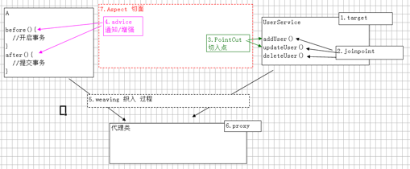
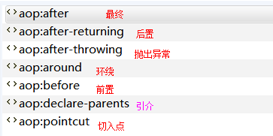
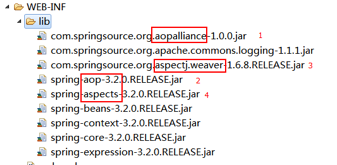
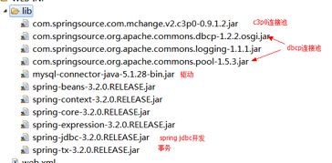

#AOP
## 什么是AOP
* 在软件业，AOP为Aspect Oriented Programming的缩写，意为：面向切面编程，通过预编译方式和运行期动态代理实现程序功能的统一维护的一种技术。AOP是OOP的延续，是软件开发中的一个热点，也是Spring框架中的一个重要内容，是函数式编程的一种衍生范型。利用AOP可以对业务逻辑的各个部分进行隔离，从而使得业务逻辑各部分之间的耦合度降低，提高程序的可重用性，同时提高了开发的效率。
* AOP 采取横向抽取机制，取代了传统纵向继承体系重复性代码。
* 经典应用：事物管理，性能监视，安全检查，缓存，日志等。
* Spring AOP 使用纯java实现，不需要专门的编译过程和类加载器，在运行期通过代理方式向目标类织入增强代码
* AspectJ是一个基于Java语言的AOP框架，Spring2.0开始，Spring 	AOP引入对Aspect的支持，AspectJ扩展了Java语言，提供了一个专门的编译器，在编译时提供横向代码的织入

## AOP实现原理
* aop 底层将采用代理机制进行实现。
* 接口 + 实现类：spring采用jdk的动态代理proxy。
* 实现类：spring采用cglib字节码增强。

## AOP术语
* 1.target：目标类，需要被代理的类。例如：UserService。
* 2.Joinpoint(连接点):所谓连接点是指那些可能被拦截到的方法。例如：所有的方法。
* 3.PointCut 切入点：已经被增强的连接点。例如：addUser()。
* 4.advice 通知/增强，增强代码。例如：after、before。
* 5. Weaving(织入):是指把增强advice应用到目标对象target来创建新的代理对象proxy的过程.
* 6.proxy 代理类。
* 7. Aspect(切面): 是切入点pointcut和通知advice的结合。

## 手动方式
#### JDK动态代理
* JDK动态代理 对“装饰者”设计模式 简化。使用前提：必须有接口
1.目标类：接口 + 实现类
2.切面类：用于存通知 MyAspect
3.工厂类：编写工厂生成代理

#####	目标类
	public interface UserService {
	    void addUser();
	    void updateUser();
	    void deleteUser();
	}

	public class UserServiceImpl implements UserService {

	    @Override
	    public void addUser() {
	        System.out.println("------addUser");
	    }

	    @Override
	    public void updateUser() {
	        System.out.println("------updateUser");
	    }

	    @Override
	    public void deleteUser() {
	        System.out.println("------deleteUser");

	    }
	}

##### 切面类
	public class MyAspect {
	    public void before(){
	        System.out.println("方法之前");
	    }

	    public void after(){
	        System.out.println("方法之后");

	    }
	}

##### 工厂类
	public class MyBeanFactory {
	    public static UserService createService() {
	        final UserService userService = new UserServiceImpl();
	        final MyAspect myAspect = new MyAspect();
	        /**
	         * Proxy.newProxyInstance
	         * 参数1:loader 类加载器,动态代理类 运行时创建,任何类都需要类加载器加载到内存
	         *      一般情况:当前类.getClassLoader();
	         *              目标类实例.getClass.getClassLoader()
	         * 参数2: Class[] interfaces代理类需要实现所有的接口
	         *      方式1:目标类实例.getClass().getInterfaces();只能获得自己接口,不能获得父元素接口
	         *      方式2:new Class[]{...}
	         * 参数3:InvocationHandler 处理类,接口必须进行实现类,一般采用匿名内部
	         *      提供invoke 方法,代理类的每一个方法执行,都将调用一次invoke
	         *      参数1:Object proxy:代理对象
	         *      参数2:Mehod method:代理对象当前执行的方法描述对象(反射)
	         *              执行方法名:method.getName()
	         *              执行方法:method.invoke(对象,实际参数)
	         *      参数3:Object[] args:方法实际参数
	         *
	         */

	        UserService proxService = (UserService) Proxy.newProxyInstance(MyBeanFactory.class.getClassLoader(),
	                userService.getClass().getInterfaces(), new InvocationHandler() {
	                    @Override
	                    public Object invoke(Object proxy, Method method, Object[] args) throws Throwable {
	                        myAspect.before();
	                        Object  obj = method.invoke(userService,args);
	                        myAspect.after();
	                        return obj;
	                    }
	                });

	        return proxService;
	    }
	}

#### CGLIB 字节码增强
* 没有接口，只有实现类。
* 采用字节码增强框架CGLIB，在运行时创建目标类的子类，从而对目标类进行增强
##### 实例
	public class CGLIBFactory {

	    public static UserServiceImpl createService() {
	        //目标类
	        UserServiceImpl userService;
	        userService = new UserServiceImpl();
	        //切面类
	        MyAspect myAspect = new MyAspect();

	        //代理类采用cglib 底层创建目标类的子类
	        //核心类
	        Enhancer enhancer = new Enhancer();
	        //确定父类
	        enhancer.setSuperclass(userService.getClass());

	        /**
	         * 设置回调函数,MethodInterceptor 接口等效 jdk InvocationHandler接口
	         * intercept 等效jdk invoke()
	         * 参数4:methodProxy 方法的代理
	         */
	        enhancer.setCallback(new MethodInterceptor() {
	            @Override
	            public Object intercept(Object proxy, Method method, Object[] args, MethodProxy methodProxy) throws Throwable {
	                myAspect.before();
	               Object obj =  method.invoke(userService,args);
	                myAspect.after();

	                return obj;
	            }
	        });

	        //创建代理类
	        UserServiceImpl proxService = (UserServiceImpl) enhancer.create();
	        return  proxService;

	    }

	}

## AOP联盟通知类型
AOP联盟为通知Advice定义了org.aopalliance.aop.Advice
#### Spring按照通知Advice在目标类方法的连接点位置，可以分为5类

##### 前置通知 org.springframework.aop.MethodBeforeAdvice
	在目标方法执行前实施增强

##### 后置通知 org.springframework.aop.AfterReturningAdvice
	在目标方法执行后实施增强

##### 环绕通知 org.aopalliance.intercept.MethodInterceptor	
	在目标方法执行前后实施增强

##### 异常抛出通知 org.springframework.aop.ThrowsAdvice
	在方法抛出异常后实施增强

##### 引介通知 org.springframework.aop.IntroductionInterceptor
	在目标类中添加一些新的方法和属性

###### 环绕通知，必须手动执行目标方法
	try{
	   //前置通知
	   //执行目标方法
	   //后置通知
	} catch(){
	   //抛出异常通知
	}

## spring 编写代理：半自动
* 让spring 创建代理对象，从spring容器中手动的获取代理代理对象
* 需要jar包： aopallicance-1.0.0.jar ,spring-aop.release.jar

##### spring 配置

	//目标类
	 <bean id="userServiceId" class="cn.leyue.a_aop.c_spring.UserServiceImpl"></bean>
	 //切面类（通知）
	 <bean id="myAspectId" class="cn.leyue.a_aop.c_spring.MyAspect"></bean>

	    <!--
	        创建代理类
	        * 使用工厂bean FactoryBean ,底层调用getObject()返回特殊bean
	        * ProxyFactoryBean 用于创建代理工程bean,生成特殊代理对象,
	            interfaces:确定接口们
	                通过<array>可以设置多个值
	                只有一个值时,value=""
	             target 确定目标类
	                 interceptorNames:通知切面类的名称,类型String[],如果设置一个值 value=""
	             optimize:强制使用cglib
	                 <property name="optimize" value="true"></property>
	        * 底层机制
	             如果目标类接口,采用jdk动态代理
	             如果没有接口,采用cglib 字节码增强
	             如果生命optimize=true 无论是否有接口,都采用cglib

	    -->
	    <bean id="proxyServiceId" class="org.springframework.aop.framework.ProxyFactoryBean">
	        <property name="interfaces" value="cn.leyue.a_aop.c_spring.UserService"></property>
	        <property name="target" ref="userServiceId"></property>
	        <property name="interceptorNames" value="myAspectId"></property>
	        <property name="optimize" value="true"></property>
	    </bean>

##### 目标类
	public interface UserService {
	    void addUser();
	    void updateUser();
	    void deleteUser();
	}

	public class UserServiceImpl implements UserService {

	    @Override
	    public void addUser() {
	        System.out.println("b_cglib------addUser");
	    }

	    @Override
	    public void updateUser() {
	        System.out.println("b_cglib------updateUser");
	    }

	    @Override
	    public void deleteUser() {
	        System.out.println("b_cglib------deleteUser");

	    }
	}

##### 切面类
	/**
	 * 切面类中确定通知,需要实现不同接口,接口就是规范,从而确定方法名称.
	 * 采用"环绕通知"MethodInterceptor
	 */
	public class MyAspect implements MethodInterceptor {

	    @Override
	    public Object invoke(MethodInvocation methodInvocation) throws Throwable {
	        System.out.println("c_spring_方法之前");
	        //手动执行目标方法
	        Object obj = methodInvocation.proceed();
	        System.out.println("c_spring_方法之后");
	        return obj;

	    }

	}

##### 测试类
	public class SpringTest {
	    @Test
	    public void spring() {
	        String path = "cn/leyue/a_aop/c_spring/beans.xml";
	        ClassPathXmlApplicationContext application = new ClassPathXmlApplicationContext(path);
	        UserService service = application.getBean("proxyServiceId", UserService.class);
	        service.addUser();
	        service.updateUser();
	        service.deleteUser();
	    }
	}

## spring aop编程：全自动
* 从spring 容器获得目标类，如何配置aop,spring将自动生成代理
* 要确定目标类，aspectj切入点表达式，导入包。
	com.springsource.org.aspectj.weaver-1.6.8.RELEASE.jar
#### spring 配置
###### 导入命名空间
	xmlns="http://www.springframework.org/schema/beans"
    xmlns:xsi="http://www.w3.org/2001/XMLSchema-instance"
    xmlns:aop="http://www.springframework.org/schema/aop"
    xsi:schemaLocation="http://www.springframework.org/schema/beans
    http://www.springframework.org/schema/beans/spring-beans.xsd
    http://www.springframework.org/schema/aop 
   	http://www.springframework.org/schema/aop/spring-aop.xsd
###### spring aop示例
	<?xml version="1.0" encoding="UTF-8"?>
	<beans xmlns="http://www.springframework.org/schema/beans"
	       xmlns:xsi="http://www.w3.org/2001/XMLSchema-instance"
	       xmlns:aop="http://www.springframework.org/schema/aop"
	       xsi:schemaLocation="http://www.springframework.org/schema/beans
	        http://www.springframework.org/schema/beans/spring-beans.xsd
	         http://www.springframework.org/schema/aop 
	       	 http://www.springframework.org/schema/aop/spring-aop.xsd

	        ">
	    <!--目标类-->
	    <bean id="userServiceId" class="cn.leyue.a_aop.d_spring_auto.UserServiceImpl"></bean>
	    <!--切面类通知-->
	    <bean id="myAspectId" class="cn.leyue.a_aop.d_spring_auto.MyAspect"></bean>
	    <bean id="proxyId" class="cn.leyue.a_aop.d_spring_auto.ProxyTest"></bean>

	    <!--
	        aop编程
	        * 导入命名空间
	        * 使用 <aop:config>进行配置
	        * proxy-target-class="true" 声明时使用cglib代理
	        * <aop:pointcut> 切入点,从目标对象获得具体方法
	        * <aop:advisor> 特殊的切面,只有一个通知和一个切入点
	            advice-ref 通知引用
	            pointcut-ref 切入点引用
	        * 切入点表达式
	            execution(*  cn.leyue.a_aop.d_spring_auto.*.*(..) )
	            选择方法 返回值任意             包      类名任意  方法名任意 参数任意

	    -->
	    <aop:config proxy-target-class="true">
	        <aop:pointcut id="myPointCut" expression="execution(* cn.leyue.a_aop.d_spring_auto.*.*(..))"></aop:pointcut>
	        <aop:advisor advice-ref="myAspectId" pointcut-ref="myPointCut"></aop:advisor>
	    </aop:config>

	</beans>

#### 目标类
	public interface UserService {
	    void addUser();
	    void updateUser();
	    void deleteUser();
	}

	public class UserServiceImpl implements UserService {

	    @Override
	    public void addUser() {
	        System.out.println("d_spring_auto------addUser");
	    }

	    @Override
	    public void updateUser() {
	        System.out.println("d_spring_auto------updateUser");
	    }

	    @Override
	    public void deleteUser() {
	        System.out.println("d_spring_auto------deleteUser");

	    }
	}

#### 切面类
	public class MyAspect implements MethodInterceptor {
	    @Override
	    public Object invoke(MethodInvocation methodInvocation) throws Throwable {
	        System.out.println("d_spring_auto_方法之前");
	        //手动执行目标方法
	        Object obj = methodInvocation.proceed();
	        System.out.println("d_spring_auto_方法之后");
	        return obj;

	    }

	}

#### 测试
	public class TestSpring {
	    @Test
	    public void testSpring() {
	        String path = "cn/leyue/a_aop/d_spring_auto/beans.xml";
	        ClassPathXmlApplicationContext application = new ClassPathXmlApplicationContext(path);
	        UserService userService = application.getBean("userServiceId", UserService.class);
	        userService.addUser();
	        userService.updateUser();
	        userService.deleteUser();
	        System.out.println("------------------");
	        ProxyTest proxy = application.getBean("proxyId", ProxyTest.class);
	        proxy.sayHello();
	    }

	}

## AspectJ
#### AspectJ介绍
* AspectJ是一个基于Java 语言的AOP框架。
* Spring2.0以后新增了对AspectJ切点表达式支持。
* @AspectJ 是AspectJ1.5新增功能，通过JDK5注解技术，允许直接在Bean类中定义切面，新版本Spring框架，建议使用AspectJ方式来开发AOP
* 主要用途：自定义开发

### 切入点表达式
#### 1，execution 用于描述方法
##### 语法：execution(修饰符 返回值 包.类.方法名(参数) throws 异常)
##### 修饰符，一般省略
	public 公共方法
	*       任意
##### 返回值 ，不能省略
	void 	返回没有值
	String 返回值字符串
	* 		任意
##### 包
	cn.leyue.a_aop  固定包
	cn.leyue.a_aop.*.service 	a_aop包下面子包任意 （例如：cn.leyue.a_aop.staff.service）
	cn.leyue.a_aop..			a_aop包下面的所有子包（含自己）
	cn.leyue.a_aop.*.service..   a_aop包下面任意子包，固定目录service ,service所有的子包

##### 类
	UserServiceImpl      指定类
	*Impl 				以Impl结尾
	User*				以User开头
	* 					任意

##### 方法名，不能省略
	addUser 			固定方法
	add* 				以add开头
	*Do  				以Do结尾
	*     				任意

##### (参数)
	（） 				无参
	（int）				一个整型参数
	（int,int）  		两个
	（..）  				参数任意

##### throws  可省略，一般不写
##### 示例
	execution(* com.itheima.crm.*.service..*.*(..))
	<aop:pointcut expression="execution(* com.itheima.*WithCommit.*(..)) || 
                          execution(* com.itheima.*Service.*(..))" id="myPointCut"/>

#####  2，within:匹配包或子包中的方法。
	within(com.itheima.aop..*)

##### 3，this:匹配实现接口的代理对象中的方法。
	this(com.itheima.aop.user.UserDAO)

##### 4，target:匹配实现接口的目标对象中的方法
	target(com.itheima.aop.user.UserDAO)	

##### 5，args:匹配参数格式符合标准的方法
	args(int,int)

##### 6，bean(id)  对指定的bean所有的方法
	bean('userServiceId')

### AspectJ 通知类型
* aop联盟定义通知类型，具有特性接口，必须实现，从而确定方法名称。
* aspectj 通知类型，只定义类型名称。已经方法格式。

#### 类型
##### before:前置通知(应用：各种校验)
	在方法执行前执行，如果通知抛出异常，阻止方法运行。

##### afterReturning:后置通知(应用：常规数据处理)
	方法正常返回后执行，如果方法中抛出异常，通知无法执行。
	必须在方法执行后才执行，所以可以获得方法的返回值。

##### 	around:环绕通知(应用：十分强大，可以做任何事情)
	方法执行前后分别执行，可以阻止方法的执行。
	必须手动执行目标方法。

##### afterThrowing:抛出异常通知(应用：包装异常信息)
	方法抛出异常后执行，如果方法没有抛出异常，无法执行。

##### 	after:最终通知(应用：清理现场)
	方法执行完毕后执行，无论方法中是否出现异常	

#### AspectJ 需要导入jar包
	aop 联盟规范  spring aop 实现 		aspect规范 	spring aspect 实现
	

####  aspect 基于xml
* 目标类： 接口 + 实现
* 切面类： 编写多个通知，采用aspectj 通知名称任意（方法名任意）
* aop编程，将通知应用到目标类

##### 切面类
	/**
	 * 切面类,含有多个通知
	 */
	public class MyAspect {
	    public void myBefore(JoinPoint joinPoint) {
	        System.out.println("前置通知: " + joinPoint.getSignature().getName());
	        System.out.println("参数: "+ Arrays.asList(joinPoint.getArgs()));

	    }

	    public void myAfterReturning(JoinPoint joinPoint, Object ret) {
	        System.out.println("后置通知: " + joinPoint.getSignature().getName() + ",----->" + ret);
	    }

	    public Object myAround(ProceedingJoinPoint joinPoint) throws Throwable {
	        System.out.println("环绕通知: 前");
	        Object obj = joinPoint.proceed();
	        System.out.println("环绕通知: 后");
	        return obj;
	    }

	    public void myAfterThrowing(JoinPoint joinPoint,Throwable e) {
	        System.out.println("抛出异常通知: "+e.getMessage());
	    }

	    public void myAfter(JoinPoint joinPoint) {
	        System.out.println("最终通知");

	    }
	}

##### spring 配置
	<beans xmlns="http://www.springframework.org/schema/beans"
	       xmlns:xsi="http://www.w3.org/2001/XMLSchema-instance"
	       xmlns:aop="http://www.springframework.org/schema/aop"
	       xsi:schemaLocation="http://www.springframework.org/schema/beans
	       http://www.springframework.org/schema/beans/spring-beans.xsd
	       http://www.springframework.org/schema/aop
	       http://www.springframework.org/schema/aop/spring-aop.xsd
	       ">
	       <!-- 1 创建目标类 -->
	        <bean id="userServiceId" class="cn.leyue.a_aop.e_aspect.a_xml.UserServiceImpl"></bean>
	   
	    <!-- 2 创建切面类（通知） -->
	    <bean id="myAspectId" class="cn.leyue.a_aop.e_aspect.a_xml.MyAspect"></bean>
	    	<!-- 3 aop编程 
			<aop:aspect> 将切面类 声明“切面”，从而获得通知（方法）
				ref 切面类引用
			<aop:pointcut> 声明一个切入点，所有的通知都可以使用。
				expression 切入点表达式
				id 名称，用于其它通知引用
		 -->

	    <aop:config>
	        <aop:aspect ref="myAspectId">

	            <aop:pointcut id="myPointCut" expression="execution(* cn.leyue.a_aop.e_aspect.a_xml.UserServiceImpl.*(..))"></aop:pointcut>

	            <!--前置通知-->
	            <aop:before method="" pointcut="" pointcut-ref=""/>
					method : 通知，及方法名
					pointcut :切入点表达式，此表达式只能当前通知使用。
					pointcut-ref ： 切入点引用，可以与其他通知共享切入点。
				通知方法格式：public void myBefore(JoinPoint joinPoint){
					参数1：org.aspectj.lang.JoinPoint  用于描述连接点（目标方法），获得目标方法名等

	            <aop:before method="myBefore" pointcut-ref="myPointCut"></aop:before>
	            <!--后置通知-->
	            3.2后置通知  ,目标方法后执行，获得返回值
				<aop:after-returning method="" pointcut-ref="" returning=""/>
					returning 通知方法第二个参数的名称
				通知方法格式：public void myAfterReturning(JoinPoint joinPoint,Object ret){
					参数1：连接点描述
					参数2：类型Object，参数名 returning="ret" 配置的

	            <aop:after-returning method="myAfterReturning" pointcut-ref="myPointCut" returning="ret"></aop:after-returning>
	            3.3 环绕通知 
				<aop:around method="" pointcut-ref=""/>
				通知方法格式：public Object myAround(ProceedingJoinPoint joinPoint) throws Throwable{
					返回值类型：Object
					方法名：任意
					参数：org.aspectj.lang.ProceedingJoinPoint
					抛出异常
				执行目标方法：Object obj = joinPoint.proceed();

	            <aop:around method="myAround" pointcut-ref="myPointCut"></aop:around>

	            <!--抛出异常-->
	            <aop:after-throwing method="" pointcut-ref="" throwing=""/>
					throwing ：通知方法的第二个参数名称
				通知方法格式：public void myAfterThrowing(JoinPoint joinPoint,Throwable e){
					参数1：连接点描述对象
					参数2：获得异常信息，类型Throwable ，参数名由throwing="e" 配置

	            <aop:after-throwing method="myAfterThrowing" pointcut-ref="myPointCut" throwing="e"></aop:after-throwing>
	            <!--最终通知-->
	           <aop:after method="myAfter" pointcut-ref="myPointCut"></aop:after>
	        </aop:aspect>
	        
	    </aop:config>

	</beans>

####  aspect 基于注解
##### spring 配置
	<?xml version="1.0" encoding="UTF-8"?>
	<beans xmlns="http://www.springframework.org/schema/beans"
	       xmlns:xsi="http://www.w3.org/2001/XMLSchema-instance"
	       xmlns:aop="http://www.springframework.org/schema/aop"
	       xmlns:context="http://www.springframework.org/schema/context"
	       xsi:schemaLocation="http://www.springframework.org/schema/beans
	                           http://www.springframework.org/schema/beans/spring-beans.xsd
	                           http://www.springframework.org/schema/aop
	                           http://www.springframework.org/schema/aop/spring-aop.xsd
	                           http://www.springframework.org/schema/context
	                           http://www.springframework.org/schema/context/spring-context.xsd
	       ">
	    <!--扫描 注解类-->
	    <context:component-scan base-package="cn.leyue.a_aop.e_aspect.b_anno"></context:component-scan>
	    <!--确定 aop注解生效-->
	    <aop:aspectj-autoproxy></aop:aspectj-autoproxy>

	</beans>

##### 替换AOP
* 必须进行aspectj自动代理
	  <!--确定 aop注解生效-->
    <aop:aspectj-autoproxy></aop:aspectj-autoproxy>
  <!--扫描 注解类-->
    <context:component-scan base-package="cn.leyue.a_aop.e_aspect.b_anno"></context:component-scan> 
      
##### 切面类
	/**
	 * 切面类,含有多个通知
	 */
	@Component
	@Aspect
	public class MyAspect {

	    //声明公共变量
	    @Pointcut("execution(* cn.leyue.a_aop.e_aspect.b_anno.UserServiceImpl.*(..))")
	    private void myPointCut() {

	    }

	    //切入点当前有效
	//    @Before("execution(* cn.leyue.a_aop.e_aspect.b_anno.UserServiceImpl.*(..))")
	    public void myBefore(JoinPoint joinPoint) {
	        System.out.println("前置通知: " + joinPoint.getSignature().getName());
	        System.out.println("参数: "+ Arrays.asList(joinPoint.getArgs()));

	    }

	//    @AfterReturning(value = "myPointCut()",returning = "ret")
	    public void myAfterReturning(JoinPoint joinPoint, Object ret) {
	        System.out.println("后置通知: " + joinPoint.getSignature().getName() + ",----->" + ret);
	    }

	//    @Around(value = "myPointCut()")
	    public Object myAround(ProceedingJoinPoint joinPoint) throws Throwable {
	        System.out.println("环绕通知: 前");
	        Object obj = joinPoint.proceed();
	        System.out.println("环绕通知: 后");
	        return obj;
	    }

	    @AfterThrowing(value = "myPointCut()",throwing = "e")
	    public void myAfterThrowing(JoinPoint joinPoint,Throwable e) {
	        System.out.println("抛出异常通知: "+e.getMessage());
	    }

	//    @After(value="myPointCut()")
	    public void myAfter(JoinPoint joinPoint) {
	        System.out.println("最终通知");

	    }
	}

------------------------------------------------------------------------
	public interface UserService {
	    void addUser(String username);
	    String updateUser();
	    void deleteUser();
	}

	@Service("userServiceId")
	public class UserServiceImpl implements UserService {

	    @Override
	    public void addUser(String username) {
	        System.out.println("b_anno------addUser  "+username);
	    }

	    @Override
	    public String updateUser() {
	        System.out.println("b_anno------updateUser");
	        int i= 1/0;
	        return "back";
	    }

	    @Override
	    public void deleteUser() {
	        System.out.println("b_anno------deleteUser");

	    }
	}

##### 测试注解
	public class TestAspectAnno {

	    @Test
	    public void testanno() {
	        String path ="cn/leyue/a_aop/e_aspect/b_anno/beans.xml";
	        ClassPathXmlApplicationContext application = new ClassPathXmlApplicationContext(path);
	        UserService userService = application.getBean("userServiceId",UserService.class);
	        userService.addUser("anno");
	        userService.updateUser();
	        userService.deleteUser();
	    }
	}

## JdbcTemplate
* spring 提供用于操作JDBC工具类，类似DBUtils
* 依赖连接池DataSource(数据源)	

### 环境搭建
#### 导入jar包

##### javabean
	public class Building {
	    private String buname;
	    private int id;
	    private String buaddress;
	    private double aveprice;

	    public String getBuname() {
	        return buname;
	    }

	    public void setBuname(String buname) {
	        this.buname = buname;
	    }

	    public int getId() {
	        return id;
	    }

	    public void setId(int id) {
	        this.id = id;
	    }

	    public String getBuaddress() {
	        return buaddress;
	    }

	    public void setBuaddress(String buaddress) {
	        this.buaddress = buaddress;
	    }

	    public double getAveprice() {
	        return aveprice;
	    }

	    public void setAveprice(double aveprice) {
	        this.aveprice = aveprice;
	    }

	    @Override
	    public String toString() {
	        return "Building{" +
	                "buname='" + buname + '\'' +
	                ", id=" + id +
	                ", buaddress='" + buaddress + '\'' +
	                ", aveprice=" + aveprice +
	                '}';
	    }
	}

##### 使用api
	@Test
    public void jdbc() {
        //1 创建数据源(连接池)dbcp
        BasicDataSource dataSource = new BasicDataSource();

        //基本四项
        dataSource.setDriverClassName("com.mysql.jdbc.Driver");
        dataSource.setUrl("jdbc:mysql://localhost:3306/haoju_cn?useUnicode=true&characterEncoding=UTF-8");
        dataSource.setUsername("root");
        dataSource.setPassword("");

        //创建模板
        JdbcTemplate jdbcTemplate  = new JdbcTemplate();
        jdbcTemplate.setDataSource(dataSource);

        //通过api操作
        String sql = "select * from fc_building limit ?";
        List<Building> datas = jdbcTemplate.query(sql, new Object[]{10}, ParameterizedBeanPropertyRowMapper.newInstance(Building.class));
        for (Building building : datas) {
            System.out.println(building);
        }

    }

##### DAO
	public class BuildingDao {
	    private JdbcTemplate jdbcTemplate;

	    public void setJdbcTemplate(JdbcTemplate jdbcTemplate) {
	        this.jdbcTemplate = jdbcTemplate;
	    }

	    public List<Building> findAll() {
	        List<Building> datas = jdbcTemplate.query("select * from fc_building limit ?",new Object[]{10},
	                ParameterizedBeanPropertyRowMapper.newInstance(Building.class));
	        return datas;
	    }

	}

#### 配置DBCP
	<?xml version="1.0" encoding="UTF-8"?>
	<beans xmlns="http://www.springframework.org/schema/beans"
	       xmlns:xsi="http://www.w3.org/2001/XMLSchema-instance"
	       xsi:schemaLocation="http://www.springframework.org/schema/beans
	       					   http://www.springframework.org/schema/beans/spring-beans.xsd">

	    <bean id="dataSourceId" class="org.apache.commons.dbcp.BasicDataSource">
	        <property name="driverClassName" value="com.mysql.jdbc.Driver"></property>
	        <property name="url" value="jdbc:mysql://localhost:3306/haoju_cn?useUnicode=true&amp;characterEncoding=UTF-8"></property>
	        <property name="username" value="root"></property>
	        <property name="password" value=""></property>
	    </bean>

	    <bean id="jdbcTemplateId" class="org.springframework.jdbc.core.JdbcTemplate">
	        <property name="dataSource" ref="dataSourceId"></property>
	    </bean>

	    <bean id="buildingDaoId" class="cn.leyue.jdbc.dbcp.BuildingDao">
	        <property name="jdbcTemplate" ref="jdbcTemplateId"></property>
	    </bean>

	</beans>

#### 配置的C3P0
	<?xml version="1.0" encoding="UTF-8"?>
	<beans xmlns="http://www.springframework.org/schema/beans"
	       xmlns:xsi="http://www.w3.org/2001/XMLSchema-instance"
	       xsi:schemaLocation="http://www.springframework.org/schema/beans http://www.springframework.org/schema/beans/spring-beans.xsd">

	    <bean id="dataSourceId" class="com.mchange.v2.c3p0.ComboPooledDataSource">
	       <property name="driverClass" value="com.mysql.jdbc.Driver"></property>
	        <property name="jdbcUrl" value="jdbc:mysql://localhost:3306/haoju_cn?useUnicode=true&amp;characterEncoding=UTF-8"></property>
	        <property name="user" value="root"></property>
	        <property name="password" value=""></property>
	    </bean>

	  <bean id="template" class="org.springframework.jdbc.core.JdbcTemplate">
	      <property name="dataSource" ref="dataSourceId"></property>
	  </bean>

	    <bean id="buildingDaoId" class="cn.leyue.jdbc.dbcp.BuildingDao">
	        <property name="jdbcTemplate" ref="template"></property>
	    </bean>
	    
	</beans>

#### 使用JdbcDaoSupport
##### dao 需要继承 JdbcDaoSupport
	public class BuildingSupportDao extends JdbcDaoSupport {
	    public List<Building> findAll() {
	        List<Building> datas = getJdbcTemplate().query("select * from fc_building limit ?",new Object[]{10},
	                ParameterizedBeanPropertyRowMapper.newInstance(Building.class));
	        return datas;
	    }
	}

##### spring 配置文件
	<?xml version="1.0" encoding="UTF-8"?>
	<beans xmlns="http://www.springframework.org/schema/beans"
	       xmlns:xsi="http://www.w3.org/2001/XMLSchema-instance"
	       xsi:schemaLocation="http://www.springframework.org/schema/beans
	       http://www.springframework.org/schema/beans/spring-beans.xsd">

	    <bean id="dataSourceId" class="com.mchange.v2.c3p0.ComboPooledDataSource">
	       <property name="driverClass" value="com.mysql.jdbc.Driver"></property>
	        <property name="jdbcUrl" value="jdbc:mysql://localhost:3306/haoju_cn?useUnicode=true&amp;characterEncoding=UTF-8"></property>
	        <property name="user" value="root"></property>
	        <property name="password" value=""></property>
	    </bean>

	   <!--
	        dao 继承 JdbcDaoSupport，之后只需要注入数据源，底层将自动创建模板
	   -->
	    <bean id="buildingDaoId" class="cn.leyue.jdbc.support.BuildingSupportDao">
	       <property name="dataSource" ref="dataSourceId"></property>
	    </bean>

	</beans>

#### 配置properties
##### properties 文件
	jdbc.driverClass=com.mysql.jdbc.Driver
	jdbc.jdbcUrl=jdbc:mysql://localhost:3306/haoju_cn?useUnicode=true&characterEncoding=UTF-8
	jdbc.user=root
	jdbc.password=

##### spring配置
	<?xml version="1.0" encoding="UTF-8"?>
	<beans xmlns="http://www.springframework.org/schema/beans"
	       xmlns:xsi="http://www.w3.org/2001/XMLSchema-instance"
	       xmlns:context="http://www.springframework.org/schema/context"
	       xsi:schemaLocation="http://www.springframework.org/schema/beans
	       					   http://www.springframework.org/schema/beans/spring-beans.xsd
	       					   http://www.springframework.org/schema/context
	       					   http://www.springframework.org/schema/context/spring-context.xsd">

	    <!--
	        加载配置文件
	        "classpath" 前缀表示src下
	        在配置文件之后通过${key}获得内容
	    -->
	    <context:property-placeholder location="classpath:cn/leyue/jdbc/properties/jdbcInfo.properties"/>

	    <!--创建数据源c3p0-->
	    <bean id="dataSourceId" class="com.mchange.v2.c3p0.ComboPooledDataSource">
	        <property name="driverClass" value="${jdbc.driverClass}"></property>
	        <property name="jdbcUrl" value="${jdbc.jdbcUrl}"></property>
	        <property name="password" value="${jdbc.password}"></property>
	        <property name="user" value="${jdbc.user}"></property>
	    </bean>

	    <bean id="daoId" class="cn.leyue.jdbc.support.BuildingSupportDao">
	        <property name="dataSource" ref="dataSourceId"></property>
	    </bean>

	</beans>

#### 测试类
    @Test
    public void c3p0() {
        String path = "cn/leyue/jdbc/c3p0/beans.xml";
        ClassPathXmlApplicationContext application = new ClassPathXmlApplicationContext(path);
        BuildingDao dao = application.getBean("buildingDaoId", BuildingDao.class);
        System.out.println("    ===c3p0===    ");
        List<Building> datas = dao.findAll();
        for (Building building : datas) {
            System.out.println(building);
        }
    }

     @Test
    public void support() {
        String path = "cn/leyue/jdbc/support/beans.xml";
        ClassPathXmlApplicationContext application = new ClassPathXmlApplicationContext(path);
        BuildingSupportDao dao = application.getBean("buildingDaoId", BuildingSupportDao.class);
        System.out.println("    ===support===    ");
        List<Building> datas = dao.findAll();
        for (Building building : datas) {
            System.out.println(building);
        }
    }

     @Test
    public void propertis() {
        String path = "cn/leyue/jdbc/properties/beans.xml";
        ClassPathXmlApplicationContext application = new ClassPathXmlApplicationContext(path);
        BuildingSupportDao dao = application.getBean("daoId", BuildingSupportDao.class);
        System.out.println("    ===propertis===    ");
        List<Building> datas = dao.findAll();
        for (Building building : datas) {
            System.out.println(building);
        }
    }

