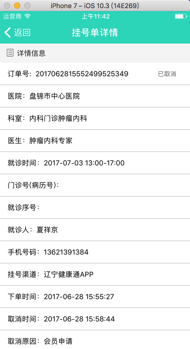

#api 优化以及新增
#### 1,新闻资讯
#### 2,专家名医直播	
#### 3, 添加意见反馈api
#### 4，挂号-订单确认
#### 5，挂号单详情
#### 6，挂号记录

## 1,新闻资讯
api: 
 	 Article/getList 
修改方案：
	修改artContentNoHtml 字段，只要返回 50个字符即可。

## 2,专家名医直播	
api: 
	live/loopPicture
	live/play?type=1
	live/play?type=0
	live/play?type=2

修改方案：
	合并成一个api 返回。

## 3, 添加意见反馈api

## 4，挂号-订单确认
api: schedule/detail

修改方案：
	现在所有的字段内容都是前端写死的，要修改成api提供字段。
	

## 5，挂号单详情
api:
	ticket/detail

修改方案：
	现在所有的字段内容都是前端写死的，要修改成api提供字段。

## 6，挂号记录
api:
	ticket/history

修改方案：
	添加搜索功能 搜索维度：1，就诊人 2，时间段。

