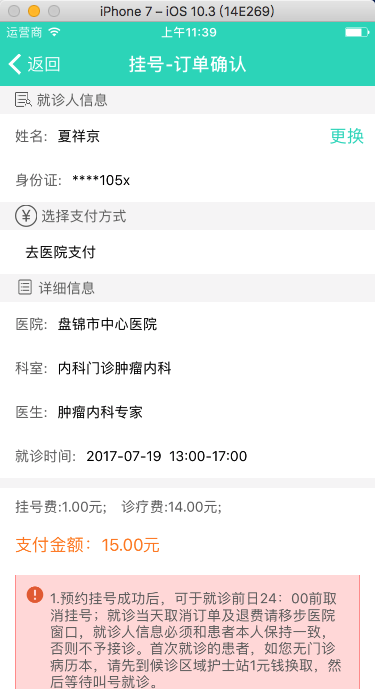
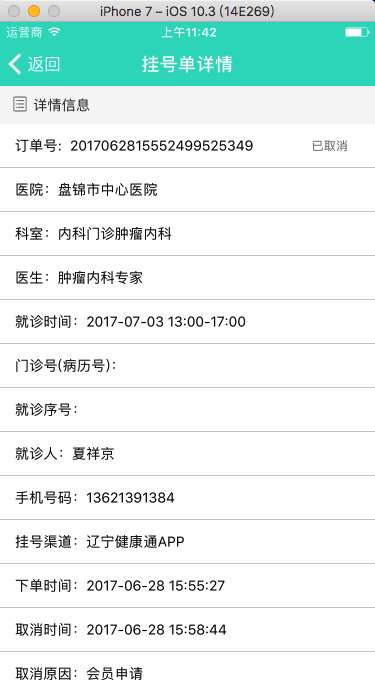

## app优化汇总.md
#### api 优化
* 1，消息推送需要有统一的新消息模版，点击推送来的消息后，统一进入共公模块，然后再选择具体的消息类型。
* 2，直播列表一个接口要分别请求三次。
* 3，订单确认页面和挂号记录及挂号历史详情页的参数字段，是客户端写死的。

* 4，获取直播信息，直播详情接口可以规划一个接口。

#### api 添加功能
* 1，要不要增加第三方登陆功能。
* 2，缓存首页的咨询列表，常年不变；还有消息列表。
* 3，挂号记录，增加筛选功能，方便查找挂号单。
* 4，意见反馈 。
* 5，市场评分。
* 6，检查版本更新。

#### android bug
* **[严重]**1,登陆一段时间后，再进入应用总是显示登陆超时，而且也不能退出。
* 2，观看回拨视频后返回列表，观看的时长没有刷新。
* 3，修改密码和手机页，切换显示明文的按钮不太好点击。
* 4，编辑视屏，列表会上下跳一下。
* 5，订单确认页，选择就诊人身份证显示有误（其他地方也是）。

#### ios bug
* 1，首页预约挂号、我的—关注管理、我的咨询、名医视频直播， 导航切换蓝色下滑条。
* 2，首页搜索  第一次点击搜索就进行搜索 以及距离左边框的距离。
* 3，首页滑动切换tab。
* 4，候诊排队，去缴费，检查检验，头部搜索条件切换不能及时获取查询结果。
* 5，我的—联系人管理 联系人信息 修改样式的位置。
* 6，我的咨询，未开通的提示信息，以及空页面的样式。
* 7，挂号订单详情提示的样式。
* 8，首页文章详情头部。
* 9，修改密码手机号下划线样式，医院简介样式。

####
1，设计标准文档

