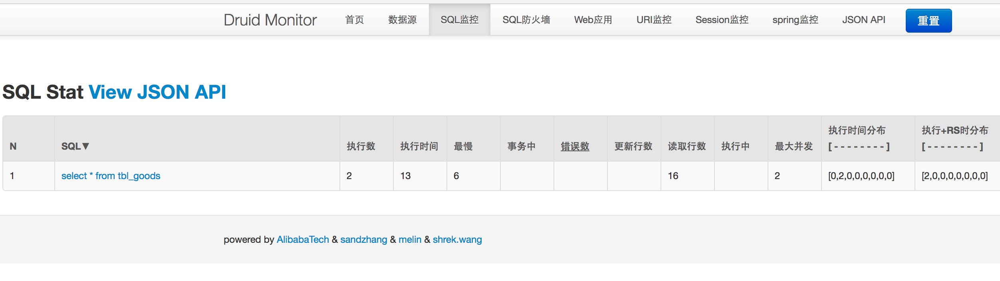

## druid_monitor 基本使用
##### 1，添加依赖包
##### 2，spring 配置
##### 3，web.xml 配置



#### 添加依赖包
gradle
```
compile 'com.alibaba:druid:1.1.0'
```
mavn

```
<dependency>
    <groupId>com.alibaba</groupId>
    <artifactId>druid</artifactId>
    <version>1.1.0</version>
</dependency>
```

#### spring 配置
```
  <!--配置数据库-->
    <bean name="dataSource" class="com.alibaba.druid.pool.DruidDataSource">
        <property name="driverClassName" value="com.mysql.jdbc.Driver"/>
        <property name="url">
            <value>jdbc:mysql://localhost:3306/arch1?useUnicode=true&amp;characterEncoding=UTF-8</value>
        </property>
        <property name="username" value="root"></property>
        <property name="password" value=""></property>


            <!--druid-->

        <!-- 配置初始化大小、最小、最大 -->
        <property name="initialSize" value="1" />
        <property name="minIdle" value="1" />
        <property name="maxActive" value="20" />

        <!-- 配置获取连接等待超时的时间 -->
        <property name="maxWait" value="60000" />

        <!-- 配置间隔多久才进行一次检测，检测需要关闭的空闲连接，单位是毫秒 -->
        <property name="timeBetweenEvictionRunsMillis" value="60000" />

        <!-- 配置一个连接在池中最小生存的时间，单位是毫秒 -->
        <property name="minEvictableIdleTimeMillis" value="300000" />

        <!--
            用来检测连接是否有效的sql，要求是一个查询语句。
            如果validationQuery为null，testOnBorrow、testOnReturn、
            testWhileIdle都不会其作用
        -->
        <property name="validationQuery" value="SELECT 1 FROM DUAL" />
        <property name="testWhileIdle" value="true" />
        <property name="testOnBorrow" value="false" />
        <property name="testOnReturn" value="false" />

        <!--
            打开PSCache，并且指定每个连接上PSCache的大小
            如果用Oracle，则把poolPreparedStatements配置为true，mysql可以配置为false
        -->
        <property name="poolPreparedStatements" value="true" />
        <property name="maxPoolPreparedStatementPerConnectionSize" value="20" />

        <!-- 配置监控统计拦截的filters，去掉后监控界面sql无法统计 -->
        <property name="filters" value="stat,wall,log4j" />

        <!--
            如果配置了proxyFilters，此配置可以不配置
            druid.stat.mergeSql=true 合并执行的相同sql，避免因为参数不同而统计多条sql语句
            druid.stat.slowSqlMillis=10000 用来配置SQL慢的标准，执行时间超过slowSqlMillis的就是慢

        <property name="connectionProperties" value="druid.stat.mergeSql=true;druid.stat.slowSqlMillis=10000" />
         -->

        <!-- 监控统计拦截的filters -->
        <!-- 并在filters属性中配置了log4j -->
        <property name="proxyFilters">
            <list>
                <ref bean="stat-filter" />
                <ref bean="log-filter" />
            </list>
        </property>

    </bean>

    <!-- 慢SQL记录-->
    <bean id="stat-filter" class="com.alibaba.druid.filter.stat.StatFilter">
        <property name="mergeSql" value="true" />
        <property name="slowSqlMillis" value="10000" />
        <property name="logSlowSql" value="true" />
    </bean>

    <bean id="log-filter" class="com.alibaba.druid.filter.logging.Log4jFilter">
        <!-- <property name="resultSetLogEnabled" value="false" /> -->
        <!-- <property name="statementExecutableSqlLogEnable" value="true" /> -->
    </bean>

     <!-- 配置druid监控spring jdbc -->
    <bean id="druid-stat-interceptor"
          class="com.alibaba.druid.support.spring.stat.DruidStatInterceptor">
    </bean>

    <bean id="pointcut" class="org.springframework.aop.support.JdkRegexpMethodPointcut"
          scope="prototype">
        <property name="patterns">
            <list>
            	<!--
            	<value>com.sishu.service.*</value>
                <value>com.sishu.dao.*</value>
                -->
                <value>你的service.*</value>
                <value>你的dao.*</value>
            </list>
        </property>
    </bean>

    <aop:config proxy-target-class="true">
        <aop:advisor advice-ref="druid-stat-interceptor" pointcut-ref="pointcut" />


    </aop:config>


```
#### web.xml 配置
```
  <!--druid-->
    <filter>
        <filter-name>DruidWebStatFilter</filter-name>
        <filter-class>com.alibaba.druid.support.http.WebStatFilter</filter-class>
        <init-param>
            <!-- 经常需要排除一些不必要的url，比如.js,/jslib/等等。配置在init-param中 -->
            <param-name>exclusions</param-name>
            <param-value>*.js,*.gif,*.jpg,*.png,*.css,*.ico,/druid/*</param-value>
        </init-param>
        <!-- 缺省sessionStatMaxCount是1000个。你可以按需要进行配置 -->
        <init-param>
            <param-name>sessionStatMaxCount</param-name>
            <param-value>1000</param-value>
        </init-param>
        <!-- druid 0.2.7版本开始支持profile，配置profileEnable能够监控单个url调用的sql列表 -->
        <init-param>
            <param-name>profileEnable</param-name>
            <param-value>true</param-value>
        </init-param>
        <init-param>
            <param-name>principalSessionName</param-name>
            <param-value>users.username</param-value>
        </init-param>
        <!-- 你可以关闭session统计功能-->
        <init-param>
            <param-name>sessionStatEnable</param-name>
            <param-value>true</param-value>
        </init-param>
    </filter>

    <servlet>
        <servlet-name>DruidStatView</servlet-name>
        <servlet-class>com.alibaba.druid.support.http.StatViewServlet</servlet-class>
        <!--
            deny优先于allow，如果在deny列表中，就算在allow列表中，也会被拒绝。
            如果allow没有配置或者为空，则允许所有访问
         -->
        <init-param>
            <param-name>allow</param-name>
            <param-value>128.242.127.1/24,127.0.0.1</param-value>
        </init-param>
        <init-param>
            <param-name>deny</param-name>
            <param-value>71.0.0.179</param-value>
        </init-param>
        <!-- 在StatViewSerlvet输出的html页面中，有一个功能是Reset All，执行这个操作之后，会导致所有计数器清零，重新计数 -->
        <init-param>
            <param-name>resetEnable</param-name>
            <param-value>false</param-value>
        </init-param>
        <!--  用户名和密码 -->
        <init-param>
            <param-name>loginUsername</param-name>
            <param-value>root</param-value>
        </init-param>
        <init-param>
            <param-name>loginPassword</param-name>
            <param-value>123456</param-value>
        </init-param>
    </servlet>
    <servlet-mapping>
        <servlet-name>DruidStatView</servlet-name>
        <url-pattern>/druid/*</url-pattern>
    </servlet-mapping>


```

#### 访问地址
http://127.0.0.1:8080/你的项目/druid/sql.html


##### 参考
https://github.com/alibaba/druid/wiki/%E5%B8%B8%E8%A7%81%E9%97%AE%E9%A2%98
http://blog.csdn.net/binglovezi/article/details/50610269


