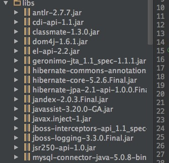
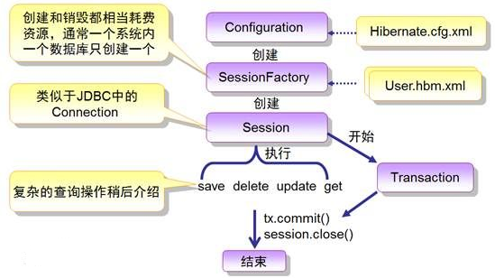

## ORM框架
	对象关系映射（英语：Object Relation Mapping，简称ORM，或O/RM，或O/R mapping），
	是一种程序技术，用于实现面向对象编程语言里不同类型系统的数据之间的转换  。
	从效果上说，它其实是创建了一个可在编程语言里使用的--“虚拟对象数据库”。

* hibernate 是一个数据持久化成的ORM框架。
* Object:对象，java对象，此处特指javaBean。
* relational:关系，二维表，数据库中的表。

## hibernate
	Hibernate是一个开放源代码的对象关系映射框架，它对JDBC进行了非常轻量级的对象封装，
	它将POJO与数据库表建立映射关系，是一个全自动的orm框架，
	hibernate可以自动生成SQL语句，自动执行，使得Java程序员可以随心所欲的使用对象编程思维来操纵数据库。 
	Hibernate可以应用在任何使用JDBC的场合，既可以在Java的客户端程序使用，
	也可以在Servlet/JSP的Web应用中使用，最具革命意义的是，
	Hibernate可以在应用EJB的J2EE架构中取代CMP，完成数据持久化的重任。

* hibernate 是轻量级javaEE应用的持久层解决方案,是一个关系数据库ORM框架
	* ORM 就是通过将java对象映射到数据库表，通过操作java对象，
		就可以完成对数据表的操作。
* hibernate提供了对关系数据库增删改查操作。

###	主流的ORM框架
* hibernate最流行ORM框架，通过对象-关系映射配置，可完全脱离sql层。
* mybatis本身是apache的一个开源项目ibatis，支持普通sql查询，存储过程和
	高级映射的优秀持久层框架。
* apache dbutils,spring JDBCTemplate。

### 优点
* hibernate对jdbc访问数据库的代码做了封装，大大简化了数据访问层繁琐的重复性代码。
* hibernate 是一个基于jdbc的主流持久化框架，是一个优秀的orm实现，它很大程度的简化了dao层编码工作。
* hibernate 使用java的反射机制。
* hibernate 的性能非常好，因为它是一个轻量级框架。映射的灵活性很出色。它支持很多关系型数据库，从一对一到多对多各种复杂关系。	

### Hibernate基本使用
#### 使用步骤
* 导入jar包。
* 创建数据库和表。
* 编写核心配置文件（hibernate.cfg.xml）配置获得链接等参数。
* 编写映射文件hibernate mapping(*.hbm.xml)bean映射

##### 导入jar包

##### 编写核心配置文件hibernate.cfg.xml
	<?xml version="1.0" encoding="UTF-8"?>
	<!DOCTYPE hibernate-configuration PUBLIC
	        "-//Hibernate/Hibernate Configuration DTD 3.0//EN"
	        "http://www.hibernate.org/dtd/hibernate-configuration-3.0.dtd">
	<hibernate-configuration>
	    <session-factory>
	        <!--数据库地址 用户名 密码 驱动-->
	        <property name="hibernate.connection.driver_class">com.mysql.jdbc.Driver</	property>
	        <property name="hibernate.connection.url">jdbc:mysql://localhost:3306/	school?useUnicode=true&amp;characterEncoding=UTF-8</property>
	        <property name="hibernate.connection.username">root</property>
	        <property name="hibernate.connection.password"></property>
	
	        <!--添加映射文件-->
	        <mapping resource="User.hbm.xml"></mapping>
	    </session-factory>
	</hibernate-configuration>

##### 编写映射文件
	<?xml version="1.0" encoding="UTF-8"?>
	<!DOCTYPE hibernate-mapping PUBLIC
	        "-//Hibernate/Hibernate Mapping DTD 3.0//EN"
	        "http://www.hibernate.org/dtd/hibernate-mapping-3.0.dtd">
	<hibernate-mapping>
	    <class name="com.hibernate.dao.User" table="user">
	        <id name="id">
	           <generator class="native"></generator>
	        </id>
	        <property name="username"></property>
	        <property name="birthday" type="java.util.Date"></property>
	        <property name="sex"></property>
	        <property name="address"></property>
	
	    </class>
	
	</hibernate-mapping>

* 扩展名 bean.hbm.xml
* 文件名称：javabean 同名	

##### javabean
	public class User {
    	private int id;
    	private String username;// 用户姓名
    	private String sex;// 性别
    	private Date birthday;// 生日
    	private String address;// 地址
	
    	public int getId() {
    	    return id;
    	}
	
    	public void setId(int id) {
    	    this.id = id;
    	}

    	public String getUsername() {
    	    return username;
    	}
	
    	public void setUsername(String username) {
    	    this.username = username;
    	}
	
    	public String getSex() {
    	    return sex;
    	}
	
    	public void setSex(String sex) {
    	    this.sex = sex;
    	}
	
    	public Date getBirthday() {
    	    return birthday;
    	}

    	public void setBirthday(Date birthday) {
    	    this.birthday = birthday;
    	}
	
    	public String getAddress() {
    	    return address;
    	}
	
    	public void setAddress(String address) {
    	    this.address = address;
    	}
	
    	@Override
    	public String toString() {
        	return "User{" +
                "id=" + id +
                ", username='" + username + '\'' +
                ", sex='" + sex + '\'' +
                ", birthday=" + birthday +
                ", address='" + address + '\'' +
                '}';
    	}
	}

##### 测试插入数据
	public void test1() {
        User user = new User();
        user.setUsername("成龙2");
        user.setAddress("香港");
        user.setSex("1");
        user.setBirthday(new Date());

        //加载配置文件获得核心配置对象
        Configuration config = new Configuration().configure();

        //获得工厂 sessionFactory 相当于连接池
        SessionFactory factory = config.buildSessionFactory();

        //获得会话session 相当于connection
        Session session = factory.openSession();
        
        //开启事物
        Transaction transaction = session.beginTransaction();

        //操作
        session.save(user);

        //提交事物
        transaction.commit();

        //释放资源 关闭session
        session.close();

        //释放资源 关闭工厂factory
        factory.close();

        System.out.println(user);

    }

##### javabean 不同的用途
* PO Persistent Object 用户与数据库交互数据。--dao层。
* BO Business Object 业务数据对象。--service层。
* VO Value Object 值对象。--web层。

#### hibernate 流程图

##### Configuration 配置对象
* hibernate 核心配置文件种类
	* hibernate.cfg.xml 通常使用xml配置文件，可以配置内容更丰富。
	* hibernate.properties 用于配置key/value 形式的内容，key不能重复。
	* 扩展api configure(String)加载指定目录下的xml 文件。

##### SessionFactory 工厂
* SessionFactory 相当于java web 连接池，用于管理所有session。
* 获得方式：config.buildSessionFactory()。
* SessionFactory hibenate 缓存配置信息（数据配置信息，映射文件，预定义HQL语句）。
* SessionFactory 线程安全，可以成员变量，多个线程同时访问，不会出现线程并发问题。
* 提供api:
	* 代开一个新的session会话  factory.openSession
	* factory.getCurrentSession()
	hibernate支持，将创建的session绑定到本地线程中，底层使用ThreadLocal,在程序之间共享
	session ,必须在hibernate.cfg.xml配置
	<property name="current_session_context_class">thread</property>

##### Session 会话
* Session 相当于JDBC的Connection 会话。
* 通过session操作PO对象--增删改查。
* session 单线程，线程不安全，不能编写成成员变量。
* session api:
	* save
	* update
	* delete 
	* get 通过id 查询，如果没有返回null。
	* load 通过id查询，如果没有抛出异常。
	* createQuery("hql") 获得Query对象。
	* createCriteria(Class) 获得Criteria对象。

##### Transaction 事物
* 开启事物 beginTransaction()
* 获得事物 getTransaction()
* 提交事物：commit()
* 回滚事件：rollback()
	try{
	   //开启
	   //session操作
	   //提交
	} catch(e){
	   //回滚
	}

