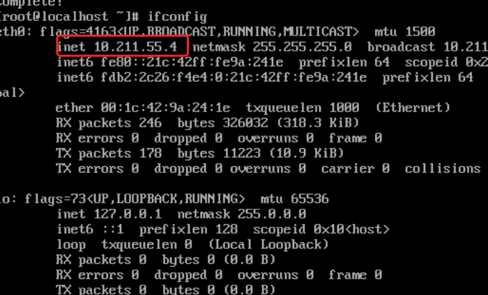
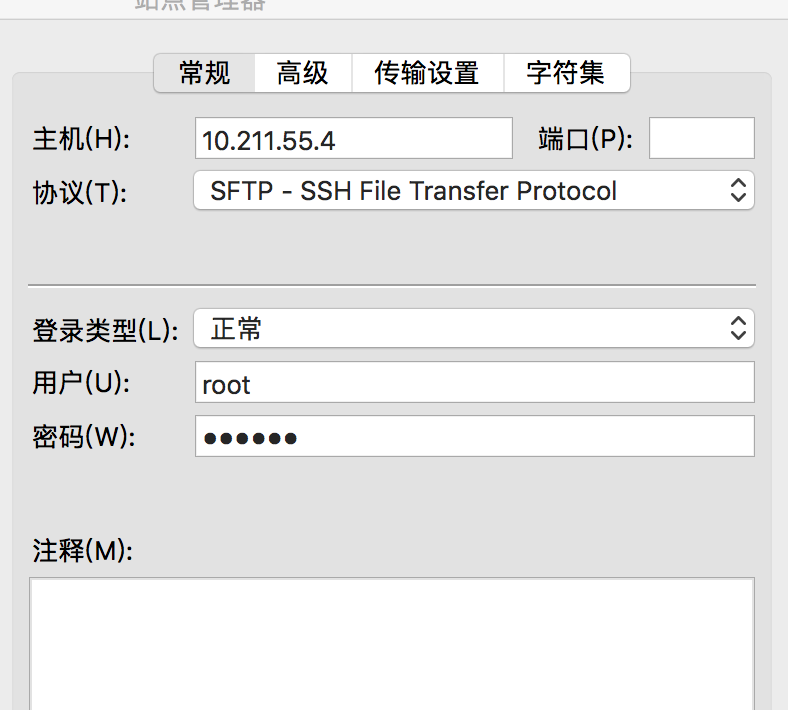

# mac上面linux虚拟机 配置开发环境
#### linux虚拟机安装
#### jdk安装
#### mysql安装
#### tomcat 安装

---------------------------------------------------
## mac 上面安装 prallels desktop 虚拟机
http://www.parallelsdesktop.cn/xiazai.html

## linux虚拟机安装
#### centos 下载
 链接: http://pan.baidu.com/s/1pLa1Xnt 密码: d5ee
 在  prallels desktop 安装centos

#### centos 安装 ifconfig命令
`yum search ifconfig`
  可以看到“net-tools.x86_64”
  安装
  `yum install net-tools.x86_64`

  输入ifconfig 可以查看虚拟机网址
  

---------------------------------------------------

## mac 工具安装
####1， mac 安装filezilla  用于本机和虚拟机文件交互
链接: http://pan.baidu.com/s/1nvc7Ypr 密码: ju4m

##### filezilla 新建站点 设置
 

####2，安装 iterm  用于连接虚拟机
* 查看文件是否存在
`cat ~/.bash_profile `
* 文件不存在创建
`touch ~/.bash_profile`
* 设置快捷方式
 `vi ~/.bash_profile`
* 添加到最后
  alias @4='ssh root@10.211.55.4'
* 使快捷方式生效  
`source ~/.bash_profile`
* 在命令行中输入
`@4  ` 
即可连接

---------------------------------------------------

## centos 安装jdk
#### 下载jdk
链接: http://pan.baidu.com/s/1bNvvTc 密码: t3yt

#### 安装jdk
* centos 创建路径
 `mkdir /usr/java`
* 通过filezilla 将jdk 上传到 /usr/java
* 解压安装包
`tar -zxvf jdk-8u131-linux-x64.tar.gz` 
* 配置环境变量
`vi /etc/profile`
在最后添加如下配置
JAVA_HOME=/usr/java/jdk1.8.0_131
export JRE_HOME=/usr/java/jdk1.8.0_131/jre
export CLASSPATH=.:$JAVA_HOME/lib/dt.jar:$JAVA_HOME/lib/tools.jar:$JRE_HOME/lib:$CLASSPATH
export PATH=$JAVA_HOME/bin:$PATH

* 使配置生效
`source /etc/profile`
* 测试
`java -version`

---------------------------------------------------

## 安装mysql
#### 安装命令
  `yum install -y mysql-server mysql mysql-deve`
#### 启动服务  
 `/bin/systemctl start  mysqld.service`

* 如果报错
Failed to start mysqld.service: Unit not found.
* 解决方案依次执行以下命令
`yum install wget`
`wget http://dev.mysql.com/get/mysql-community-release-el7-5.noarch.rpm`
`rpm -ivh mysql-community-release-el7-5.noarch.rpm`
`yum install mysql-community-server`
* 再次启动mysql
/bin/systemctl start  mysqld.service

#### 进入mysql
`mysql -u root`
* 修改ip 访问权限
`GRANT ALL PRIVILEGES ON *.* TO 'root'@'%' IDENTIFIED BY '你要设置的root密码' WITH
GRANT OPTION;`

--------------------------------------------------------------------------------
##安装tomcat
#### tomcat 安装包
链接: http://pan.baidu.com/s/1c2qx5fU 密码: pjsb
#### 安装
* 创建tomcat存放路径
`mkdir /usr/tomcat`
* 通过通过filezilla上传安装包
* 解压
`tar -zxvf apache-tomcat-8.5.14.tar.gz`

#### 启动tomcat
切换到tomcat bin目录下面
`sh startup.sh`
#### 在浏览器上访问
`http://10.211.55.4:8080/`
有可能访问不到 关闭防火墙

####关闭防火墙
* 停止firewall
systemctl stop firewalld.service 
* 禁止firewall开机启动
systemctl disable firewalld.service 
刷新浏览器就可以访问Tomcat了

#### 上传应用到webapps下面重启服务器就可以访问自己的网站了
* 不能访问重启tomcat 就可以了

