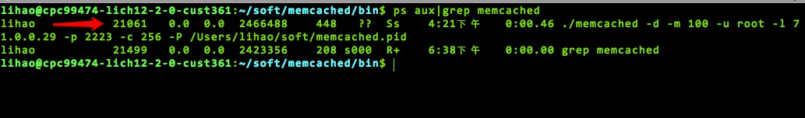

## Memcached 涉及以下内容
##### 1，Memcached 基本概念
##### 2，Memcached 安装
##### 3，Memcached 基本命令
##### 4，Memcached 原理
##### 5，stats 命令
##### 6，stats items 数据项统计
##### 7，stats settings 查看设置
##### 8，stats slabs区块统计
##### 9，Memcached的数据存储过程

##### Memcached 是什么
> Memcached  是一款开源的，高性能的，分布式的内存对象缓存系统。

##### Memcached能干什么
> 最主要的功能就是：在内存中缓存数据,以减轻数据库负载。
它通过在内存中缓存数据和对象来减少读取数据库的次数，从而提高动态数据库驱动网站的速度。

##### Memcached  特点
* 在内存中以key/value 对存储，性能好。
* 协议简单(基于文本行)，功能强大。
* 基于libevent的事件处理，无阻塞通信，对内存读写数据非常快。
* 基于客户端的分布式，服务器多个Memcached之间不互相通信。
* 服务器端以守护进程运行，客户端可以用任何语言来编写。

### 安装Memcached服务器端
#####  1. 需要安装libevent.
* libevent是个程序库,它将Linux的epoll、BSD类操作系统的kqueue等事件 处理功能封装成统一的接口,具有很高的性能。
>下载 wget https://github.com/libevent/libevent/releases/download/release-2.1.8-stable/libevent-2.1.8-stable.tar.gz
解压 tar vxf  libevent-2.1.8-stable.tar.gz
.configure --prefix=/usr/common/libevent 
make & make install

#####  2. 安装Memcached.
> 下载 wget http://www.memcached.org/files/memcached-1.4.37.tar.gz
解压 tar vxf memcached-1.4.37.tar.gz
./configure --prefix=/usr/common/memcached --with-libevent=/usr/common/libevent/
make & make install

### Memcached 基本命令
#### 启动服务器端
> cd /usr/common/memcached
./memcached -d -m 100 -u root -l 71.0.0.29 -p 2223 -c 256 -P /usr/pid/memcached.pid

-d 选项是启动一个守护进程 。
-m 是分配给Memcache使用的内存数量,单位是MB,这里是100MB 。
-u 是运行Memcache的用户,这里是root 。
-l 是监听的服务器IP地址,这里指定了服务器的IP地址71.0.0.29。
-p 是监听的端口,这里设置了2223,最好是1024以上的端口 。
-c 选项是最大运行的并发连接数,默认是1024,这里设置了256 。
-P 是设置保存Memcache的pid文件,这里是保存在 /usr/pid/memcached.pid。
常用的还有几个需要了解:
-f 块大小增长因子,默认是1.25。
-n 最小分配空间, key+value+flags 默认是 65byte。
-I 每个slab page的大小。
-v/-vv 详细显示工作时各种参数。

#### 关闭Memcached
> ps aux|grep memcached
kill pid

### Memcached的基本原理
##### Memcached的基本的工作原理
> Memcached 是以守候程序的方式运行与一个或者多个服务器，
随时等待客户端的链接。通过启动Memcached服务器端，配置相应的监听
IP,端口内存大小等参数，客户端通过制定的服务器端IP，将数据以key/value的方式存储。

##### Memcached 的两阶段哈希
>  客户端存取数据时，首先参考节点列表计算出key的哈希值（阶段一 哈希），
进而选中一个节点；客户端将请求发送给选中的节点，然后Memcached节点通过
一个内部的哈希算法（阶段二哈希），进行真正的数据（item）存取。

Memcached 的服务器客户端通信并不适用复杂的xml等格式，而使用简单的基于
文本行的协议。因此，通过telnet 也能在Memcached 上保存，取得数据。

### Memcached的操作命令
* 命令行连接 Memcached
>	telnet 71.0.0.29 2223
* 标准协议：Memcached所有的标准协议包含在item执行命令过程中，一个item包含两行：
> 第一行：Key flags expirationTime Bytes
Key:Key 用于查找缓存值 。
Flags:一个32位的标志值,客户机使用它存储关于键值对的额外信息 。
Expirationtime:在缓存中保存键值对的时长(以秒为单位,0表示永远) 。
Bytes:在缓存中存储的字节数。

> 第二行:Value:存储的值(始终位于第二行)

> noreply:可以在命令的第一行后面加入noreply,以避免在处理交互命令的时候,等待服
务端的返回
向Memcached写入值

##### 常用命令有:set、add、replace、append、prepend、cas，delete
* 1:set:用于向缓存添加新的键值对,如果键已经存在,则之前的值将被替换。

* 2:add:仅当缓存中不存在键时,add命令才会向缓存中添加一个键值对,如果缓存中已经存
在键,则之前的值将仍然保持,服务器响应 NOT_STORED。

* 3:replace:仅当键已经存在时,replace命令才会替换缓存中的键。如果缓存中不存在键,
服务器响应NOT_STORED。

* 4:append:是在现有缓存数据后面新增数据。如果key不存在,服务器响应 NOT_STORED。

* 5:prepend:是在现有缓存数据前面新增数据。如果key不存在,服务器响应 NOT_STORED。

* 6:cas(Check And Set ):检查和更新,只有从你读取数据后,别人没有更新这 个数据,才能够正确保存。就是版本控制,通常和gets配合使用。
获取数据的命令有:get 、 gets get用来获取数据,gets获取的是数据+版本号。

* 7: 删除数据的命令:delete。

>  set k1 0 0 5
  lihao
  STORED
  --------------
> add s2 0 0 5
lihao
STORED

### 命令stats
stats命令:查询服务器的运行状态和其他内部数据。

* pid :服务器进程 ID。
* uptime :服务器运行时间,单位秒。
* time:服务器当前的 UNIX 时间 。
* version :服务器的版本号 5:libevent:libevent的版本。
* pointer_size :服务器操作系统位数。
* rusage_user:该进程累计的用户时间 
* rusage_system:该进程累计的系统时间
* curr_connections : **当前连接数**
* total_connections :**服务器启动后总连接数**
* connection_structures :服务器分配的连接结构的数量。
* reserved_fds:内部使用的miscfds 数量。
* cmd_get :**获取请求数量**
* get_hits :**获取成功的总次数,命中次数** 
* get_misses :**获取失败的总次数** 
* cmd_set :**存储请求数量**
* delete_misses :**删除失败次数** 
* delete_hits :**删除命中**
* bytes :已用缓存空间
* bytes_read :总共获取的数据量
* bytes_written :总写入数量数
* limit_maxbytes :总允许写入的数据量,和分配的内存有关
* accepting_conns:允许的总连接数
* curr_items： 当前缓存 item 数量
* total_items :从服务启动后,总的存储缓存 item 数量
* evictions :通过删除 item 释放内存的次数

##### 这些数据隐含的几个基本关系：
1，缓存命中率 = get_hits/cmd_get * 100%
2, get_misses的数字加上get_hits应该等于cmd_get。
3，flush_all命令:使内存中所有的item失效。加入参数则表示在N秒后失效。这个操作并不
会真的释放内存空间,而是标志所有的item为失效。
4，version 命令 ： 查看版本。

### stats settings 查看设置
* maxbytes:最大字节数限制,0无限制
* maxconns:允许最大连接数
* growth_factor:增长因子 
* chunk_size:key+value+flags大小
* reqs_per_event: 最大IO吞吐量(每event)

### stats items 数据项统计
* number: 该slab中对象数，不包含过期对象。
* age：LRU队列中最老对象的过期时间.
* evicted: LRU释放对象数.
* evicted_nonzero: 设置了非0时间的LRU释放对象数。
* evicted_time: 最后一次LRU秒数,监控频率。

### stats slabs区块统计
* chunk_size: chunk大小，byte
* chunks_per_page: 每个page的chunk数量
* total_pages : page数量
* total_chunks: chunk数量*page数量
* get_hits: 命中数。
* used_chunks： 已被分配的chunk数
* free_chunks：剩余chunk数
* total_chunks： 总chunk数  used_chunks+free_chunks
* mem_requested： 请求存储的字节数。
* active_slabs：slab数量。
* total_malloced：总内存数量。
被浪费内存数=((total_chunks或者used_chunks) * chunk_size) - mem_requested,如 果太大,需要调整factor。

### Memcached的数据存储
##### Memcached的数据存储方式被称为Slab Allocator,其基本方式是: 

1:先把内存分成很多个Slab,这个大小是预先规定好的,以解决内存碎片的问题。
分配给Slab的内存空间被称为Page,默认是1M。一个Slab下可以有多个Page。 

2:然后把一个Page分成很多个chunk块,chunk块是用于缓存记录的空间。Chunk的
大小是先有一个基本值,然后根据增长因子来增大。

3:slab class:内存区类别(48byte-1M),每个类别有一个slab classId 

4:Memcached里面保存着slab内空闲的chunk列表,当收到要保存的item的时候,它
会根据item的大小,去选择一个最合适的slab,然后找到空闲的chunk,把数据 存放进去。

##### 新建Item分配内存过程
1:快速定位slab classid,先计算Item长度
  key键长 + flag长度+value值长+65
  如果>1MB，无法存储丢弃。
  取最小冗余的slab class
		如:有48,96,120,存90会选择96

2:按顺序寻找可用chunk

(1)slot:检查slab回收空间slot里是否有剩余chunk 
		delete:delete时标记到slot
 		exptime:get时检查的过期对象标记到slot
(2)end_page_ptr:检查page中是否有剩余chunk 

(3)memory:内存还有剩余空间可以用于开辟新的slab

(4)LRU

##### Memcached的数据存储方式的缺点：
	由于chunk的大小是预先分配好的特定长度,因此如果数据不能完全填满
chunk,那么剩余的空间就浪费了。

 Lazy Expiration(延迟/惰性 过期)
 	Memcached不会监控记录是否过期,而是在外部来获取数据的时候,才检查
记录的时间戳,因此称为Lazy Expiration。

LRU(Least Recently Used 最近最少使用)
	当空间不足的时候,Memcached会优先使用已经过期的数据空间,如果还不
  够,那么就会把最近最少使用的对象的空间释放出来使用。

懒惰删除机制 
	删除item对象时,不释放内存,作删除标记,指针放入slot回收插槽,下
次分配的时候直接使用。

要特别注意:Memcached的LRU不是全局的,而是针对slab的,可以说是区域性的。 

