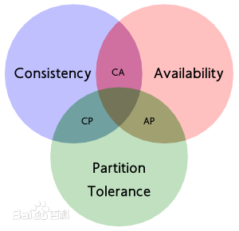

#### 本文涉及以下内容

###### mongodb简介
###### MongoDB特点
###### NoSQL简介
###### CAP 原则
###### 与BASE的关系
######  MongoDB安装

#### mongodb简介
	MongoDB 是一个使用C++编写的，开源的，面向文档的NoSQL(Not Only SQL)数据库。
	NoSQL的意思是“不仅仅是SQL”,是目前流行的“非关系型数据库”的统称。
    常见的NoSQL数据库如:Redis、CouchDB、MongoDB、HBase、Cassandra等。

#### MongoDB特点
* 高性能、易于使用、易于扩展、功能丰富 
* 面向集合存储,模式自由 
* 支持动态查询,支持javascript表达式查询 
* 支持索引
* 支持副本集复制和自动故障恢复 
* 自动处理分片
* 支持二进制和大型对象数据 
* 文件存储格式为BSON(JSON的一种扩展)    


#### NoSQL 
##### NoSQL解决了哪些问题
* 1，对数据库高并发读写的需求。
* 2，对海亮数据的高效率和访问的需求。
* 3，对数据库的高可扩展性和高可用性的需求。

##### NoSQL的优点
* 扩展简单方便,尤其是水平横向扩展(纵向扩展是指用更强的机器;横向扩展是指把数据分散到多个机器)。

* 读写快速高效,多数都会映射到内存操作 。

* 成本低廉,用普通机器,分布式集群即可 。

* 数据模型灵活,没有固定的数据模型。


#### CAP 原则
	CAP原则又称CAP定理，指的是在一个分布式系统中， 
	Consistency（一致性）、 Availability（可用性）、Partition tolerance（分区容错性），三者不可得兼

* 1: 强一致性(Consistency):系统在执行过某项操作后仍然处于一致的,在分布式系统中,更 新操作执行成功后所有的用户都应该读取到最新的值,这样的系统被认为具有强一致性。

* 2: 可用性(Availability): 每一个操作总是能够在一定的时间内返回结果。

* 3: 分区容错性(Partition tolerance): 系统在存在网络分区的情况下仍然可以接受
	请求并处理，这里网络分区是指由于某种原因网络被分成若干个孤立区域，而区域之间互不相通

** 根据CAP 原理将数据库分成了满足CA原则，满足CP原则和满足AP原则三大类 **	

* CA: 单点集群，满足一致性，可用性，通常在可扩展上不太强大，比如关系型数据库。

* CP: 满足一致性和分区容错性，通常性能不是特别高，如分布式数据库。

* AP: 满足可用性和分区容错性，通常可能对一致性要求低一些，如大多数的NoSQL。



#### 与BASE的关系
	BASE就是为了解决关系数据库强一致性引起的问题而引起的可用性降低而提出的解决方案。
	BASE(Basically Available,Soft-state,Eventual consistency )

* 1: 基本可用(Basically Available): 系统能够基本运行，一直提供服务。

* 2: 软状态(Soft-state): 系统不要求一直保持强一致状态。

* 3: 最终一致性(Eventual consistency):系统需要在某一时刻后达到一致性要求。


####  MongoDB安装
1，下载https://www.mongodb.com/download-center#community。
2，然后tar zvxf 解压。
3，拷贝到相应的文件夹即可。

##### 启动
1,新建一个文件 指定数据库 日志 存储位置
mdb.conf
```
dbpath=../dbs
logpath=../logs/log
fork=true
nojournal = true
```
** ./mongod -f mdb.conf **

可选参数：

* port   指定服务端口号,默认端口27017。

* bind_ip  绑定服务IP,若绑定127.0.0.1,则只能本机访问,不指定默认本地所有IP。

* logpath 指定MongoDB日志文件,注意是指定文件不是目录。

* fork 以守护进程的方式运行MongoDB,创建服务器进程。

* auth 启用验证。

* dbpath 指定数据库路径。

* journal 启用日志选项,MongoDB的数据操作将会写入到journal文件夹的文件里。

* maxConns 最大同时连接数 默认2000 。

./mongod -help  查看更多配置。

##### 关闭
1:如果是在Shell里面启动的,ctrl+c退出shell就关闭了。
 2:如果是在后台启动的,运行 pkill mongod。
3:也可以进入javascript shell,切换到admin数据库,运行db.shutdownServer()。


####后台启动
./mongod -f mdb.conf
```
	dbpath=../dbs
	logpath=../logs/log1
	fork=true
```	


#mongoDB  数据库
##mongoDB  数据库概念
	MongoDB的一个实例可以拥有一个或多个相互独立的数据库，每个数据库都有自己的集合。

## 集合
	集合可以看作是拥有动态模式的表。

## 文档	
	文档是MongoDB中基本的数据单元，类似关系型数据库表的行。
	文档是键值对的一个有序集合。

## _id
	每个文档都有个特殊的"_id",在文档所属集合中是唯一的。

## mongo命令 链接MongoDB 数据库时 会进入 javascript shell
	MongoDB自带了一个功能强大的JavaScript Shell,可以用于管理或操作MongoDB。

## 数据库命名规则

	* 1:不能是空串。

	* 2:不得含有/、\、?、$、空格、空字符等等,基本只能使用ASCII中的字母和数字 。

	* 3:区分大小写,建议全部小写。

	* 4:最多为64字节。

	* 5:不得使用保留的数据库名,比如:admin,local,config 

	注意:数据库最终会成为文件,数据库名就是文件的名称。

## 集合名称定义规则
   * 1: 不能是空串。

   * 2: 不能包含\0字符(空字符),这个字符表示集合名的结束,也不能包含”$”。

   * 3: 不能以”system.”开头,这是为系统集合保留的前缀

## 文档的key定义规则
	* 1: 不能包含\0字符(空字符),这个字符表示键的结束。
	* 2: “.”和“$”是被保留的,只能在特定环境下用。
	* 3: 区分类型,同时也区分大小写。
	* 4: 键不能重复

	注意:文档的键值对是有顺序的,相同的键值对如果有不同顺序的话,也是不同的文档。


## 数据库操作

显示现有的数据库。

```
	show dbs

	leyue   0.078GB
	local   0.078GB
	mongo   0.078GB
	mycol   0.078GB
	mydb    0.078GB
	testdb  0.078GB
```

 显示当前使用的数据。

```

	db
```

切换当前使用的数据库。

```
	use leyue
```	
	
创建数据库

```	
	use 数据库名称
	db.集合名称.insert({"name":"wang wu"})

	创建数据库:MongoDB没有专门创建数据库的语句,可以使用“use” 来使用某个数据库,如果要使用
的数据库不存在,那么将会创建一个,会在真正向该库加入文档后,保存成为文件。

```

删除数据库

```
	use 数据库名称
	db.dropDatabase()

```	

# 集合的操作
#### 创建集合

```
	创建集合:在MongoDB中不用创建集合,因为没有固定的结构,直接使用db.集合名称.命令 来操作就可
以了。如果非要显示创建集合的话,用:db.createCollecion(“集合名称”);

```	

#### 显示现有的集合

```
	use leyue

	show collections

```	
	
#### insert 可以插入一个用{} 多条数据用[]

```	
	db.userdatas.insert([ {"name":'lisan',"age":23},{"name":"wang wu","age":33} ])
```
	1:MongoDB会为每个没有“_id”字段的文档自动添加一个”_id”字段
	2:每个Doc必须小于16MB

#### 删除文档 db.集合.remove()

```	
	db.userdatas.remove({"name":"lisan"})
```

#### 查看数据库 文档状态 可以看到文档的个数大小 等等信息

```	
	数据库： db.stats()
	文档：db.集合.stats
	db.stats()
	{
		"db" : "leyue",
		"collections" : 4,
		"objects" : 418,
		"avgObjSize" : 110.77511961722487,
		"dataSize" : 46304,
		"storageSize" : 192512,
		"numExtents" : 6,
		"indexes" : 2,
		"indexSize" : 32704,
		"fileSize" : 67108864,
		"nsSizeMB" : 16,
		"extentFreeList" : {
			"num" : 0,
			"totalSize" : 0
		},
		"dataFileVersion" : {
			"major" : 4,
			"minor" : 22
		},
		"ok" : 1
	}

	db.userdatas.stats()
	{
		"ns" : "leyue.userdatas",
		"count" : 11,
		"size" : 1040,
		"avgObjSize" : 94,
		"numExtents" : 1,
		"storageSize" : 8192,
		"lastExtentSize" : 8192,
		"paddingFactor" : 1,
		"paddingFactorNote" : "paddingFactor is unused and unmaintained in 3.0. It 	remains hard coded to 1.0 for compatibility only.",
		"userFlags" : 1,
		"capped" : false,
		"nindexes" : 1,
		"totalIndexSize" : 8176,
		"indexSizes" : {
			"_id_" : 8176
		},
		"ok" : 1
	}

```

#### 查看集合中所有的文档

```
	db.集合名称.find();
	db.userdatas.find()
	{ "_id" : ObjectId("59789a56bc629e73c4f09e1c"), "name" : "wang wu", "age" : 45 }
	{ "_id" : ObjectId("59789a74bc629e73c4f09e1e"), "name" : "wang wu", "age" : 8 }
	{ "_id" : ObjectId("59789ac0bc629e73c4f09e20"), "name" : "wang wu", "age" : 33 }
	{ "_id" : ObjectId("597f357a09c84cf58880e40e"), "name" : "u1", "age" : 37 }
```


#### 文档替换 db.集合名称.update(条件,新的文档);只会修改符合条件的第一个文档。

```
db.test.update({"age":12},{"address":"北京","name":"老王"})
```

#### $set :指定一个字段的值,如果字段不存在,会创建一个.

```
db.test.update({"name":"u1"},{"$set":{"name":"u2"}},0,1)
```

#### $unset :删掉某个字段
```
db.test.update({"name":"u1"},{"$unset":{"address":1}},0,1)
```

#### $push:向已有数组的末尾加入一个元素,要是没有就新建一个数组。

```
db.test.update({"name":"u1"},{"$push":{"score":2}},0,1)
```

#### $each:通过一次$push来操作多个值
```
db.test.update({"name":"u1"},{"$push":{"score":{"$each":[4,5,6]}}})
```

#### save方法 
如果文档存在就更新,不存在就新建,主要根据”_id”来判断。
```
	db.test.save({"name":"li si"})
```


#### update
第三个参数 0 表示查找不到，不增加一个文档   1表示查找不到，增加文档
第四个参数 0 表示只更新第一个   1 更新所有查找到的文档
1:只能用在$XXX的操作中
2:最好每次都显示的指定update的第4个参数,以防止服务器使用默认行为 
  查询更新了多少个文档


## find

#### find(条件,显示的字段)
```
db.userdatas.find({},{name:1,_id:0})
``

#### 比较操作:$lt,$lte,$gt,$gte,$ne

```
	db.userdatas.find({age:{$gte:35}})
	30<=age<=35
	db.userdatas.find({age:{$lte:35,$gte:30}})
```	

#### $and:包含多个条件,他们之间为and的关系

```
	db.userdatas.find({"name":"u5",age:{$gt:33}})
	db.userdatas.find({$and:[{"name":"u5"},{age:{$gt:33}}]})
```	

#### $or :包含多个条件,他们之间为or的关系 ,$nor相当于or取反

```
	 db.userdatas.find({$or:[{"name":"u5"},{age:{$gt:33}}]})
```	 

#### $not:用作其他条件之上,不能作为顶级查询，后面可跟条件，正则

```
	db.userdatas.find({age:{$not:{$lt:35}}})
	db.userdatas.find({name:{$not:/wang/}})
```	

#### $mod:将查询的值除以第一个给定的值,如果余数等于等二个值则匹配成功。

```
	db.userdatas.find({age:{$mod:[10,7]}})
	db.userdatas.find({age:{$not:{$mod:[10,7]}}})
```	

#### $in :查询一个键的多个值,只要键匹配其中一个即可 , $nin为不包含

```
	db.userdatas.find({age:{$in:[33,35]}})
	db.userdatas.find({age:{$nin:[33,35]}})
```	

#### $all:键需要匹配所有的值,用于数组

```	
	db.userdatas.find({score:{$all:[7,4]}})
```	

#### $exists:检查某个键是否存在,1表示存在,0表示不存在
```
	db.userdatas.find({"score":{$exists:1}})
```	

#### null类型:不仅能匹配键的值为null,还匹配键不存在的情况

```
	db.userdatas.find({score:null})
	db.userdatas.find({name:{$in:[null],$exists:1}})	
```	

#### 正则

```
	MongoDB使用Perl兼容的正则表达式(PCRE),
	比如: db.users.find({“name”:/sishuok/i}); 
	又比如: db.users.find({“name”:/^sishuok/});
```	

## 数组搜索

#### 单个元素匹配,就跟前面写条件一样,{key:value}
```
	db.userdatas.find({score:0})
```	

#### 多个元素匹配,使用$all, {key:{$all:[a,b]}},元素的顺序无所谓

```
	db.userdatas.find({score:{$all:[2,0]}})
```	

#### 可以使用索引指定查询数组特定位置, {“key.索引号”:value}	

```
	db.userdatas.find({"score.0":7})  索引从0开始
```	

#### 查询某个长度的数组,使用$size
```
	db.userdatas.find({"score":{$size:4}})
```	

####  指定子集,使用$slice,正数是前面多少条,负数是尾部多少条,也可以指定偏
移量和要返回的元素数量,比如:$slice:[50,10]

```
	db.userdatas.find({},{"score":{$slice:2}})
	db.userdatas.find({},{"score":{$slice:-2}})
	db.userdatas.find({},{"score":{$slice:[1,1]}})
```	

#### 可以使用$来指定符合条件的任意一个数组元素,如:{”users.$”:1}

```
	db.userdatas.find({"score":{$in:[7,4]}},{"score.$":1,name:1})
```	

#### $elemMatch:要求同时使用多个条件语句来对一个数组元素进行比较判断

```
	db.userdatas.find({score:{$elemMatch:{$gt:8,$lt:12}}})
```	


##查询内嵌文档
1:查询整个内嵌文档与普通查询是一样的 。

2:如果要指定键值匹配,可以使用“.” 操作符,比如:{“name.first”:”a” ,“name.last”:”b”} 。

3:如果要正确的指定一组条件,那就需要使用$elemMatch,以实现对内嵌文档的多个键进行匹配操作。	

```
插入一个文档：
	db.userdatas.update({"name":"u2"},{$set:{wendang:{"yw":80,"xw":90}}})
查询文档：
	 db.userdatas.find({"wendang.yw":80})

``
#### 查询记录条数的命令：count
1,直接使用count()的话，得到的是整个记录的条数。

2，如果要获取按条件查询后记录的条数，需要指定count(true 或者非0 的数)

```
	db.userdatas.find().count()
	db.userdatas.find().limit(2).count(true)
```	


#### 限制返回的记录条数的命令：limit(要返回的条数)	 
```	
	db.userdatas.find().limit(2)
```	

#### 限制返回的记录条数起点的命令:skip(从第几条开始返回)
```
	db.userdatas.find().skip(0).limit(2)
```	

#### 排序的命令:sort({要排序的字段:1为升序,-1为降序})
```
	db.userdatas.find().sort({age:-1})	
	db.userdatas.find().sort({age:-1}).limit(2)
```	


#### 分页
分页查询:组合使用limit,skipt和sort  skip 效率低
当然也可以使用其他方式来分页,比如采用自定义的id,然后根据id来分页


#### 查询给定键的所有不重复的数据,命令:distinct
```
     语法:db.runCommand({“distinct”:集合名,“key”:”获得不重复数据的字段”});
     db.runCommand({"distinct":"userdatas","key":"age"})

     db.runCommand({"distinct":"userdatas","key":"age"})
	{
		"waitedMS" : NumberLong(0),
		"values" : [
			45,
			8,
			33,
			37,
			78,
			32,
			30,
			20
		],
		"stats" : {
			"n" : 11,
			"nscanned" : 0,
			"nscannedObjects" : 11,
			"timems" : 0,
			"planSummary" : "COLLSCAN"
		},
		"ok" : 1
	}

```     


#### 游标
1:获取游标,示例如下:
var c = db.users.find();

2:循环游标,可以用集合的方式,示例如下:
   while(c.hasNext()){
         printjson(c.next().文档键);
} 
3:也可以使用forEach来循环,示例如下:

   c.forEach(function(obj){
         print(obj);
}); 


## mondodb聚合框架
#### 简介
	MongoDB的聚合框架，主要用来对集合中的文档进行变换和组合，
	从而对数据进行分析加以利用。

聚合框架的基本思想是：采用多个构建来创建一个管道，用于对一连串的文档进行处理。
这些构建包括：筛选(filtering),投影(projecting),分组(grouping),排序(sorting),
限制(limiting)和跳过(skipping)。	

#### 使用聚合框架的方式
	db.集合.aggregate(构建1,构建2,构建3...)
	注意: 由于聚合的结果要返回到客户端，因此聚合结果必须限制在16M以内，这是MomgoDB支持的
	最大响应消息的大小。

    生产测试数据
    
    ```
    	for(var i=0;i<100;i++){
			for(var j=0;j<4;j++){ db.scores.insert({"studentId":"s"+i,"course":"课程"+j,"score":Math.random()*100});
			}
		 }

    ```
    将产生400条数据：
    ```
    { "_id" : ObjectId("597ffbc1d8c0f25813bcc58b"), "studentId" : "s0", "course" : "课程0", "score" : 5.999703989474325 }
	{ "_id" : ObjectId("597ffbc1d8c0f25813bcc58c"), "studentId" : "s0", "course" : "课程1", "score" : 5.040777429297738 }
	{ "_id" : ObjectId("597ffbc1d8c0f25813bcc58d"), "studentId" : "s0", "course" : "课程2", "score" : 63.74926111710963 }
	{ "_id" : ObjectId("597ffbc1d8c0f25813bcc58e"), "studentId" : "s0", "course" : "课程3", "score" : 66.50186953829127 }
	{ "_id" : ObjectId("597ffbc1d8c0f25813bcc58f"), "studentId" : "s1", "course" : "课程0", "score" : 84.74255359132857 }
	{ "_id" : ObjectId("597ffbc1d8c0f25813bcc590"), "studentId" : "s1", "course" : "课程1", "score" : 85.7428949944855 }
	{ "_id" : ObjectId("597ffbc1d8c0f25813bcc591"), "studentId" : "s1", "course" : "课程2", "score" : 33.198227427842056 }
	{ "_id" : ObjectId("597ffbc1d8c0f25813bcc592"), "studentId" : "s1", "course" : "课程3", "score" : 5.346516072417174 }
	{ "_id" : ObjectId("597ffbc1d8c0f25813bcc593"), "studentId" : "s2", "course" : "课程0", "score" : 97.1040803312415 }
	{ "_id" : ObjectId("597ffbc1d8c0f25813bcc594"), "studentId" : "s2", "course" : "课程1", "score" : 20.47611488352149 }
   ...
    ```
#### 管道操作符简介
	每个操作符接受一系列的文档，对这些文档做响应的处理，然后把转换后的文档作为文档传递给下一个操作符。
	最后一个操作符会将结果返回。

#### 管道操作符$match
	用于文档集合进行筛选，里面可以使用所有常规的操作符。通常会放置在管道最前面的位置，
	理由如下：
	1：快速将不需要的文档过滤，减少后续操作的数据量。
	2：在投影和分组之前做筛选，查询可以使用索引

	查找score大于90的三条数据 
	db.scores.aggregate({"$match":{"score":{$gt:90}}},{"$limit":3})
	```
	{ "_id" : ObjectId("597ffbc1d8c0f25813bcc593"), "studentId" : "s2", "course" : "课程0", "score" : 97.1040803312415 }
	{ "_id" : ObjectId("597ffbc1d8c0f25813bcc5a6"), "studentId" : "s6", "course" : "课程3", "score" : 95.37347295013626 }
	{ "_id" : ObjectId("597ffbc1d8c0f25813bcc5ab"), "studentId" : "s8", "course" : "课程0", "score" : 90.49825247672626 }

	```

#### 管道操作符$project
    用来从文档中提取字段，可以指定包含和排除字段，也可以重命名字段。

    只显示studentId score

    db.scores.aggregate({"$match":{"score":{$gt:90}}},{"$project":{studentId:1,score:1,_id:0}},{"$limit":3})

```
{ "studentId" : "s2", "score" : 97.1040803312415 }
{ "studentId" : "s6", "score" : 95.37347295013626 }
{ "studentId" : "s8", "score" : 90.49825247672626 }

```    
	把 studentId 重命名为 sid
	db.scores.aggregate({"$match":{"score":{$gt:90}}},{"$project":{"sid":"$studentId",score:1,_id:0}},{"$limit":3})

```
	{ "score" : 97.1040803312415, "sid" : "s2" }
	{ "score" : 95.37347295013626, "sid" : "s6" }
	{ "score" : 90.49825247672626, "sid" : "s8" }

```	
	管道操作符还可以使用表达式，以满足更复杂的需求。
##### 支持的操作符和相应的语法：
* 1:$add : [expr1[,expr2,...exprn]] 
* 2:$subtract:[expr1,expr2]
* 3:$multiply:[expr1[,expr2,...exprn]] 
* 4:$divice:[expr1,expr2] 5:$mod:[expr1,expr2]

db.scores.aggregate({"$match":{"score":{$gt:90}}},{"$project":{"sid":"$studentId","score":1,_id:0,"newScore":{$add:["$score",20]}}},{"$limit":3})
```
{ "score" : 97.1040803312415, "sid" : "s2", "newScore" : 117.1040803312415 }
{ "score" : 95.37347295013626, "sid" : "s6", "newScore" : 115.37347295013626 }
{ "score" : 90.49825247672626, "sid" : "s8", "newScore" : 110.49825247672626 }

```

#### 管道操作符$project的日期表达式
合框架包含了一些用于提取日期信息的表达式,如下: $year、$month、$week、$dayOfMonth、$dayOfWeek、$dayOfYear、$hour、$minute、 $second 。
 插入一条日期的文档
 db.userdatas.insert({"date":new Date()})
 { "_id" : ObjectId("5983f5c88eec53fbcd56a7ca"), "date" : ISODate("2017-08-04T04:19:20.693Z") }

 db.userdatas.aggregate({"$match":{"_id":ObjectId("5983f5c88eec53fbcd56a7ca")}},
 {"$project":{"year":{"$year":"$date"},"month":{"$month":"$date"}}})

 { "_id" : ObjectId("5983f5c88eec53fbcd56a7ca"), "year" : 2017, "month" : 8 }

#### 管道操作符$project的字符串表达式

* 1:$substr : [expr,开始位置,要取的字节个数]
* 2:$concat:[expr1[,expr2,...exprn]]
* 3:$toLower:expr
* 4:$toUpper:expr

db.scores.aggregate({"$project":{"sid":{"$concat":["$studentId","--"]}}},{"$limit":2})


#### 管道操作符$project的逻辑表达式
1:$cmp:[expr1,expr2] :比较两个表达式,0表示相等,正数前面的大,负数后面的大 
2:$strcasecmp:[string1,string2] :比较两个字符串,区分大小写,只对由罗马字符组成的
字符串有效
3:$eq、$ne、$gt、$gte、$lt、$lte :[expr1,expr2]
4:$and、$or、$not 5:$cond:[booleanExpr,trueExpr,falseExpr]:如果boolean表达式为true,返回true表达
式,否则返回false表达式 6:$ifNull:[expr,otherExpr]:如果expr为null,返回otherExpr,否则返回expr

db.scores.aggregate({"$project":{"result":{"$strcasecmp":["$studentId","s3"]},"studentId":1}},{"$skip":8},{"$limit":12})

```
{ "_id" : ObjectId("597ffbc1d8c0f25813bcc593"), "studentId" : "s2", "result" : -1 }
{ "_id" : ObjectId("597ffbc1d8c0f25813bcc594"), "studentId" : "s2", "result" : -1 }
{ "_id" : ObjectId("597ffbc1d8c0f25813bcc595"), "studentId" : "s2", "result" : -1 }
{ "_id" : ObjectId("597ffbc1d8c0f25813bcc596"), "studentId" : "s2", "result" : -1 }
{ "_id" : ObjectId("597ffbc1d8c0f25813bcc597"), "studentId" : "s3", "result" : 0 }
{ "_id" : ObjectId("597ffbc1d8c0f25813bcc598"), "studentId" : "s3", "result" : 0 }
{ "_id" : ObjectId("597ffbc1d8c0f25813bcc599"), "studentId" : "s3", "result" : 0 }
{ "_id" : ObjectId("597ffbc1d8c0f25813bcc59a"), "studentId" : "s3", "result" : 0 }
{ "_id" : ObjectId("597ffbc1d8c0f25813bcc59b"), "studentId" : "s4", "result" : 1 }
{ "_id" : ObjectId("597ffbc1d8c0f25813bcc59c"), "studentId" : "s4", "result" : 1 }
{ "_id" : ObjectId("597ffbc1d8c0f25813bcc59d"), "studentId" : "s4", "result" : 1 }
{ "_id" : ObjectId("597ffbc1d8c0f25813bcc59e"), "studentId" : "s4", "result" : 1 }

```

#### $group 分组
	用来将文档依据特定字段的不同值进行分组。选定了分组字段后，就可以把这些字段传递给$group函数的“_id”字段。
* 1:$sum:value :对于每个文档,将value与计算结果相加
* 2:$avg:value :返回每个分组的平均值
* 3:$max:expr :返回分组内的最大值
* 4:$min:expr :返回分组内的最小值
* 5:$first:expr :返回分组的第一个值,忽略其他的值,一般只有排序后,明确知道数据顺 序的时候,这个操作才有意义
* 6:$last:expr :与上面一个相反,返回分组的最后一个值 
* 7:$addToSet:expr :如果当前数组中不包含expr,那就将它加入到数组中 
* 8:$push:expr:把expr加入到数组中

###### 问题一：按照人进行分组
db.scores.aggregate({$group:{"_id":"$studentId"}}) 

###### 问题二：算出每个人的平均分前十名的学生

```
db.scores.aggregate({$group:{"_id":"$studentId","avgscore":{"$avg":"$score"}}},{"$project":{"score":1,"avgscore":1}},{"$sort":{"avgscore":-1}},{"$limit":10})
{ "_id" : "s68", "avgscore" : 83.18088197080301 }
{ "_id" : "s29", "avgscore" : 81.47034353997472 }
{ "_id" : "s87", "avgscore" : 80.55368613639939 }
{ "_id" : "s14", "avgscore" : 78.15436971363175 }
{ "_id" : "s33", "avgscore" : 76.56089285481109 }
{ "_id" : "s35", "avgscore" : 74.60393122282694 }
{ "_id" : "s99", "avgscore" : 73.79357383668147 }
{ "_id" : "s6", "avgscore" : 72.401925493081 }
{ "_id" : "s89", "avgscore" : 71.40932193466372 }
{ "_id" : "s41", "avgscore" : 70.28421418013374 }

```
构件1：{$group:{"_id":"$studentId","avgscore":{"$avg":"$score"}}} 按照学生分组算出平均成绩

构件2：{"$project":{"score":1,"avgscore":1}} ：显示score avgscore字段 _id 会自动显示

构件3：{"$sort":{"avgscore":-1}}：  按照avgscore 降序排序

构件4：{"$limit":10} 显示10条


###### 问题三：算出每个人的总分最高的10个人。
```
	db.scores.aggregate({"$group":{"_id":"$studentId","count":{"$sum":"$score"}}},{"$sort":{"count":-1}},{"$limit":10})

	{ "_id" : "s68", "count" : 332.72352788321206 }
	{ "_id" : "s29", "count" : 325.8813741598989 }
	{ "_id" : "s87", "count" : 322.21474454559757 }
	{ "_id" : "s14", "count" : 312.617478854527 }
	{ "_id" : "s33", "count" : 306.24357141924435 }
	{ "_id" : "s35", "count" : 298.4157248913078 }
	{ "_id" : "s99", "count" : 295.1742953467259 }
	{ "_id" : "s6", "count" : 289.607701972324 }
	{ "_id" : "s89", "count" : 285.6372877386549 }
	{ "_id" : "s41", "count" : 281.136856720535 }

```

###### 问题四：每个最高的得分的科目。
```
	db.scores.aggregate({"$group":{"_id":{"sid":"$studentId","course":"$course"},"max":{"$max":"$score"}}},{"$project":{"max":1,"course":1}},{"$sort":{"max":-1}},{"$limit":10})
{ "_id" : { "sid" : "s63", "course" : "课程1" }, "max" : 99.90599299936622 }
{ "_id" : { "sid" : "s35", "course" : "课程3" }, "max" : 99.30405860298266 }
{ "_id" : { "sid" : "s64", "course" : "课程0" }, "max" : 99.1537696673095 }
{ "_id" : { "sid" : "s50", "course" : "课程2" }, "max" : 98.52420500572934 }
{ "_id" : { "sid" : "s20", "course" : "课程0" }, "max" : 98.28681013083249 }
{ "_id" : { "sid" : "s40", "course" : "课程0" }, "max" : 98.2529822556756 }
{ "_id" : { "sid" : "s30", "course" : "课程2" }, "max" : 98.2195611010153 }
{ "_id" : { "sid" : "s65", "course" : "课程3" }, "max" : 97.93186806691125 }
{ "_id" : { "sid" : "s10", "course" : "课程1" }, "max" : 97.87209639127002 }
{ "_id" : { "sid" : "s23", "course" : "课程3" }, "max" : 97.36489703312259 }

```	


#### 拆分命令:$unwind
	用来把数组中的每个值拆分成为单独的文档。

```	
	db.userdatas.find({"name":"u4"})
{ "_id" : ObjectId("597f357a09c84cf58880e411"), "name" : "u4", "age" : 30, "score" : [ 7, 4, 2, 0 ] }

	db.userdatas.aggregate({"$match":{"name":"u4"}},{"$unwind":"$score"})
{ "_id" : ObjectId("597f357a09c84cf58880e411"), "name" : "u4", "age" : 30, "score" : 7 }
{ "_id" : ObjectId("597f357a09c84cf58880e411"), "name" : "u4", "age" : 30, "score" : 4 }
{ "_id" : ObjectId("597f357a09c84cf58880e411"), "name" : "u4", "age" : 30, "score" : 2 }
{ "_id" : ObjectId("597f357a09c84cf58880e411"), "name" : "u4", "age" : 30, "score" : 0 }

```
构件1: {"$match":{"name":"u4"}} 查询出 name=u4 的文档，然后把结果给 构件2.

构件2：{"$unwind":"$score"} 把score 拆分成一个个独立的文档。


#### 排序命令:$sort
	可以根据任何字段进行排序，与普通查询中的语法相同。如果要对大量的文档进行排序，
	强烈建议在管道的第一个阶段进行排序，这时可以使用索引。

	问题一：按照年龄字段排序
```
	db.userdatas.find()
{ "_id" : ObjectId("59789a56bc629e73c4f09e1c"), "name" : "wang wu", "age" : 45 }
{ "_id" : ObjectId("59789a74bc629e73c4f09e1e"), "name" : "wang wu", "age" : 8 }
{ "_id" : ObjectId("59789ac0bc629e73c4f09e20"), "name" : "wang wu", "age" : 33 }
{ "_id" : ObjectId("597f357a09c84cf58880e40e"), "name" : "u1", "age" : 37 }
{ "_id" : ObjectId("597f357a09c84cf58880e40f"), "name" : "u1", "age" : 37 }
{ "_id" : ObjectId("597f357a09c84cf58880e410"), "name" : "u5", "age" : 78 }
{ "_id" : ObjectId("597f357a09c84cf58880e412"), "name" : "u3", "age" : 32 }
{ "_id" : ObjectId("597f357a09c84cf58880e411"), "name" : "u4", "age" : 30, "score" : [ 7, 4, 2, 0 ] }
{ "_id" : ObjectId("597fcc0f411f2b2fd30d0b3f"), "age" : 20, "score" : [ 7, 4, 2, 0, 10, 9, 8, 7 ], "name" : "lihao" }
{ "_id" : ObjectId("597f357a09c84cf58880e413"), "name" : "u2", "age" : 33, "wendang" : { "yw" : 80, "xw" : 90 } }
{ "_id" : ObjectId("5983f5c88eec53fbcd56a7ca"), "date" : ISODate("2017-08-04T04:19:20.693Z") }

	db.userdatas.aggregate({"$sort":{"age":-1}},{"$match":{"age":{"$exists":1}}},{"$project":{"name":1,"age":1,"_id":0}})
{ "name" : "u5", "age" : 78 }
{ "name" : "wang wu", "age" : 45 }
{ "name" : "u1", "age" : 37 }
{ "name" : "u1", "age" : 37 }
{ "name" : "wang wu", "age" : 33 }
{ "name" : "u2", "age" : 33 }
{ "name" : "u3", "age" : 32 }
{ "name" : "u4", "age" : 30 }
{ "age" : 20, "name" : "lihao" }
{ "name" : "wang wu", "age" : 8 }

```	

构件1：{"$sort":{"age":-1}} 按照age字段降序，把数据给构件2.

构件2：{"$match":{"age":{"$exists":1}}} 筛选出 age存在的字段，然后把数据给构件3，

构件3：{"$project":{"name":1,"age":1,"_id":0}} 投影 只显示 name, age 字段。


# MongoDB mapreduce 使用

## MapReduce介绍
	MapReduce是一种编程模型，用于大规模数据集（大于1TB）的并行运算。概念"Map（映射）"和"Reduce（归约）"，
	是它们的主要思想，都是从函数式编程语言里借来的，还有从矢量编程语言里借来的特性。
	它极大地方便了编程人员在不会分布式并行编程的情况下，将自己的程序运行在分布式系统上。 
	当前的软件实现是指定一个Map（映射）函数，用来把一组键值对映射成一组新的键值对，指定并发的Reduce（归约）函数，
	用来保证所有映射的键值对中的每一个共享相同的键组。

MongoDB 中的MapReduce 使用JavaScript来作为查询语言，因此能表达任意的逻辑，
但是它运行非常慢，不应该用在实时的数据分析中	

## MongoDB MapReduce语法
	db.runCommand("mapreduce":“集合名称”,"map":Map函数名称,"reduce":Reduce函数名称,"out":"集合名称")

* 1:Map函数使用emit函数来返回要处理的值 。this 表示整个文档

* 2:reduce函数需要处理Map阶段或者是前一个reduce的数据,因此reduce返回的文档必须要能作为reduce的第二个参数的一个元素,

问题一：计算每个键出现的次数

```
	db.userdatas.find()
{ "_id" : ObjectId("59789a56bc629e73c4f09e1c"), "name" : "wang wu", "age" : 45 }
{ "_id" : ObjectId("59789a74bc629e73c4f09e1e"), "name" : "wang wu", "age" : 8 }
{ "_id" : ObjectId("59789ac0bc629e73c4f09e20"), "name" : "wang wu", "age" : 33 }
{ "_id" : ObjectId("597f357a09c84cf58880e40e"), "name" : "u1", "age" : 37 }
{ "_id" : ObjectId("597f357a09c84cf58880e40f"), "name" : "u1", "age" : 37 }
{ "_id" : ObjectId("597f357a09c84cf58880e410"), "name" : "u5", "age" : 78 }
{ "_id" : ObjectId("597f357a09c84cf58880e412"), "name" : "u3", "age" : 32 }
{ "_id" : ObjectId("597f357a09c84cf58880e411"), "name" : "u4", "age" : 30, "score" : [ 7, 4, 2, 0 ] }
{ "_id" : ObjectId("597fcc0f411f2b2fd30d0b3f"), "age" : 20, "score" : [ 7, 4, 2, 0, 10, 9, 8, 7 ], "name" : "lihao" }
{ "_id" : ObjectId("597f357a09c84cf58880e413"), "name" : "u2", "age" : 33, "wendang" : { "yw" : 80, "xw" : 90 } }
{ "_id" : ObjectId("5983f5c88eec53fbcd56a7ca"), "date" : ISODate("2017-08-04T04:19:20.693Z") }

	var map = function(){
  				for(var key in this){
         			emit(key,{count:1});
				} 
			}

	var reduce = function(key,emits){
  					var total = 0;
   					for(var i in emits){
         				total += emits[i].count;
   					}
   					return {"count":total};
				};

	db.runCommand({"mapreduce":"userdatas","map":map,"reduce":reduce,"out":"result"});	
	{
	"result" : "result",
	"timeMillis" : 42,
	"counts" : {
		"input" : 11,
		"emit" : 11,
		"reduce" : 2,
		"output" : 9
	},
	"ok" : 1
	}


db.result.find()
{ "_id" : "_id", "value" : { "count" : 11 } }
{ "_id" : "age", "value" : { "count" : 10 } }
{ "_id" : "date", "value" : { "count" : 1 } }
{ "_id" : "name", "value" : { "count" : 10 } }
{ "_id" : "score", "value" : { "count" : 2 } }
{ "_id" : "wendang", "value" : { "count" : 1 } }

```

#### MongoDB MapReduce 可选参数

* 1:finalize:function :可以将reduce的结果发送到finalize,这是整个处理的最后一步 

* 2:keeptemp:boolean :是否在连接关闭的时候,保存临时结果集合

* 3:query:document :在发送给map前对文档进行过滤

* 4:sort:document :在发送给map前对文档进行排序

* 5:limit:integer :发往map函数的文档数量上限

* 6:scope:document :可以在javascript中使用的变量

* 7:verbose:boolean :是否记录详细的服务器日志


问题一 ：  计算出文档中含有age字段的总和

```
var map = function() {
	emit("age",this.age)
}

var reduce = function(key,emits) {
	var total = 0;
	for(var i in emits) {
		total += emits[i];
	}
	return total
}

var query = {"age":{"$exists":1}}

// var sort = {"age":1};
// var finalize = function(key,value){
//    return {"mykey":key,"myV":value}; 
// };


db.runCommand({"mapreduce":"userdatas","map":map,"reduce":reduce,"out":"result","query":query})
{
	"result" : "result",
	"timeMillis" : 17,
	"counts" : {
		"input" : 10,
		"emit" : 10,
		"reduce" : 1,
		"output" : 1
	},
	"ok" : 1
}


db.result.find()
{ "_id" : "age", "value" : 353 }


```


