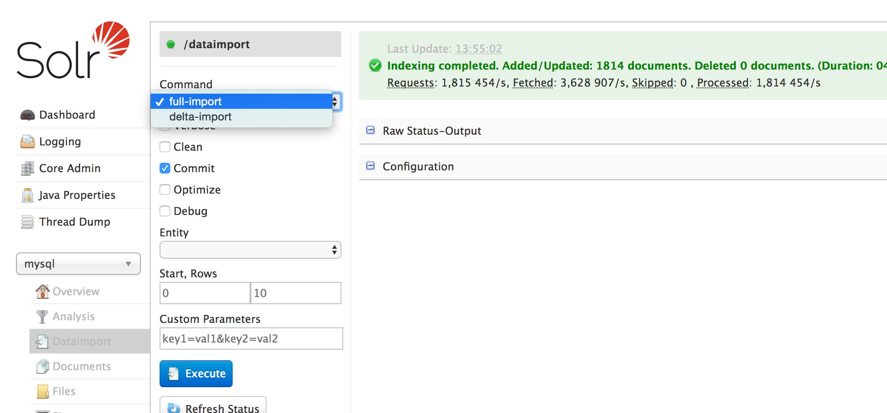
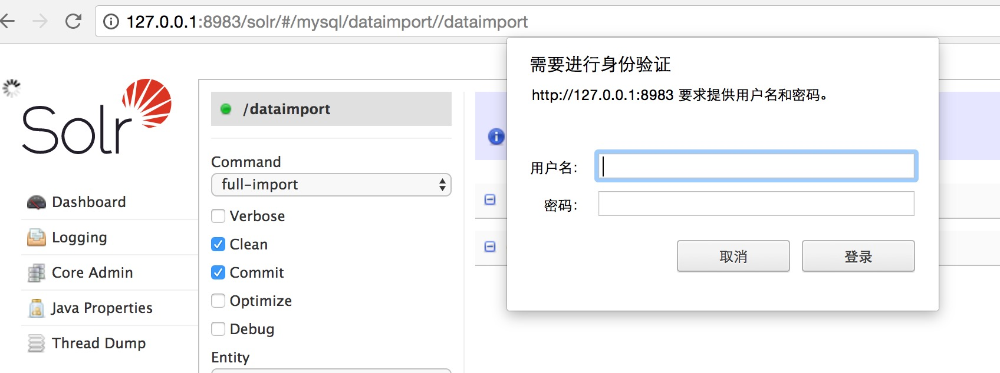

## 涉及以下内容
##### 1，安装solr
##### 2，创建solr core
##### 3，solr 分词库设置
##### 4，solr 创建字段
##### 5，从mysql中全量/增量导入数据
##### 6，solr 设置登陆密码
##### 7，总结

## 安装solr
   [solr安装](http://www.jianshu.com/p/9a42afdd7bb3)

## 创建solr core
##### 1,命令行下 solr-6.3.0/bin
	./solr create -c tests
	./solr delete -c testcore
##### 2,浏览器 delete core
	 http://127.0.0.1:8983/solr/admin/cores?action=UNLOAD&core=test&deleteIndex=true	
##### 3,老版本 添加	
	1，在solr houme 中复制一份 core,删除data 并新建data文件夹。
	2，在solr 浏览器中添加core  Core Admin -> add Core.


## solr 分词库设置
* 1,在 solr-webapp/webapp/WEB-INF/lib 文件下添加分词jar 
 IKAnalyzer2012_FF_hf1.jar

* 2,老版本要在solr-webapp/webapp/WEB-INF 创建文件夹 classes
   mydict.dic  stopword.dic  IKAnalyzer.cfg.xml
  如果是新版本server/resources  添加
   mydict.dic  stopword.dic  IKAnalyzer.cfg.xml

* 在core里面 创建分词类型   
  在创建的core 下面的schema.xml(managed-schema) 添加分词类型
```
	<fieldType name="text_smart" class="solr.TextField">
		<analyzer type="index" isMaxWordLength="false" class="org.wltea.analyzer.lucene.IKAnalyzer"/>  
	 <analyzer type="query" isMaxWordLength="true" class="org.wltea.analyzer.lucene.IKAnalyzer"/>  
       
    </fieldType>
```


## solr 创建字段
	在创建的core 下面的schema.xml(managed-schema)添加字段
```

    <field name="hName" type="text_smart" indexed="true" stored="true"/>

	<field name="City" type="text_smart" indexed="true" stored="true" multiValued="true"/>

```

## solr 从mysql中导入数据
##### 1,添加  'mysql-connector-java-*.jar' 到  'contrib/dataimporthandler/lib' 文件下面如果没有文件目录创建

##### 2,在core 目录 conf/solrconfig.xml 添加以下内容
	<lib dir="../../contrib/dataimporthandler/lib" regex=".*\.jar" />
	<lib dir="../../dist/" regex="solr-dataimporthandler-.*\.jar" /> 

	<requestHandler name="/dataimport" class="org.apache.solr.handler.dataimport.DataImportHandler">
    <lst name="defaults">
    <str name="config">data-config.xml</str>
    </lst>
	</requestHandler>

##### 3,在core 目录 data-config.xml 输入以下内容
	<?xml version="1.0" encoding="UTF-8" ?>
	<dataConfig>
	<dataSource type="JdbcDataSource"
	            driver="com.mysql.jdbc.Driver"
	            url="jdbc:mysql://127.0.0.1:3306/haoju_cn"
	            user="root"
	            password=""/>
	<document>
	  <entity name="building"
    pk="id"
    query="SELECT id,buname,buname_pinyin,areacode,areacode_str,buaddress,tel_400,restime,school,lng,lat FROM fc_building"
    deltaImportQuery="SELECT id,buname,buname_pinyin,areacode,areacode_str,buaddress,tel_400,restime,school,lng,lat FROM fc_building WHERE id='${dih.delta.id}'"
    deltaQuery="SELECT id FROM fc_building  WHERE restime > '${dih.last_index_time}'"
    >
    	 <field column="id" name="id"/>
    	 <field column="buname" name="buname"/>
    	 <field column="buname_pinyin" name="buname_pinyin"/>
    	 <field column="areacode" name="areacode"/>
    	 <field column="areacode_str" name="areacode_str"/>
    	 <field column="buaddress" name="buaddress"/>
    	 <field column="tel_400" name="tel_400"/>
    	 <field column="restime" name="restime"/>
    	 <field column="school" name="school"/>
    	 <field column="lng" name="lng"/>
    	<field column="lat" name="lat"/>

  	</entity>
	</document>
	</dataConfig>
##### 在浏览器上可以全量/增量把数据库中的数据导入到solr 中。


## 设置密码
	线上环境如果不设置密码，只要知道solr 地址就可以随便修改solr数据。
##### 1,在etc 目录下创建realm.properties 文件 输入以下内容：
lihao: lihao123,admin
用户名: 密码,角色

##### 2,在 /contexts/solr-jetty-context.xml </configure>之前 加入以下内容：
	  <Get name="securityHandler">
         <Set name="loginService">
                 <New class="org.eclipse.jetty.security.HashLoginService">
                         <Set name="name">Test Reaml</Set>
                        <Set name="config"><SystemProperty name="jetty.home" default="."/>/etc/realm.properties</Set>
                 </New>
         </Set>
  </Get>

##### 3,在solr-webapp/webapp/WEB-INF/web.xml 文件中添加以下内容:
	<security-constraint>
        <web-resource-collection>
                <web-resource-name>solr</web-resource-name>
                <url-pattern>/admin/*</url-pattern>
        </web-resource-collection>
        <auth-constraint>
                <role-name>admin</role-name>
        </auth-constraint>
	</security-constraint>
	
	<login-config>
	        <auth-method>BASIC</auth-method>
	        <realm-name>Test Realm</realm-name>
	</login-config>

##### 4,重启solr
	./bin/solr restart




## 总结
##### 1，很好的解决了mysql like 不能使用索引的情况。
##### 2，客户端直接访问solr 服务，减轻了DB了的压力。
##### 3，core 相当于 数据库中的表的数据映射。
##### 4，core 的字段也是表的字段映射，具体要使用哪些字段根据场景来定。


## 参考内容

    [http://www.lai18.com/content/2150902.html](http://www.lai18.com/content/2150902.html)

	[https://gist.github.com/maxivak/3e3ee1fca32f3949f052](https://gist.github.com/maxivak/3e3ee1fca32f3949f052)

	[http://blog.csdn.net/matthewei6/article/details/50620600](http://blog.csdn.net/matthewei6/article/details/50620600)


