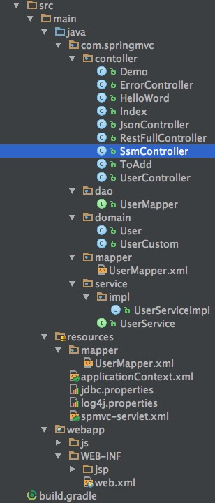

#ssm整合
## 导入jar
	ant-1.9.6.jar
	ant-launcher-1.9.6.jar
	asm-5.1.jar
	cglib-3.2.4.jar
	com.springsource.com.mchange.v2.c3p0-0.9.1.2.jar
	com.springsource.org.aopalliance-1.0.0.jar
	com.springsource.org.apache.commons.logging-1.1.1.jar
	com.springsource.org.aspectj.weaver-1.6.8.RELEASE.jar
	commons-logging-1.2.jar
	jackson-annotations-2.5.0.jar
	jackson-core-2.5.0.jar
	jackson-databind-2.5.0.jar
	javassist-3.21.0-GA.jar
	jstl-1.2.jar
	log4j-1.2.17.jar
	log4j-api-2.3.jar
	log4j-core-2.3.jar
	mybatis-3.4.2.jar
	mybatis-spring-1.3.1.jar
	mysql-connector-java-5.1.28-bin.jar
	ognl-3.1.12.jar
	slf4j-api-1.7.22.jar
	slf4j-log4j12-1.7.22.jar
	spring-aop-4.3.5.RELEASE.jar
	spring-aspects-4.3.5.RELEASE.jar
	spring-beans-4.3.5.RELEASE.jar
	spring-context-4.3.5.RELEASE.jar
	spring-context-support-4.3.5.RELEASE.jar
	spring-core-4.3.5.RELEASE.jar
	spring-expression-4.3.5.RELEASE.jar
	spring-jdbc-4.3.5.RELEASE.jar
	spring-orm-4.3.5.RELEASE.jar
	spring-test-4.3.5.RELEASE.jar
	spring-tx-4.3.5.RELEASE.jar
	spring-web-4.3.5.RELEASE.jar
	spring-webmvc-4.3.5.RELEASE.jar

## web.xml配置
	<?xml version="1.0" encoding="UTF-8"?>
	<web-app xmlns="http://xmlns.jcp.org/xml/ns/javaee"
         xmlns:xsi="http://www.w3.org/2001/XMLSchema-instance"
         xsi:schemaLocation="http://xmlns.jcp.org/xml/ns/javaee
         http://xmlns.jcp.org/xml/ns/javaee/web-app_3_1.xsd"
         version="3.1">

    <!--post 中文转码-->
    <filter>
        <filter-name>characterEncoding</filter-name>
        <filter-class>org.springframework.web.filter.CharacterEncodingFilter</filter-class>
        <init-param>
            <param-name>encoding</param-name>
            <param-value>UTF-8</param-value>
        </init-param>
    </filter>
    <filter-mapping>
        <filter-name>characterEncoding</filter-name>
        <url-pattern>/*</url-pattern>
    </filter-mapping>

    <!-- 加载spring配置文件 -->
    <listener>
        <listener-class>org.springframework.web.context.ContextLoaderListener</listener-class>
    </listener>
    <!-- 加载spring容器 -->
    <!--<context-param>-->
        <!--<param-name>contextConfigLocation</param-name>-->
        <!--<param-value>/WEB-INF/classes/spring/applicationContext.xml,/WEB-INF/classes/spring/applicationContext-*.xml</param-value>-->
    <!--</context-param>-->
    <context-param>
        <param-name>contextConfigLocation</param-name>
        <param-value>classpath:applicationContext.xml,applicationContext-*.xml</param-value>
    </context-param>

    <!--加载springmvc配置-->
    <servlet>
        <servlet-name>spmvc</servlet-name>
        <servlet-class>
            org.springframework.web.servlet.DispatcherServlet
        </servlet-class>
        <init-param>
            <param-name>contextConfigLocation</param-name>
            <param-value>classpath:springmvc.xml</param-value>
        </init-param>
        <load-on-startup>1</load-on-startup>
    </servlet>

    <servlet-mapping>
        <servlet-name>spmvc</servlet-name>
        <url-pattern>*.do</url-pattern>
    </servlet-mapping>
    <!--restfull风格 指定目录-->
    <servlet-mapping>
        <servlet-name>spmvc</servlet-name>
        <url-pattern>/rest/*</url-pattern>
    </servlet-mapping>

    <!--首页-->
    <welcome-file-list>
        <welcome-file>/WEB-INF/jsp/index2.jsp</welcome-file>
    </welcome-file-list>

    <!--错误页面-->
    <error-page>
        <error-code>404</error-code>
        <location>/error/404.do</location>
    </error-page>
    <!--<error-page>-->
        <!--<error-code>500</error-code>-->
        <!--<location>/error/500.do</location>-->
    <!--</error-page>-->
    <error-page>
        <error-code>403</error-code>
        <location>/error/403.do</location>
    </error-page>
	</web-app>

## spring 配置 applicationContext.xml
	<?xml version="1.0" encoding="UTF-8"?>
	<beans xmlns="http://www.springframework.org/schema/beans"
       xmlns:xsi="http://www.w3.org/2001/XMLSchema-instance"
       xmlns:aop="http://www.springframework.org/schema/aop"
       xmlns:tx="http://www.springframework.org/schema/tx"
       xmlns:context="http://www.springframework.org/schema/context"
       xsi:schemaLocation="http://www.springframework.org/schema/beans
                            http://www.springframework.org/schema/beans/spring-beans.xsd
                            http://www.springframework.org/schema/context
                            http://www.springframework.org/schema/context/spring-context.xsd
                            http://www.springframework.org/schema/aop
                            http://www.springframework.org/schema/aop/spring-aop.xsd
                             http://www.springframework.org/schema/tx
       					   http://www.springframework.org/schema/tx/spring-tx.xsd"
	>

    <!--扫描组件-->
    <!--配置数据源-->
    <!--数据库工厂-->
    <!--事务-->

    <!--组件扫描-->
    <context:component-scan base-package="com.springmvc"></context:component-scan>
    <!--加载数据库配置文件-->
    <context:property-placeholder location="classpath:jdbc.properties"></context:property-placeholder>

    <bean id="dataSource" class="com.mchange.v2.c3p0.ComboPooledDataSource">
        <property name="driverClass" value="${jdbc.driver}"></property>
        <property name="jdbcUrl" value="${jdbc.url}"></property>
        <property name="user" value="${jdbc.username}"></property>
        <property name="password" value="${jdbc.password}"></property>

    </bean>
    <!--创建sqlSessionFactory。生产sqlSession-->
    <bean id="sqlSessionFactory" class="org.mybatis.spring.SqlSessionFactoryBean">
        <property name="dataSource" ref="dataSource"></property>
        <property name="mapperLocations" value="classpath:mapper/*.xml"></property>
    </bean>

    <bean class="org.mybatis.spring.mapper.MapperScannerConfigurer">
        <property name="basePackage" value="com.springmvc.dao"></property>
        <property name="sqlSessionFactoryBeanName" value="sqlSessionFactory"></property>
    </bean>

    <!--事务管理-->
    <bean id="txManager" class="org.springframework.jdbc.datasource.DataSourceTransactionManager">
        <property name="dataSource" ref="dataSource"></property>
    </bean>

    <!--
    事务详情
            <tx:attributes> 用于配置事务详情（属性属性）
			<tx:method name=""/> 详情具体配置
				propagation 传播行为 ， REQUIRED：必须；REQUIRES_NEW:必须是新的
				isolation 隔离级别
    -->
    <tx:advice id="txAdvice" transaction-manager="txManager">
        <tx:attributes>
            <!--事务名称-->
            <tx:method name="save*" propagation="REQUIRED" isolation="DEFAULT"/>
            <tx:method name="update*" propagation="REQUIRED" isolation="DEFAULT"/>
            <tx:method name="delete*" propagation="REQUIRED" isolation="DEFAULT"/>
            <tx:method name="insert*" propagation="REQUIRED" isolation="DEFAULT"/>
            <tx:method name="*" propagation="REQUIRED" isolation="DEFAULT"/>
        </tx:attributes>
    </tx:advice>
    <!--AOP编程，目标类有ABCD（4个连接点），切入点表达式-->
    <aop:config>
        <aop:advisor advice-ref="txAdvice" pointcut="execution(* com.springmvc.service.impl..*(..))"></aop:advisor>
    </aop:config>

	</beans>

## 数据库配置 jdbc.properties
	jdbc.url = jdbc:mysql://localhost:3306/school?useUnicode=true&amp;characterEncoding=UTF-8
	jdbc.driver = com.mysql.jdbc.Driver
	jdbc.username= root
	jdbc.password=

## springmvc.xml 配置
	<?xml version="1.0" encoding="UTF-8"?>
	<beans xmlns="http://www.springframework.org/schema/beans"
       xmlns:xsi="http://www.w3.org/2001/XMLSchema-instance"
       xmlns:context="http://www.springframework.org/schema/context"
       xmlns:mvc="http://www.springframework.org/schema/mvc"
       xsi:schemaLocation="http://www.springframework.org/schema/beans
       http://www.springframework.org/schema/beans/spring-beans.xsd
       http://www.springframework.org/schema/context
        http://www.springframework.org/schema/context/spring-context-4.0.xsd
         http://www.springframework.org/schema/mvc http://www.springframework.org/schema/mvc/spring-mvc-4.0.xsd
       ">

    <!--配置扫描包-->
    <context:component-scan base-package="com.springmvc.contoller"></context:component-scan>
    <!--包含mapping adapter json-->
    <mvc:annotation-driven/>

    <bean class="org.springframework.web.servlet.mvc.method.annotation.RequestMappingHandlerAdapter">
        <property name="messageConverters">
            <list >
                <ref bean="mappingJacksonHttpMessageConverter" />
            </list>
        </property>
    </bean>
    <bean id="mappingJacksonHttpMessageConverter"
          class="org.springframework.http.converter.json.MappingJackson2HttpMessageConverter">
        <property name="supportedMediaTypes">
            <list>
                <value>text/html;charset=UTF-8</value>
            </list>
        </property>
    </bean>

    <!--view 解析-->
    <bean class="org.springframework.web.servlet.view.InternalResourceViewResolver">
        <property name="prefix" value="/WEB-INF/jsp/"></property>
        <property name="suffix" value=".jsp"></property>

    </bean>
	</beans>

## mapper/*.xml 下UserMapper.xml
	<?xml version="1.0" encoding="UTF-8" ?>
	<!DOCTYPE mapper
	        PUBLIC "-//mybatis.org//DTD Mapper 3.0//EN"
	        "http://mybatis.org/dtd/mybatis-3-mapper.dtd">
	
	<mapper namespace="com.springmvc.dao.UserMapper">
    	<select id="findUserById" parameterType="int" 	resultType="com.springmvc.domain.User">
    	    SELECT * FROM USER WHERE id=#{id}
    	</select>
	</mapper>

## 示例代码
#### UserMapper.java
	public interface UserMapper {
	    User findUserById(int id);
	}
#### User.java
	public class User {

    	private Integer id;
    	private String username;
    	private String birthday;
    	private String sex;
    	private String address;

    	public Integer getId() {
    	    return id;
    	}
	
    	public void setId(Integer id) {
    	    this.id = id;
    	}
	
    	public String getUsername() {
    	    return username;
    	}

    	public void setUsername(String username) {
    	    this.username = username;
    	}
	
    	public String getBirthday() {
    	    return birthday;
    	}
	
    	public void setBirthday(String birthday) {
    	    this.birthday = birthday;
    	}
	
    	public String getSex() {
    	    return sex;
    	}
	
    	public void setSex(String sex) {
    	    this.sex = sex;
    	}

    	public String getAddress() {
    	    return address;
    	}
	
    	public void setAddress(String address) {
    	    this.address = address;
    	}

   		@Override
   		public String toString() {
   		    return "User{" +
   		            "id=" + id +
   		            ", username='" + username + '\'' +
   		            ", birthday=" + birthday +
   		            ", sex='" + sex + '\'' +
   		            ", address='" + address + '\'' +
   		            '}';
   		}
	}	

#### UserService.java
	public interface UserService {
	    User getUserById(int id);
	}
#### UserServiceImpl.java
	@Service("userService")
	public class UserServiceImpl implements UserService {
	
	    @Resource
	    private UserMapper userMapper;
	
	    @Override
	    public User getUserById(int id)  {
	
	        return userMapper.findUserById(id);
	    }
	}

#### SsmController.java
	@Controller
	@RequestMapping("ssm")
	public class SsmController {
	
	   @Resource
	    private UserService userService;
	
	    @RequestMapping("index")
	    public String demo(Model model,int id ){
	       User user = userService.getUserById(id);
	        System.out.println(user);
	        model.addAttribute("name",user);
	        return "demo";
	    }
	}

#### jsp
	<%@ page contentType="text/html;charset=UTF-8" language="java" %>
	<html>
	  <head>
	    <title>$Title$</title>
	  </head>
	  <body>
	
	${name}
	  </body>
	</html>

#### 访问
	http://localhost:8484/springmvc/ssm/index.do?id=31

#### 整体目录
 

