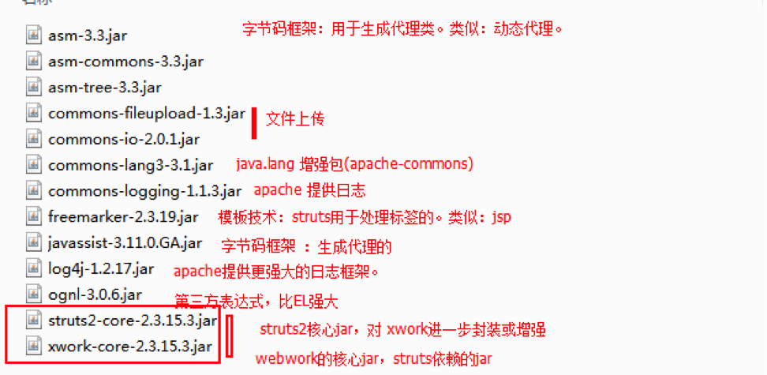
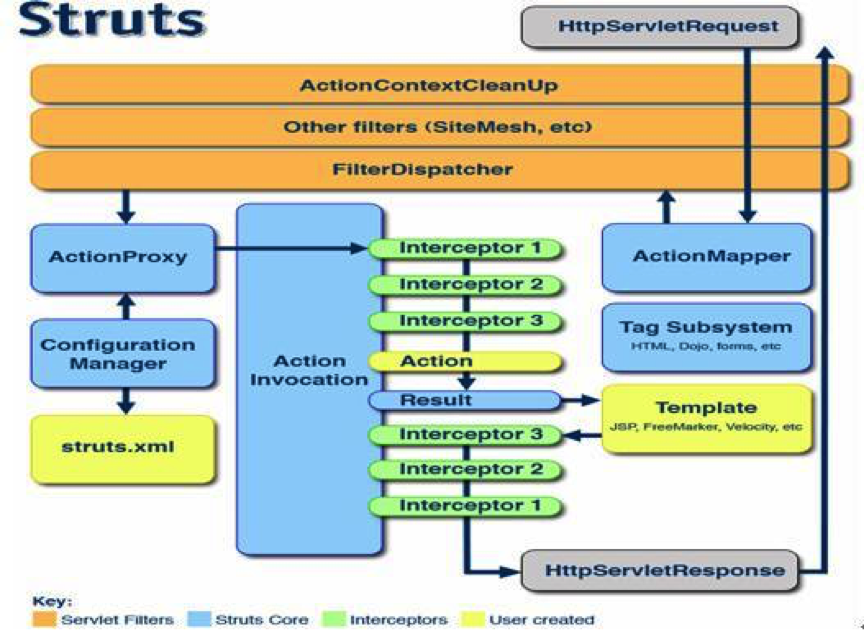

## struts2 是什么
	Struts2是一个基于MVC设计模式的Web应用框架，它本质上相当于一个servlet，
	在MVC设计模式中，Struts2作为控制器(Controller)来建立模型与视图的数据交互。Struts 2是Struts的下一代产品，是在 struts 1和WebWork的技术基础上进行了合并的全新的Struts 2框架。
	其全新的Struts 2的体系结构与Struts 1的体系结构差别巨大。
	Struts 2以WebWork为核心，采用拦截器的机制来处理用户的请求，
	这样的设计也使得业务逻辑控制器能够与ServletAPI完全脱离开，所以Struts 2可以理解为WebWork的更新产品。
	虽然从Struts 1到Struts 2有着太大的变化，但是相对于WebWork，Struts 2的变化很小。

## struts2 介绍
* struts2 是在stuts1 和 webwork的技术基础上进行合并的全新的struts2框架。其全新的struts2的体系架构与struts体系结构差别巨大。
* struts2 以webwork为核心采用拦截器的机制，来处理用户请求，这样的设计也使得业务逻辑控制器能够与ServletApi完全脱离开。
* struts和webwork同为服务于web的一种mvc框架。

## struts2 核心功能
* 在Action的实现方面，可以是一个普通的POJO（Plain Old Java Objects）.
* 线程模型方面，Action是 一个请求对应一个实例（new 一个对象），没有线程安全方面的问题。一次请求一个action，对比：servlet单例。
* Servlet依赖方面，Action不再依赖于Servlet Api,有利于测试。
* 封装请求参数，可以选择使用pojo类来封装请求的参数，或者直接使用Action的属性。
* 表达式语言方面，整合了OGNL ognl表达式比el表达式更强大的表达式。
	* OGNL(Object Graph Navigation Language)对象图形导航语言。
* 绑定值到视图技术，使用“ValueStack”技术。
* 类型转换，使用OGNL进行转换，可以更方便的使用。
* 数据校验，支持重写validate方法或者使用xwork的验证框架。
* 基于Spring AOP 思想的拦截器机制，更易扩展。	

## struts2 jar包
	apps / struts2-blank.war 最简单环境
	

## struts2 使用步骤
#### 1.过滤器配置
	<filter>
        <filter-name>struts2</filter-name>
        <filter-class>org.apache.struts2.dispatcher.ng.filter.StrutsPrepareAndExecuteFilter</filter-class>
    </filter>
    <filter-mapping>
        <filter-name>struts2</filter-name>
        <url-pattern>/*</url-pattern>
    </filter-mapping>

#### 2.在项目里创建pojo 
	public class HelloAction {
	    public String execute() {
	        System.out.println("hello_execute");
	        return "success";
	    }
	}

#### 3.新建stuts.xml
	在src 目录下新建stuts.xml
	<?xml version="1.0" encoding="UTF-8" ?>
	<!DOCTYPE struts PUBLIC
		"-//Apache Software Foundation//DTD Struts Configuration 2.3//EN"
		"http://struts.apache.org/dtds/struts-2.3.dtd">

	<struts>
	    <constant name="struts.enable.DynamicMethodInvocation" value="true"></constant>
	    <!--设置开发模式，默认关闭。如果设置true：将提供更多提示信息，自动加载文件-->
	    <constant name="struts.devMode" value="true"></constant>
	    <!--
	    name:单纯的给包起一个名字,不要与其他包名重复
			namespace: 为action访问加上一层或多层路径
			extends: 继承一个其他包,目的是引入其他包的配置
			abstract: 声明包是抽象的.意思就是让别的包来继承,声明为抽象的包中不能含有Action配置
	    -->
	    <package name="hello" namespace="/struts2" extends="struts-default">
	        <!--
				name: 为我们的action类加上一个标识,在访问时填入name名称.就可以找到action
				class: action完整类名
				method:处理的方法
			 -->
	        <action name="HelloAction" class="cn.structs.mini.HelloAction" method="execute">
	            <!-- name:返回结果的标识,用于找到结果路径
					 type: 可以决定跳转到结果的方式=> 转发,重定向.....
				 -->

	            <result name="success" type="dispatcher">/lihao.jsp</result>
	        </action>

	    </package>
	</struts>

##### 访问网址
	http://localhost:8484/test/struts2/HelloAction
						项目名称 namespace action 

#### 执行流程
	

## 基本配置
	1. default.properties ：用于配置struts 常量。例如：编码
	2. struts-default.xml 	：struts提供的默认核心配置文件，struts大部分功能都在此配置文件中。
	3.struts-plugin.xml ： struts插件核心配置文件，struts整合其他框架或工具。
	* 以上三个文件，用户自己不进行修改
	4. struts.xml ：用户自定义核心配置文件。
	5.struts.properties ： 用于自定义struts常量配置文件。一般不使用。
	6.web.xml ：也可以配置struts常量
	@@@注意：如果配置常量，所有的配置文件存在优先级，编号越大优先级越高。

##### default.properties
	struts2-core-2.3.15.1.jar!/org/apache/struts2/default.properties	
##### struts-default.xml 
	struts2-core-2.3.15.1.jar!/struts-default.xml
##### struts-plugin.xml 
	插件里面配置	

##### struts.xml 可以包含所有的内容包括：常量 拦截器 action ...
	<constant name="struts.i18n.encoding" value="GBK"></constant> 配置编码

### 常见struts 常量
##### 1.用于配置项目编码
	struts.i18n.encoding=UTF-8
##### 2.struts整合spring需要配置，默认注释掉了【】
	struts.objectFactory = spring
##### 3.struts默认使用文件上传解析工具：apache-commons-fileupload
	struts.multipart.parser=jakarta
		* 3.1 临时文件保存位置
			struts.multipart.saveDir=
		* 3.2 上传文件最大大小，默认值：2M，单位字节
			struts.multipart.maxSize
##### 4.用于设置action请求路径扩展名。默认：action或空。多个值使用逗号分隔【】
	struts.action.extension=action,,
	例如：/hello/userAction  或  /hello/userAction.action
#####  5.确定是否使用动态方法调用。默认关闭的。
	struts.enable.DynamicMethodInvocation = false
#####  6. 设置开发模式，默认关闭。如果设置true：将提供更多提示信息，自动加载文件。【】
	struts.devMode = false
	* 6.1 自动重新加载国际化资源文件。
		struts.i18n.reload = true
	* 6.2 自动冲洗加载xml配置文件。例如：struts.xml。但不会自动加载action类。
		struts.configuration.xml.reload = true
##### 7. 设置struts标签主题，默认值：xhtml。取值：simple。【】
	struts.ui.theme=xhtml
	开发中常用simple。xhtml存在默认布局，开发中布局使用美工提供页面，布局自定义。

### struts.xml 详解

##### <constant> 用于配置stuts常量的
	name：struts提供固定常量名称。此名称从 default.properties文件获得
	value：常量值
	例如：<constant name="struts.devMode" value="true"></constant>

##### <package> struts 用于管理所有action类。
	name：给当前包进行唯一命名，必填项。用于其他包继承的。
		例如：struts-default.xml/<package name="struts-default" abstract="true">
			将struts已经完成的功能，作为一个包存在。名称是固定值struts-default。

	namespace：action访问路径前缀。
	extends：用于继承其他包的。
		例如：<package extends="struts-default"> 当前action继承struts已经完成功能。
	abstract：是否抽象，如果设置为true，表示没有具体action实现功能。

##### <action> 用于配置action类（请求处理类）
	name: action 名称，用于在请求路径进行访问。
	class: action 类全限定类名。
	method:用于确定action类中需要执行的方法，默认值：execute。

##### <result> 用于配置结果集
	name:用于确定action类中，方法的返回值。
	type:结果集类型
		dispatcher：请求转发，从一个action到jsp页面，默认值。
		redirect：重定向到jsp页面。
		redirectAction：重定向到另一个action。
		stream：以流的方法发送浏览器，用于文件下载。
		chain：链，在一次请求中，从一个action到另一个action

##### <interceptors> 用于配置拦截器
	 	<interceptor> 用于注册拦截器的
		<interceptor-stack> 拦截器栈，将已经注册的拦截器组合在一起，形成一个栈。
		<default-interceptor-ref>用于确定当前默认拦截器的
			 <interceptors>
	            <interceptor name="login" class="cn.project.action.LoginInterceptor"></interceptor>
	            
	            <interceptor-stack name="myDefaultStarck">
	                <interceptor-ref name="login">
	                    <param name="excludeMethods">login</param>
	                </interceptor-ref>
	                <interceptor-ref name="defaultStack"></interceptor-ref>
	            </interceptor-stack>
	        </interceptors>

	        <default-interceptor-ref name="myDefaultStarck"></default-interceptor-ref>

##### <default-class-ref> 如果访问的action不存在，默认执行的aciton。
	别人访问这个action的时候，如果找不到对应的action 默认就用这个action了.
	 <default-action-ref name="login"></default-action-ref>

#####  <include> 将多个struts配置文件组合成一个。
	struts.xml 入口配置文件，大家共用的。用于存放通用模块。
		<include file="struts-user.xml" />
		<include file="struts-book.xml" />
	提供子配置文件
		struts-user.xml
		struts-book.xml

### action 访问
#### 动态方法调用
##### 格式：
	action名称!add.action

#### 通配符
	  <action name="userAction_*" class="cn.project.action.UserAction" method="{1}">
            <result name="error">/user/error1.jsp</result>
            <result name="login">/login/login.jsp</result>
	</action>

## Action 类
#### 实现方式
* pojo 普通类
* Action 接口，实现接口
	public interface Action {

	    public static final String SUCCESS = "success";

	    public static final String NONE = "none";

	    public static final String ERROR = "error";

	    public static final String INPUT = "input";

	    public static final String LOGIN = "login";

	    public String execute() throws Exception;

	}
	success ： 表示成功了。
	none：没有返回值。相当方法void。没有返回值表示没有result，常用与ajax操作。使用response发送数据
	error：服务器异常。
	input：表示用户输入错误。
	login：表示需要权限。

* ActionSupport类，继承类
	public class ActionSupport implements Action, Validateable, ValidationAware, TextProvider, LocaleProvider, Serializable {

	Action 规范接口
	Validateable 数据校验
	ValidationAware 错误信息
	TextProvider 国际化
	LocaleProvider 本地化
#### 方法	
	 public String execute() throws Exception {
        return SUCCESS;
    }
* 必须是public
* 建议又返回值，类型必须String
* 方法名称自定义
* 没有参数
* 需要throw Exception
* 非静态的
	注意：可以没有返回值，一般情况都有，可以使用return "none" 表示没有返回。
	public void add() throw Exception{
    }

##	访问Servlet api
#### 完全解耦
* ActionContext: Struts2的数据中心
* Struts2将我们在开发中可能用到的和框架本身需要用到的所有域放入了ActionContext。
	获得实例：ActionContxt.getContext()
	ac.put(key,value) , 相当于操作request作用域。request.setAttribute("key",value)
		ac.getSession().put(key,value) ，相当于操作session作用域。session.setAttribute("key",value)
		ac.getApplication().put(key,value) ，相当于操作application作用域。servletContext.setAtt...

#### 操作原生servlet对象

##### ServletActionContext 工具类，获得需要servlet对象
	//1 获得request对象
	HttpServletRequest request = ServletActionContext.getRequest();
	//2 获得response对象
	HttpServletResponse response = ServletActionContext.getResponse();
	//3获得servletContext对象
	ServletContext servletContext = ServletActionContext.getServletContext();
	//4 获得session
	HttpSession session = request.getSession();
	

