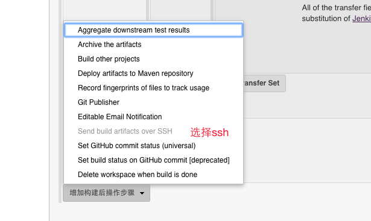

## jenkins 使用


###maven 安装

- Maven 安装下载maven

  http://mirror.bit.edu.cn/apache/maven/maven-3/3.5.2/binaries/apache-maven-3.5.2-bin.tar.gz

- 配置环境变量

  ```
  export M2_HOME=/Users/lixueqin/maven
  export PATH=$PATH:$M2_HOME/bin
  ```

- 查看是否配置成功

  ```
  mvn -v
  ```


### jenkins 安装


#### 下载

```
wget http://mirrors.jenkins.io/war/2.83/jenkins.war
```


#### 启动服务

```
java -jar jenkins.war --httpPort=7070 &
```


* 第一次启动时要输入一次密码

  ​


*  然后一步步配置一直到启动


### 系统设置

#### 设置jdk 位置

系统管理—>  全局工具配置—> 安装jdk

自动安装去掉


#### maven 位置设置

自动安装去掉


###  插件安装

系统管理 —> 管理插件


分别安装插件

* Git plugin
* Maven Integration plugin
* publish over SSH


### 设置 public over  ssh

系统管理 —> 系统设置

设置 cat ~/.ssh/id_rsa


### 部署项目

* 新建一个任务

* 选择构建一个maven项目

  ​





http还需要设置一下账号

新建一个~/..netrc

```
machine 101.220.204.74
login xiaohaozi
password 123

```


服务器上的脚本

```shell
#!/bin/bash

DATE=$(date +%Y%m%d)
export JAVA_HOME PATH CLASSPATH
JAVA_HOME=/usr/java/jdk1.8.0_144
PATH=$JAVA_HOME/bin:$JAVA_HOME/jre/bin:$PATH
CLASSPATH=.:$JAVA_HOME/lib:$JAVA_HOME/jre/lib:$CLASSPATH
DIR=/home/test
JARFILE=zhongan-1.0-SNAPSHOT.jar

if [ ! -d $DIR/backup ];then
   mkdir -p $DIR/backup
fi
cd $DIR

ps -ef | grep $JARFILE | grep -v grep | awk '{print $2}' | xargs kill -9
mv $JARFILE backup/$JARFILE$DATE
mv -f /root/.jenkins/workspace/zhongan/zhongan/target/$JARFILE .

echo /home/jenkins/$JARFILE >> lihao.out

java -jar $JARFILE > out.log &
if [ $? = 0 ];then
        sleep 30
        tail -n 50 out.log
fi

cd backup/
ls -lt|awk 'NR>5{print $NF}'|xargs rm -rf
```

* 保存 然后立即构建