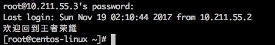

## 常用命令

#### 同步时间

```shell
rdate -s time-b.nist.gov
```


#### 加大服务器文件描述符

在unix/linux里面，你的服务只要开启一个进程，就要占用文件的描述符。linux 默认是1024，如果描述符少了，你的访问量多了，你的服务器支撑不了，所以要把描述符加大。

```
echo '* - nofile 65535 ' >>/etc/security/limits.conf
ulimit -n //查看当前文件描述符数量
```


#### find

```
Linux find命令用来在指定目录下查找文件。任何位于参数之前的字符串都将被视为欲查找的目录名。如果使用该命令时，不设置任何参数，则find命令将在当前目录下查找子目录与文件。并且将查找到的子目录和文件全部进行显示。
```

* 将目前目录及其子目录下所有延伸档名是 sh的文件列出来。

```
find . -name "*.sh"
```

* 将目前目录及其子目录下所有最近 3天内更新过的文件列出

```
find /Users/lihao/Downloads/ -mtime -3 -type f
```


* 删除最近3天修改的文件

  ```
  find . -mtime -3 -type f | xargs rm -rf
  ```

  ​


#### 修改字符编码

```
echo 'LANG="en_US.UTF-8"' > /etc/sysconfig/i18n
source /etc/sysconfig/i18n
echo $LANG
```

```
locale
```


#### history

```
history 查看及清理历史记录 
-c 清空所有
-d 清空指定的命令
```


#### 设置登录服务器的提示信息

```
echo "欢迎回到王者荣耀" > /etc/motd
```




#### 重要文件

```
/etc/sysconfig/network-scripts/ifcfg-eth0
/etc/resolv.conf
/etc/hosts
/etc/sysconfig/network
/etc/fstab
/etc/rc.local
/etc/inittab
/var/spool/mail/
```


#### 查看硬件信息

```
/proc/cpuinfo
/proc/meminfo
/proc/mounts

```


#### 查看最新修改的文件

```
ls -lrt   新修改的文件再最后一个
```


#### 开机启动

```
chkconfig 服务 on
chkconfig --list # 查看开机启动服务
chkconfig --level 345 mysqld  on
chkconfig redis on
 
/etc/rc.local
```


##### 自定义开启启动命令

* 新建文件在 /etc/init.d/lihao

  ```
  # chkconfig: 2345 56  27

  echo "lihao"
  ```

  ​

* 添加运行权限

  ```
  chmod +x lihao
  ```

  ​

* 添加到 chkconfig 中管理

  ```
  chkconfig --add lihao
  ```

  ​

* 查看详情

  ```
  chkconfig --list lihao
  ```

* 关闭

  ```
  chkconfig lihao off
  ```

  ​

#### cp 命令

```
 #相当于-dR 不会改变文件的属性
 cp -a 

 #把lihao.txt  备份成 lihao.txt.ori
cp lihao.txt{,.ori} 

# 把test2 目录 复制到hd 下面
cp -a  /tmp/{test2,hd/} 
```


