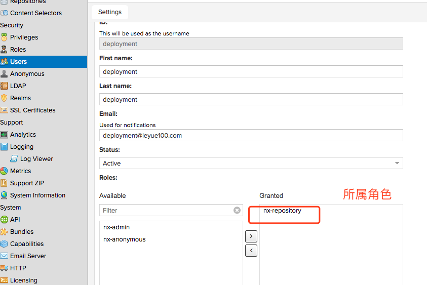

## 第四讲

* Maven 安装下载maven

  http://mirror.bit.edu.cn/apache/maven/maven-3/3.5.2/binaries/apache-maven-3.5.2-bin.tar.gz

* 配置环境变量

  ```
  export M2_HOME=/Users/lixueqin/maven
  export PATH=$PATH:$M2_HOME/bin
  ```

*  查看是否配置成功

  ```
  mvn -v
  ```

  ​

#### maven的配置文件

```
maven 有一个重要的配置文件，就是settings.xml ，这个文件默认是在%M2_HOME%/conf目录下面，但是如果升级maven的版本，那么可能导致新的安装包的settings文件一片空白。
所以一般maven的配置文件都会放在当前用户的目录下的 ~/.m2/settings.xml中，这样就是对当前用户有效。
```


## 第五讲

#### 设置mavn 设置aliyun镜像

在settings.xml 的标签<mirrors> 中添加如下配置

```
<mirror>
    <id>nexus-aliyun</id>
    <mirrorOf>*</mirrorOf>
    <name>Nexus aliyun</name>
    <url>http://maven.aliyun.com/nexus/content/groups/public</url>
</mirror>
```


#### 用maven 命令创建工程

```
mvn archetype:generate -DgroupId=com.zhss.maven -DartifactId=maven-first-app -DarchetypeArtifactId=maven-archetype-quickstart -DinteractiveMode=false
```


* -DartifactId 项目目录

#### maven的约定

在maven 项目工程目录结构中，其中src/main/java 目录包含了这个项目的java 源码 src/test/java 目录包含了测试代码，pom.xml文件是maven的核心配置文件，是这个项目的Project Object Model


#### pom.xml 介绍

```Xml
<project xmlns="http://maven.apache.org/POM/4.0.0" xmlns:xsi="http://www.w3.org/2001/XMLSchema-instance"
  xsi:schemaLocation="http://maven.apache.org/POM/4.0.0 http://maven.apache.org/maven-v4_0_0.xsd">
  <modelVersion>4.0.0</modelVersion>
  <groupId>com.zhss.maven</groupId>
  <artifactId>maven-first-app</artifactId>
  <packaging>jar</packaging>
  <version>1.0-SNAPSHOT</version>
  <name>maven-first-app</name>
  <url>http://maven.apache.org</url>
  <dependencies>
    <dependency>
      <groupId>junit</groupId>
      <artifactId>junit</artifactId>
      <version>3.8.1</version>
      <scope>test</scope>
    </dependency>
  </dependencies>
</project>
```

* <project>: pom.xml的顶层元素
* <ModelVersion> POM 本身的版本号，一般很少变化
* <groupId> 创建这个项目的公司或者组织，一般用公司网站后缀，比如com.company，或者cn.company，或者org.zhonghuashishan
* <artifactId> 这个项目的唯一标识，一般生成的jar包名称，会是 <artifactId>-<version>.<packaging> 比如说 myapp-1.0.jar
* <packaging>要用的打包类型，比如jar,war 等等。
* <version>  这个项目的版本号
* <name> 这个项目用于展示的名称，一般在生成文档的时候使用
* <url> 这个项目的文档能下载的站点url,一般用于生成文档
* <description>：用于项目的描述


#### 对项目进行打包

使用mvn package命令，对一个工程进行构建，构建出来一个可以执行的java jar包。

会先下载依赖的包，然后运行 单元测试 编译 打包，自动运行了单元测试的用例，自动化把你的java 源代码编译成了.class 文件，自动化把我们的项目打包成了一个jar包。


#### 执行打包好的jar包

```
java  -cp maven-first-app-1.0-SNAPSHOT.jar com.zhss.maven.App
```

com.zhss.maven.App  是带有main方法的类名


## 第六讲 maven 体系架构

项目中的pom.xml 依赖以及如何构建

全局的maven配置，settings.xml

maven的约定：各种约定目录，代码、资源，输出，测试


#### mvn 构建命令执行过程

* 1，maven 一定会查看setting.xml 各种配置文件
* 2，解析项目中的pom.xml
* 3,mvn 会解析出pom.xml 中的依赖
* 4，查看本地仓库是否有pom.xml中的依赖
* 5，本地仓库在 ~/.m2/repository，先去本地仓库去查找如果没有依赖就去远程仓库查找
* 6，远程仓库下载后缓存到本地仓库，远程仓库位置到%M2_HOME%/lib下面找，maven-model-builder-3.5.2.jar，https://repo.maven.apache.org/maven2/

下载依赖->本地仓库->远程仓库


## 第七讲安装eclipse

设置meven 目录


## 第十讲 maven 知识点

每个maven项目都有一个坐标

```
groupId + artifactId + version + packageing + classifier 五个维度的坐标，唯一定位一个依赖包 
```

```
实际开发中只需要 groupId + artifactId + version 来定位一个唯一依赖
```

```
groupId 公司或者组织 官网域名倒叙来开头
com.zhss.hr
com.zhss.finance
com.zhss.crm
```

```
artifactId: 项目中的某个模块或者某个服务
com.zhss.oa，oa-organ，organ是缩写，organization
com.zhss.oa，oa-auth，auth是authorization
com.zhss.oa，oa-flow，flow就是流程的意思

```

```
version：这个工程的版本号
```


#### 设置坐标的作用

```
groupId + artifactId +version 就成了这一次这个工程目前这个状态的唯一的标识和定位。
将这个版本的代码的jar包，上传到maven的中央仓库，供其他人来使用这个版本的代码的jar包
给公司其他人来使用，只有你也有一个坐标，才能让别人唯一定位你的项目某个版本的代码的jar包，让maven下载后给别人用
```


#### 坐标的思路

1，坐标有哪些元素

2，坐标每个元素都是什么意思，怎么设置

3，设置了坐标之后的意义在哪


## 第十一讲 eclipse 结合maven 使用


## 第十二课 maven 依赖管理

#### 用<dependency> 可以引用任何你需要的依赖

```xml
  		<dependency>  
            <groupId></groupId>  
            <artifactId></artifactId>  
            <version></version>  
            <type></type>  
            <scope></scope>  
            <optional></optional>
          	
        </dependency>  
```


#### 去哪里找需要的依赖

* 官网

* maven 仓库

  ```
  http://search.maven.org/
  http://repository.sonatype.org
  http://www.mvnbrowser.com/
  http://mvnrepository.com/
  ```

  ​

#### 依赖范围

```
<scope></scope>
```

Maven 有三套classpath,classpath 就是项目中用到的各种依赖的类，jvm在运行的时候需要去classpath 下面加载对应的类：

* 1，主代码编译时一套classpath。

* 2，编译测试代码以及执行测试代码的时候一套classpath

* 3,   被打包运行的时候一套classpath

  依赖范围就是用来控制依赖包与这三种classpath的关系的。

不同的依赖范围，会导致那个依赖包可能在编译，测试或者打包运行的时候，有时候可以使用，有时候不能够使用。

##### 依赖范围的值

```
compile ： 默认，对主代码编译，测试，运行都有效。一般都是用这种scope
```

```
test: 仅仅对于运行测试代码的classpath有效，对于主代码或者打包运行的时候无效，仅仅测试代码需要用的依赖一般都会设置为这个范围，比如junit,这种返回的依赖不会出现在最终打包发布包里面的，减少发布包的体积。
```

```
provided:对主代码和测试代码有效，但是在运行的时候无效，因为可能环境已经提供了，比如servlet-api。
```

```
runtime:测试和运行classpath 有效，但是编译代码时无效，比如jdbc的驱动实现类，比如mysql驱动。因为写代码的时候基于javax.sql包下的标准接口去写代码
```


##### 传递性依赖

每个依赖可能又有其他的依赖，其他依赖又有其他的依赖，循环往复。

maven 的传递性依赖，就是说会自动递归解析所有的依赖，然后负责将依赖下载下来，接着所有层级的依赖，都会成为我们的项目的依赖，不需要我们手工干预。所有需要的依赖全部下载下来，不管有多少层级，这个就是maven的传递性依赖机制，自动给我递归依赖链条下载所有的依赖的一个特性

我们对junit的依赖范围是test，junit对A的依赖范围是compile，那么我们对A的依赖范围是什么呢？ -> test


传递性依赖机制对依赖范围也是有影响的，比如下面的表格，第一列是一级依赖，第一行是二级依赖，传递性依赖会导致多级依赖的依赖范围交叉在一起，会有影响：


有可能依赖是不会传递的，就是可能有些多层级的依赖，是不会成为我们项目的依赖的。


##### 依赖调解

maven 会自动解析所有层级的依赖，给我们自动下载所有的依赖，但是可能会出现依赖冲突的问题。

```
比如A->B->C->X(1.0)，A->D->X(2.0)，A有两个传递性依赖X，不同的版本

就产生了依赖冲突的问题，maven如何解决呢？依赖调解的机制

此时就会依赖调解，就近原则，离A最近的选用，就是X的2.0版本

如果A->B->X(1.0)和A->D->X(2.0)，路径等长呢？那么会选择第一声明原则，哪个依赖在pom.xml里先声明，就用哪个
```


##### 可选依赖

```
<optional> true </optional>
```

此时依赖传递失效，不会向上传递

```
如果A依赖于B，B依赖于C，B对C的依赖是optional，那么A就不会依赖于C。反之，如果没有optional，根据传递性依赖机制，A会依赖于C。
```


##### 总结

* 1，声明依赖
* 2，找依赖，两个方案去找到你需要的依赖的maven坐标
* 3，找到依赖后配置依赖，三要素，坐标。
* 4，依赖范围，根据依赖的使用场景，比如仅仅在test环境下使用，或者运行时由运行环境来提供，可以给依赖设置不同的依赖范围。
* 5，传递性依赖，自动解析所有层级的依赖。
* 6，传递性依赖的多层级的依赖范围，交叉影响的结果。
* 7，依赖调解，碰到一个项目多个版本，启动根据两大就近原则来选择一个最合适的版本来使用。
* 可选依赖，不向上传递。


## 第十三课 maven 依赖冲突

#### maven 依赖冲突的原因

```
当项目依赖了一个jar  这个又依赖了D 1.0版本   项目依赖了另一个jar 它却依赖了D2.0版本  
```

比如你依赖了A和B，此时A依赖了C-1.0，B依赖了D，D依赖了C-2.0

X

  -> A

-> C-1.0

  -> B

-> D

  -> C-2.0

X -> A -> C-1.0

X -> B -> D -> C-2.0

此时就会导致的事情是，由于A -> C1.0是最短路径，所以会用C1.0

但是坑爹的事情发生了，B依赖的是D，D依赖的C结果用了C-1.0版本

D本来用的是C-2.0的一个方法，但是现在给D的时C-1.0的一个类

比如C-1.0的类CClass.sayHello()

C-2.0给类CClass加了一些方法，比如CClass.printHello()，同时也有CClass.sayHello()方法

D调用了C-2.0里面的printHello()这个方法

如果用的时C-1.0，把C-1.0的CClass提供给D去用，D去调用printHello()方法的时候，就会报错。。。

C这个项目的CClass这个类的printHello()这个方法没有找到，not found的异常


#### 解决依赖冲突

1，先查看依赖的路径

```
mvn depedency:tree这个命令


com.maven:maven1:jar:1.0-SNAPSHOT
[INFO] +- org.springframework:spring-core:jar:3.2.8.RELEASE:compile
[INFO] |  \- commons-logging:commons-logging:jar:1.1.3:compile
[INFO] +- org.springframework:spring-webmvc:jar:3.2.8.RELEASE:compile
[INFO] |  +- org.springframework:spring-beans:jar:3.2.8.RELEASE:compile
[INFO] |  \- org.springframework:spring-expression:jar:3.2.8.RELEASE:compile
[INFO] +- org.springframework:spring-context:jar:3.2.8.RELEASE:compile
[INFO] +- org.springframework:spring-context-support:jar:3.2.8.RELEASE:compile
[INFO] +- org.springframework:spring-aop:jar:3.2.8.RELEAS
```

2,让其不包含依赖版本

````
  <dependency>
      <groupId>org.springframework</groupId>
      <artifactId>spring-core</artifactId>
      <version>3.2.8.RELEASE</version>
      <exclusions>
        <exclusion>
          <groupId>commons-logging</groupId>
          <artifactId>commons-logging</artifactId>
        </exclusion>
      </exclusions>
    </dependency>
````


#### 总结

* 1，maven工作中最常见的依赖冲突问题的现象。
* 产生的原因是什么
* 解决的思路
* 具体用什么命令和配置去解决


## 第十五讲 nexus安装


#### 下载

http://nexus.sonatype.org/downloads/


nexus-3.6.1-02 : 这里包含nexus 运行需要的文件

sonatype-work: 包含nexus的配置文件，日志文件，仓库文件


#### 运行

nexus {start|stop|run|run-redirect|status|restart|force-reload}


#### 访问地址

http://10.211.55.3:8081/


#### 默认用户名密码

admin

admin123


#### 可以修改的配置文件

* nexus-3.6.1-02/bin/nexus.vmoptions 修改jvm参数

```
cat nexus.vmoptions
-Xms1200M
-Xmx1200M
-XX:MaxDirectMemorySize=2G
-XX:+UnlockDiagnosticVMOptions
-XX:+UnsyncloadClass
-XX:+LogVMOutput
-XX:LogFile=../sonatype-work/nexus3/log/jvm.log
-XX:-OmitStackTraceInFastThrow
-Djava.net.preferIPv4Stack=true
-Dkaraf.home=.
-Dkaraf.base=.
-Dkaraf.etc=etc/karaf
-Djava.util.logging.config.file=etc/karaf/java.util.logging.properties
-Dkaraf.data=../sonatype-work/nexus3
-Djava.io.tmpdir=../sonatype-work/nexus3/tmp
-Dkaraf.startLocalConsole=false
```


* nexus-3.6.1-02/etc/nexus-default.properties 修改端口 ip

  ```
  cat nexus-default.properties
  ## DO NOT EDIT - CUSTOMIZATIONS BELONG IN $data-dir/etc/nexus.properties
  ##
  # Jetty section
  application-port=8081
  application-host=0.0.0.0
  nexus-args=${jetty.etc}/jetty.xml,${jetty.etc}/jetty-http.xml,${jetty.etc}/jetty-requestlog.xml
  nexus-context-path=/

  # Nexus section
  nexus-edition=nexus-pro-edition
  nexus-features=\
   nexus-pro-feature
  ```

  ​


## 第十六讲 maven 仓库

#### maven 四种仓库

* Hosted: 宿主仓库
* proxy：代理仓库
* group: 仓库组
* 3rd party：宿主仓库


#### hosted:宿主仓库

```
hosted：宿主仓库，这个仓库，是用来让你把你公司内部的发布包部署到这个仓库里来，然后公司内的其他人可以从这个宿主仓库里下载依赖去使用。
```


#### proxy:代理仓库

```
proxy代理仓库，这个仓库不是用来给你公司内部的发布包部署的，是代理了公司外部的各种仓库，比如说java.net,codehaus,jboss仓库，最重要的是代理公司外部的中央仓库，但是这里其实可以修改为nexus连接的应该是国内的阿里云镜像仓库，阿里云去连接中央仓库。
```


#### group 仓库组

```
group仓库组，其实就是将，各种宿主仓库，代理仓库全部组成一个虚拟的仓库组，然后我们的项目只要配置依赖于一个仓库组，相当于就是可以自动连接仓库组对应的各种仓库。
```


#### maven-central

```
就是maven中央仓库的代理仓库。
```


#### maven-releases

```
该仓库是个宿主仓库，用于部署公司内部的release 版本的发布包(类似于1.0.0 release的意思你的工程已经经过了完善的测试，单元测试，集成测试,QA测试，上生产环境使用了)到这个仓库里面，供其他同事在生产环境依赖和使用。
```


#### maven-snapshots

```
该仓库是个宿主仓库，用于部署公司内部的snapshot版本的发布包到这个仓库(如果你的某个工程还在开发过程中，测试还没有结束，但是此时公司其他同时也在开发一些工程，需要依赖你的包进行开发和测试，联调，测试你的工程版本就是类似1.0.0-Snapshot这样的版本),供其他同事在开发和测试的时候使用。
```


#### 3rd party

```
该仓库是个宿主仓库，主要用来部署没法从公共仓库获取的第三方依赖包，比如说，你的公司依赖于第三方支付厂商的一个依赖包，那个依赖包不是开源的，是商业的包，那么你是没有办法从maven中央仓库获取的，此时，我们可能会自己手动从支付厂商哪里获取到一个jar包，下载之后上传到私服里来，就放这个仓库里，3rd-party仓库。
```


#### nexus仓库架构图


## 第十七讲 搭建各种仓库


#### maven-public 已有

#### maven-central代理仓库

```
maven-central代理仓库：从直接代理maven中央仓库，修改为代理阿里云仓库，
http://maven.aliyun.com/nexus/content/groups/public
```

#### maven-snapshots 宿主仓库已有

#### maven-releases宿主仓库已有

#### 创建3rd-party仓库


## 第十八讲 强制依赖从私服下载

#### 在 .m2/setting.xml 中设置

```Xml


   <mirror>
    <id>nexus</id>
    <mirrorOf>*</mirrorOf>
    <url>http://10.211.55.3:8081/repository/maven-public/</url>
  </mirror>


<profile>
    <id>nexus</id>
        <repositories>
            <repository>
                <id>central</id>
                <name>Nexus </name>
              <url>http://10.211.55.3:8081/repository/maven-public/</url>
                <releases><enabled>true</enabled></releases>
                <snapshots><enabled>true</enabled></snapshots>
            </repository>
        </repositories>
        <pluginRepositories>
            <pluginRepository>
                <id>central</id>
                <name>Nexus Plugin Repository</name>
            <url>http://10.211.55.3:8081/repository/maven-public/</url>
                <releases><enabled>true</enabled></releases>
                <snapshots><enabled>true</enabled></snapshots>
            </pluginRepository>
        </pluginRepositories>
  </profile>
  </profiles>

  <activeProfiles>
  <activeProfile>nexus</activeProfile>
</activeProfiles>
```


* id设置为  repository id 设置为 central 和  pluginRepository id 设置为central的目的就是覆盖掉默认的中央仓库maven-model-builder-3.5.2.jar
* url 设置为 nexus maven-public 的地址。
* mirror 是让所有的依赖下载的url地址走私服nexus


##第十九讲 权限管理机制创建部署专用账号

nexus的权限是典型的RBAC模型，role-based access control。 每个用户可以分配多个多个角色，每个角色分配多少个权限，每个权限就是一个具体的功能，比如浏览依赖，部署发布包。

Nexus 默认有三个用户：

```
admin 管理员账号，admin123

deployment，可以搜索和部署构建，就是普通的开发账号，密码是deployment123(在nexus 3.x最新版本已经被撤销掉了)

anonymous: 如果没有给认证信息，就是这个匿名账号，可以下载依赖，查看依赖
```


#### 创建一个专门用来部署的账号 depoyment

```
1,涵盖所有匿名账号的权限，至少可以搜索仓库，下载依赖。
2，对仓库有所有的权限管理权限，就可以往仓库中去部署发布包。
```


#### 创建角色


#### 创建用户




## 第二十讲 本地项目jar 部署到nexus私服

#### 1,发布仓库配置

将项目发布包部署到哪个仓库中，是需要用下面的pom.xml中的配置来设置

```Xml
    <distributionManagement>
        <repository>
            <id> nexus-releases</id>
            <name> Nexus Release Repository</name>
            <url>http://10.211.55.3:8081/repository/maven-releases/</url>
        </repository>
        <snapshotRepository>
            <id> nexus-snapshots</id>
            <name> Nexus Snapshot Repository</name>
            <url>http://10.211.55.3:8081/repository/maven-snapshots/</url>
        </snapshotRepository>
    </distributionManagement>
```

```
<version>1.0-SNAPSHOT</version> 会部署到nexus-snapshots仓库
<version>1.0</version> 会部署到nexus-releases仓库
```


#### 2,部署专用账号的配置

nexus仓库对于普通的匿名用户是只读的，也就是说，只要下载依赖，不能部署发布包，因此如果要能够部署发布包，还需要在settings.xml文件里通过<server>元素配置使用专用的部署用户，来通过认证，进行发布包的部署。

需要在settings中配置：

```xml
  <server>
    <id>nexus-releases</id>
    <username>deployment</username>
    <password>123456</password>
  </server>
  <server>
    <id>nexus-snapshots</id>
    <username>deployment</username>
    <password>123456</password>
  </server>
```


#### 3,执行maven deploy 命令部署到私服

mvn clean deploy命令，就可以让maven自动给我们编译源代码，运行单元测试，打成jar包，将jar包安装到本地仓库，将jar包部署到配置的远程仓库里面去。

在私服上面，如果上传snapshot版本的jar包时会自动带一个时间戳，这个主要是因为考虑到在开发过程中会频繁的部署snapshot包，所以会用时间戳来区分一下，但是这个对我们是透明的，如果我们团队里其他同时要用你的这个snapshot jar包，直接还是用你的坐标来生命依赖就可以了，它是不用去考虑这个时间戳的问题的，私服会替你管理好。


#### maven 命令的说明

```
mvn clean package: 清理，编译，测试，打包.
```

```
mvn clean install: 清理，编译，测试，打包，安装到本地仓库，比如你自己负责了3个工程的开发，相互之间有依赖，那么如果你开发好其中一个工程，需要在另外一个工程中医用它，此时就需要将开发好的工程jar包安装到本地仓库，然后才可以在另外一个工程声明对他的依赖，此时会直接取用本地仓库中的jar.
```

```
mvn clean deploy:清理，编译，测试，打包，安装到本地仓库，部署到远程私服，这个其实就是你负责的工程写好了部分代码，别人需要依赖你的jar包中提供的接口来写代码和测试。此时你需要将snapshot jar包发布到私服的maven-snapshots仓库中。供给人在本地生命对你的依赖和使用
```


#### 3rd-party 将jar包部署到nexus中

##### 1，在settings.xml 加入

```Xml
<server>
    <id>nexus-3rd-party</id>
    <username>deployment</username>
    <password>123456</password>
  </server>
```

2,通过mvn 命令上传文件

```Java
 mvn deploy:deploy-file -DgroupId=com.csource -DartifactId=fastdfs-client-java -Dversion=1.24 -Dpackaging=jar -Dfile=/Users/lixueqin/fastdfs_client_v1.24.jar -Durl=http://10.211.55.3:8081/repository/3rd-party/ -DrepositoryId=nexus-3rd-party

```


* 注意：-DrepositoryId=nexus-3rd-party 一定要和settings.xml 的id 一致


## 第二十二讲 maven生命周期和plugin执行原理

#### 图解mave生命周期以及执行原理


```
maven 生命周期，就是去解析mvn 各种命令背后的原理
```

```
清理，初始化，编译，测试，打包，集成测试，验证，部署，站点生成。
```

```
maven 有三套完全独立的生命周期，clean default 和site.每套生命周期都可以独立运行，每个生命周期的运行都会包含多个phase，每个phase又是各种插件的goal来完成的，一个插件的goal可以认为是一个功能。

这就是maven的生命周期-> phase(可以理解为阶段)->插件的关系，也是maven构建执行的核心原理。
```


```
你每次执行一个生命周期，都会依赖执行这个生命周期内部的多个phase,每个phase执行时都会执行某个插件的goal完成具体的功能
```


#### maven的生命周期以及phase

* Clean 生命周期包含的phase如下

  ```
  pre-clean
  clean
  post-clean
  ```

  ​

* Default 生命周期包含的phase如下：

  ```
  validate：校验这个项目的一些配置信息是否正确

  initialize：初始化构建状态，比如设置一些属性，或者创建一些目录

  generate-sources：自动生成一些源代码，然后包含在项目代码中一起编译

  process-sources：处理源代码，比如做一些占位符的替换

  generate-resources：生成资源文件，主要是去处理各种xml、properties那种配置文件，去做一些配置文件里面占位符的替换

  process-resources：将资源文件拷贝到目标目录中，方便后面打包

  compile：编译项目的源代码

  process-classes：处理编译后的代码文件，比如对java class进行字节码增强

  generate-test-sources：自动化生成测试代码

  process-test-sources：处理测试代码，比如过滤一些占位符

  generate-test-resources：生成测试用的资源文件

  process-test-resources：拷贝测试用的资源文件到目标目录中

  test-compile：编译测试代码
  process-test-classes：对编译后的测试代码进行处理，比如进行字节码增强

  test：使用单元测试框架运行测试

  prepare-package：在打包之前进行准备工作，比如处理package的版本号

  package：将代码进行打包，

  pre-integration-test：在集成测试之前进行准备工作，比如建立好需要的环境

  integration-test：将package部署到一个环境中以运行集成测试

  post-integration-test：在集成测试之后执行一些操作，比如清理测试环境

  verify：对package进行一些检查来确保质量过关

  install：将package安装到本地仓库中，这样开发人员自己在本地就可以使用了

  deploy：将package上传到远程仓库中，这样公司内其他开发人员也可以使用了
  ```

  ​

* site 生命周期的phase

  ```
  pre-site
  site
  post-size
  site-deploy
  ```

  ​


#### 默认的phase和plugin绑定

我们直接运行mvn clean package 的时候，每个phase都是由插件的goal来完成的，phase和plugin绑定关系是什么样的？

实际上，默认maven就绑定了一些plugin goal到phase到上去了，

类似于resources:resources 这种格式，说的就是resources这个plugin的resources

```
processs-resources  resources:resources

compile 	complier:compile

process-test-resources			resources:testResources

test-compile					compiler:testCompile

test								surefire:test

package							jar:jar或者war:war

install							install:install

deploy							deploy:deploy
```


* Site 生命周期的默认绑定是

  site 			site:site

  Site-deploy		site:deploy

  ​

* Clean 生命周期的默认

  clean   clean:clean


#### maven 的命令和生命周期

* 比如 mvn clean package

clean 是指的clean 生命周期中的clean phase

Package 是指的default生命周期中的package phase

此时就会执行clean生命周期，在clean phase之前的所有phase和clean phase    pre-clean ,clean

同时会执行defalut 生命周期中，在package phase之前的所有phase和package phase


* Mvn clean package 

  ​	clean生命周期的pre-clean ,clean 两个phase

  但是 ，pre-clean默认是没有绑定任何一个plugin goal的，所以默认什么也不会干；clean phase默认是绑定了 clean:clean,clean plugin的clean goal，所以就会执行clean插件的clean goal 就会实现一个功能，清理target目录下的文件 


````
mvn dependency:tree
mvn deploy:deploy-file

这就是不执行任何一个生命周期的任何一个phase,直接执行指定的插件的一个goal.
dependency:tree 就是直接执行dependency 这个插件的tree 这个goal,这个意思就是会自动分析pom.xml 里面的依赖生命，递归解析所有的依赖，然后打印出一颗依赖树。

mvn deploy:deloy-file,就是直接执行deploy这个插件的deploy-file这个goal,这个意思就是说将制定项目的jar包，以指定的坐标，部署到指标的maven私服仓库里去，同时使用指定仓局id对应的server的账号和密码
````


## 第二十三讲 插件配置

#### 1，plugin和goal

```
plugin
每个插件都有多个goal,每个goal 都是一个具体的功能
例如： dependency插件有十几个goal,可以进行分析项目依赖，列出依赖树

插件的goal,写法就是plugin:goal,比如dependency:tree

用mvn plugin:goal 就可以手动执行某个插件的goal,执行某种功能
```


#### 2，将插件的goal绑定到phase上

maven 内置就会绑定一些插件的goal到phase上，如何手动将插件的goal 绑定到phase上？

将source插件的jar-no-fork goal 绑定到verif  phase,在完成集成测试之后，就生成源码的jar包

 ```
 
    <build>
        <plugins>
            <plugin>
                <groupId>org.apache.maven.plugins</groupId>
                <artifactId>maven-source-plugin</artifactId>
                <version>2.1.1</version>
                <executions>
                    <execution>
                        <id>attach-sources</id>
                        <phase>verify</phase>
                        <goals>

                            <goal>jar-no-fork</goal>
                        </goals>
                    </execution>
                </executions>
            </plugin>
        </plugins>
    </build>
 ```


* 把goals绑定到phase上面
* 运行 mvn verify
* http://maven.apache.org/plugins/index.html 常用插件


## 第二十六讲 多模块统一构建

```
maven 聚合功能就是将各个模块，聚合成一个大的模块，给它一个父工程，那个父模块里面聚合了所有的子模块

只要对父模块运行一次构建命令，此时maven 会自动对这个模块下面的所有子模块都运行响应的构建命令，这样就可以保证一键自动化构建所有的模块，不要一个一个依次去构建。
```

如果要一次性构建多个模块的工程，那么就需要创建一个父工程，我们可以创建一个os-parent工程

```xml
  <groupId>com.oa</groupId>
  <artifactId>oa-parent</artifactId>
  <version>1.0-SNAPSHOT</version>
  <packaging>pom</packaging>
  <modules>

    <module>oa_flow</module>
    <module>oa_organ</module>
    <module>oa_auth</module>

  </modules>
```


* packaging 设置为pom


## 第二十七讲 dependencyManagemnent和pluginManagement

* dependencyManagement 语法

```
<dependencyManagement>
    <dependencies>
        <dependency>
            <groupId></groupId>
            <artifactId></artifactId>
           <version></version>
        </dependency>
    </dependencies>
</dependencyManagement>
```


* pluginManagement 语法

```
<pluginManagement>
    <plugins>
        <plugin>
            
        </plugin>
    </plugins>
</pluginManagement>
```


将所有工程相同依赖和插件的配置，全部放入父工程中，此时子工程就会继承父工程依赖和插件，不需要每个工程都重复定义，而且可以在父工程中统一约束所有依赖和插件的版本。

但是这里有个问题，如果直接将所有依赖和插件直接放入父工程，会导致子工程强制性继承，也许自工程并不需要某些依赖呢？

此时最好的做法，就是在父工程中，使用<dependencyManagement>元素和<pluginManagement>元素，来声明所有的依赖和插件。

此时在工程中，就可以对需要的依赖进行声明，但是不用定义版本号，只要groupId和artifactId即可。这样声明之后才会继承依赖，而且版本由父工程约束。

```
dependencyManagement和pluginManagement的意义在哪？一般来说，很多人都没搞清楚用上面说的那两个元素进行继承，以及直接在parent里面放dependencies 和 plugins里面放依赖和插件来继承，他们俩的区别在哪？

如果在父工程中，直接用dependencies 和 plugins来声明依赖和插件，子工程会全部强制继承；如果用dependencyManagement和pluginManagement来声明依赖和插件，默认情况下，子工程什么都不继承，只有当子工程声明了某个依赖或者插件的groupId+ artifactId,但是不指定版本时，才会从父工程继承那个依赖。在规范的工程管理中，肯定都是用dependencyManagement和pluginManagement的。
```


## 第二十八讲 版本号统一控制

```
一般都会在properties元素里面，统一定义一个版本号，然后在这个类似spring的依赖里面，全部用${} 占位符来引用一个版本号，那么每次修改，升级版本，就直接修改properties元素中的一个地方就可以了，不会出错。
```

```xml
   <properties>
        <project.build.sourceEncoding>UTF-8</project.build.sourceEncoding>
        <spring.version>3.2.8.RELEASE</spring.version>
    </properties>
    
     <dependency>
          <groupId>org.springframework</groupId>
          <artifactId>spring-core</artifactId>
          <version>${spring.version}</version>
     </dependency>
```


