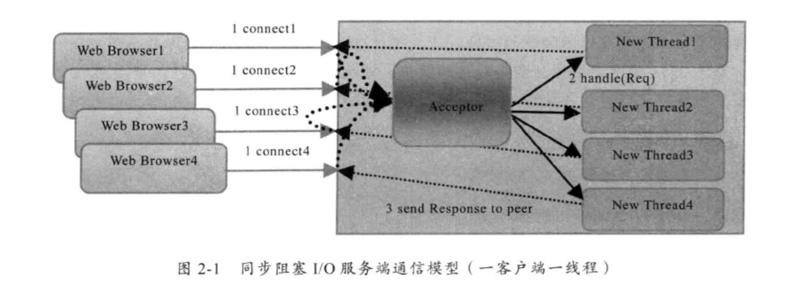

# java nio


## Nio新增功能

1,进行异步IO操作的缓冲区ByteBuffer等。

2，进行异步IO操作的管道Pipe。

3，进行各种IO操作（异步或者同步）的channel,包括ServerSocketChannel和SocketChannel。

4，多种字符集的编码能力和解码能力；

5，实现非阻塞IO操作的多路复用器selector.

6,基于流行的Perl实现的正则表达式类库。

7，文件通道FileChannel.


## 没有解决的问题

1，没有统一的文件属性（例如读写权限）.

2,API能力较弱，例如目录的级联创建和递归遍历，往往需要自己实现；

3，底层存储系统的一些高级API无法使用。

4，所有的文件操作都是同步阻塞调用，不支持异步文件读写操作。


## 传统的Bio

1，网络编程的基本模型是Client/Server 模型，也是两个进程之间进行相互通信，其中服务端提供位置信息（绑定的IP 地址和监听端口）,客户端通过连接操作向服务器端监听的地址发起连接请求，通过三次握手建立连接，如果连接建立成功,双方就可以通过网络套接字(Socket)进行通信。

2，在基于传统同步阻塞模型开发中，ServerSocket 负责绑定IP地址，启动监听端口，Socket负责发起连接操作。连接成功之后，双方通过输入输出流进行同步阻塞通信。

采用BIO通信模型的服务端，通常由一个独立的Acceptor线程负责监听客户端的链接，他接收到客户端链接请求之后为每个客户端创建一个新的线程进行链路处理，处理完成之后，通过输出流返回应答给客户端，线程销毁，这就是典型的一请求一应答的通信模型。





​	该模型最大的问题就是缺乏弹性伸缩能力，当客户端并发访问量增加后，服务端的线程个数和客户端并发访问数呈1：1的正比关系，由于线程是Java虚拟机非常宝贵的线程资源，当线程数膨胀之后，系统的性能将急剧下降，随着并发量的继续增大，系统会发生线程堆栈溢出，创建新线程失败等问题，并最终导致进程宕机或者僵死，不能对外提供服务。


server

```java
public class TimeServer {
    public static void main(String[] args) {

        int port = 8899;

        ServerSocket server = null;

        try {
            server = new ServerSocket(port);
            System.out.println("this time server is start in port: " + port);
            Socket socket = null;
            int i =0;
            while (true) {
                socket = server.accept();
                i++;
                Thread thread =  new Thread(new TimeServerHandler(socket));
                thread.setName(i+" ");
                thread.start();
            }
        } catch (IOException e) {
            e.printStackTrace();
        } finally {
            if (server != null) {
                System.out.println("The time server close");
                try {
                    server.close();
                } catch (IOException e) {
                    e.printStackTrace();
                }
                server = null;
            }
        }
    }
}
```


handler

```java
public class TimeServerHandler implements Runnable {

    private Socket socket;

    public TimeServerHandler(Socket socket) {
        this.socket = socket;
    }

    @Override
    public void run() {
        BufferedReader in = null;
        PrintWriter out = null;

        try {

            in = new BufferedReader(new InputStreamReader(this.socket.getInputStream()));
            out = new PrintWriter(this.socket.getOutputStream(), true);
            String currentTime = null;
            String body = null;
            while (true) {
                body = in.readLine();

                if (body == null) {
                    System.out.println("body === null");

                    break;


                }
                //耗时
                for(int i=0;i<100000;i++) {

                }
                System.out.println("The time server receive order: "+Thread.currentThread().getName() + body);
                currentTime = "query time order".equalsIgnoreCase(body) ? new Date(System.currentTimeMillis()).toString() : "BAD ORDER";

                out.println(currentTime);
            }


        } catch (Exception e) {
            e.printStackTrace();
            if (in != null) {
                try {
                    in.close();
                } catch (IOException e1) {
                    e1.printStackTrace();
                }
            }

            if (out != null) {
                out.close();
                out = null;
            }

            if (this.socket != null) {
                try {
                    this.socket.close();
                } catch (IOException e1) {
                    e1.printStackTrace();
                }

                this.socket = null;
            }
        }


    }
}
```


client

```java
public class TimeClient {
    public static void main(String[] args) {
        int port = 8899;
        Socket socket = null;
        BufferedReader in = null;
        PrintWriter out = null;
        try {

            for (int i = 0; i < 10000; i++) {
                socket = new Socket("127.0.0.1", port);
                in = new BufferedReader(new InputStreamReader(socket.getInputStream()));
                out = new PrintWriter(socket.getOutputStream(), true);
                out.println("query time order");
//                out.println();


                System.out.println("send order 2 server succeed.");
                String resp = in.readLine();
                System.out.println("Now is: " + i + "   " + resp);


            }


        } catch (Exception e) {
            e.printStackTrace();
        } finally {
            if (out != null) {
                out.close();
                out = null;
            }

            if (in != null) {
                try {
                    in.close();
                } catch (IOException e) {
                    e.printStackTrace();
                }
            }

            if (socket != null) {
                try {
                    socket.close();
                } catch (IOException e) {
                    e.printStackTrace();
                }

                socket = null;
            }
        }
    }
}
```


