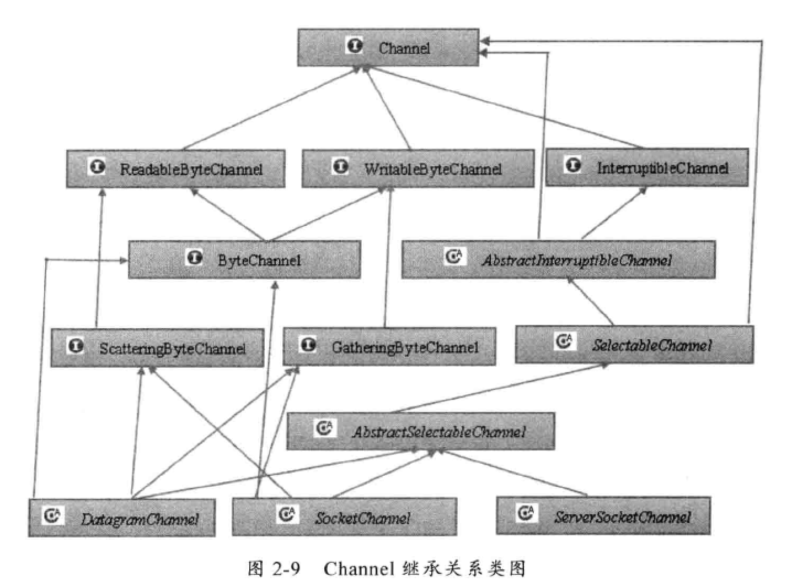

# java nio


## Nio新增功能

1,进行异步IO操作的缓冲区ByteBuffer等。

2，进行异步IO操作的管道Pipe。

3，进行各种IO操作（异步或者同步）的channel,包括ServerSocketChannel和SocketChannel。

4，多种字符集的编码能力和解码能力；

5，实现非阻塞IO操作的多路复用器selector.

6,基于流行的Perl实现的正则表达式类库。

7，文件通道FileChannel.


## 没有解决的问题

1，没有统一的文件属性（例如读写权限）.

2,API能力较弱，例如目录的级联创建和递归遍历，往往需要自己实现；

3，底层存储系统的一些高级API无法使用。

4，所有的文件操作都是同步阻塞调用，不支持异步文件读写操作。


## 传统的Bio

1，网络编程的基本模型是Client/Server 模型，也是两个进程之间进行相互通信，其中服务端提供位置信息（绑定的IP 地址和监听端口）,客户端通过连接操作向服务器端监听的地址发起连接请求，通过三次握手建立连接，如果连接建立成功,双方就可以通过网络套接字(Socket)进行通信。

2，在基于传统同步阻塞模型开发中，ServerSocket 负责绑定IP地址，启动监听端口，Socket负责发起连接操作。连接成功之后，双方通过输入输出流进行同步阻塞通信。


##缓冲区Buffer

```
Buffer 是一个对象，它包含一些要写入或者要读的数据。在NIO类库中加入Buffer 对象，体现了与新库与IO的一个重要区别。


在NIO 库中，所有数据都是用缓冲区处理的。写入写出都要经过缓冲区。

缓冲区实质上是一个数组。通常它是一个字节数组(ByteBuffer),也可以使用其它种类的数组，但是一个缓冲区不仅仅是一个数组，缓冲区提供了对对数据结构化访问以及维护读写位置(limit)等信息。

```


### 缓冲区种类

* ByteBuffer:字节缓冲区。
* CharBuffer:字符缓冲区。
* ShortBuffer:短整形缓冲区。
* IntBuffer:整形缓冲区。
* LongBuffer:长整型缓冲区。
* FloatBuffer:浮点缓冲区。
* DoubleBuffer:双精度浮点型缓冲区。


## 通道Channel

```
Channel 是一个通道，他就像来自水管一样，网络通过Channel 读取和写入。

通道与流不同之处在于通道是双向的，流只是在一个方向上移动(一个流必须是InputStream 或者OutputStream的子类)，而通道可以读，写或者二者同时进行。

因为Channel 是全双工的，所以他可以比流更好地映射底层操作系统的Api。特别是Unix网络编程模型中，底层操作系统的通道都是全双工的，同时支持读写操作。
```




## 多路复用器Selector

```
多路复用器提供选择已经就绪的任务能力。

Selector 会不断地轮询注册在其上的Channel,如果某个Channel上面发生读或者写事件，这个Channel就处于就绪状态，会被Selector轮询出来，然后通过SelectionKey 可以获取就绪Channel的集合，进行后续的IO操作。

一个多路复用器Selector可以同时轮询多个Channel,这也就意味着只需要一个线程负责Selector的轮询，就可以接入成千上万的客户端，这确实是个非常巨大的进步.
```


## NIO服务器端序列图


* 步骤一：打开ServerSocketChannel ,用于监听客户端的连接，它是所有客户端连接的父通道。

```java
ServerSocketChannel acceptorSvr = ServerSocketChannel.open();
```


* 步骤二：绑定监听端口，设置连接为非阻塞模式

```java
acceptorSvr.socket().bind(new InetSocketAddress(InetAddress.getByName(“IP”),port));

acceptorSvr.configureBlocking(false) ; 
```


* 步骤三： 创建Reactor线程，创建多路复用器并启动线程

  ```
  Selector selector = Selector.open();
  new Thread(new ReactorTask()).start();
  ```

  ​

* 步骤四：将SeverSocketChannel注册到Reactor线程的多路复用器Selector上，监听ACCEPT事件

  ```java
  SelectionKey key = acceptorSvr.register(selector,SelectionKey.OP_ACCEPT,ioHandler)
  ```


* 步骤五：多路复用器在线程run方法的无线循环体内轮询准备就绪的key

  ```java
  int num = selector.select();
  Set selectedKeys = selector.selectedKeys();
  Iterator it = selectedKeys.iterator();
  while(it.hasNext()){
    SelectionKey key = (SelectionKey)id.next();
    /**
    * deal with IO event
    **/
  }
  ```

  ​

* 步骤六：多路复用器监听到有新的客户端接入，处理新的接入请求，完成TCP三次握手，建立物理链路

  ```
  SocketChannel channel = svrChannel.accept();
  ```

  ​

* 步骤七： 设置客户端链路为非阻塞模式

  ```Java
  channel.configureBlocking(false);
  channel.socket().setReuseAddress(true)
  ```

  ​

* 步骤八：将新接入的客户端连接注册到Reactor线程的多路复用器上，监听读操作，读取客户端发送的网络消息

  ```Java
  SelectionKey key = socketChannel.register(selector,SelectionKey.OP_READ,ioHandler);
  ```

  ​

* 步骤九：异步读取客户端请求消息到缓冲区

  ```java
  int readNumber = channel.read(recivedBuffer);
  ```

  ​

* 步骤十：对ByteBuffer进行编解码，如果有半包消息指针reset，继续读取后续的报文，将解码成功的消息封装成Task，投递到业务线程池中，进行业务逻辑编排

  ```java
  Object message = null;
  while(buffer.hasRemain) {
    byteBuffer.mark();
    Object message = decode(byteBuffer);
    if(message == null) {
      byteBuffer.reset();
      break;
    }
    messageList.add(message)
    
  }
  if(!byteBuffer.hasRmain()) {
      byteBuffer.clear();
  } else {
      byteBuffer.compact();
    
  }

  if(messageList != null & !messageList.isEmpty()) {
      for(Object messageE : messageList){
          handlerTask(messageE);
      }
  }
  ```


* 步骤十一： 将POJO对象encode 成ByteBuffer,调用SocketChannel的异步write 接口，将消息异步发送给客户端

  ```java
  socketChannel.write(buffer);
  ```


注意：如果发送区TCP 缓冲区满，会导致写半包，此时，需要注册监听写操作位，循环写，直到整包消息写入TCP缓冲区