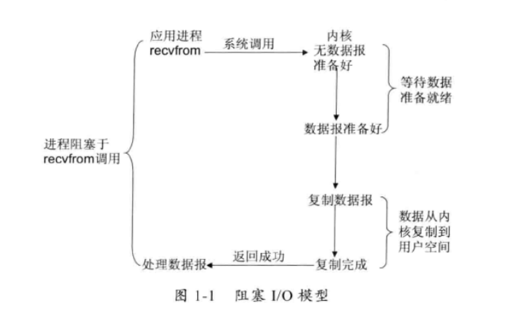
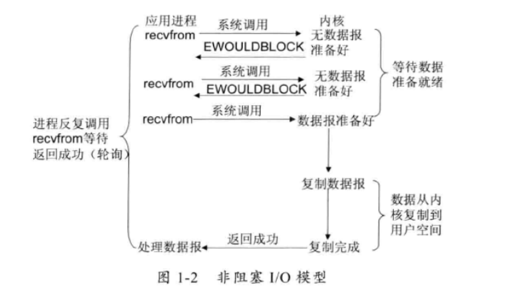
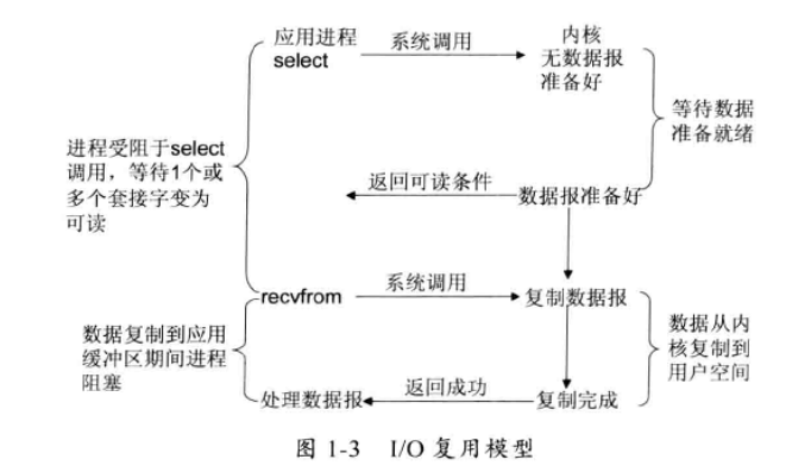
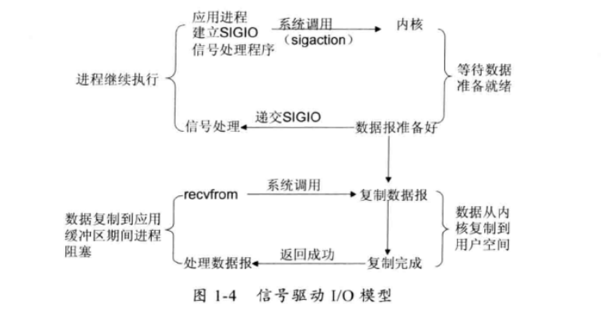
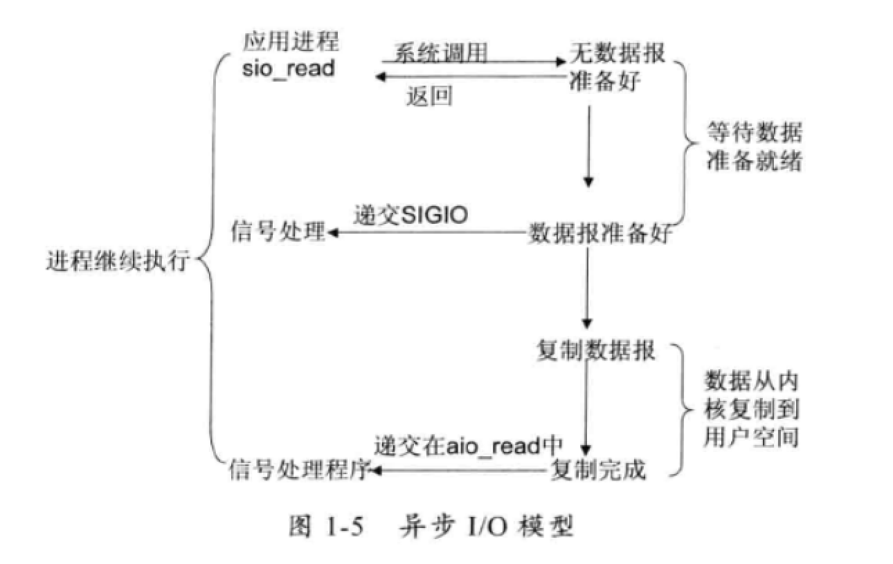

## linux IO 基本模型

Linux 的系统内核将所有外部设备都看做一个文件来操作，对一个文件的读写操作会调用内核提供的系统命令，返回一个file descriptor(fd，文件描述符)。而对一个socket的读写也会有相应的描述符，称为socketfd（socket描述符）,描述符就会一个数字，他指向内核中的一个结构体（文件路径，数据区等一些属性）。

## 阻塞I/O模型

最常用的I/O模型就是阻塞IO模型，缺省情形下，所有文件操作都是阻塞的。以套接字接口为为例来讲解此模型：在进程空间中调用recvfrom,其系统调用到数据包到达被复制到应用进程的缓冲区中或者发生错误时才返回，在此期间一直会等待，进程在调用recvfrom开始到它返回的整段时间内都是被阻塞的，因此被称为阻塞IO模型。

### 非阻塞IO模型

非阻塞IO 模型：recvfrom 从应用层到内核的时候，如果该缓冲区没有数据的话，就直接返回一个EWOULDBLOCK错误，一般都对非阻塞IO模型进行轮询检查这个状态看内核是不是有数据到来。

### IO 复用模型

IO复用模型：Linux 提供select/poll，进程通过将一个或多个fd传递给select或poll系统调用，阻塞在select操作上，这样select活poll可以帮我们侦测多个fd是否处于就绪状态。select/poll是顺序扫描fd是否就绪，而且支持的fd数量有限，因此它的使用受到了一些制约。Linux还提供一个epoll系统调用,epoll使用基于事件驱动方式代替顺序扫描，因此性能更高。当有fd就绪时，立即回调函数rollback。

### 信号驱动IO模

信号驱动IO模型：首先开启套接口信号驱动IO功能，并通过系统调用sigaction执行一个信号处理函数（此系统调用立即返回，进程继续工作，它是非阻塞的）。当数据准备就绪时，就为该进程生成一个SIGIO信号，通过信号回调通知应用程序调用recefrom 来读取数据并通知主循环函数处理数据。

### 异步IO

异步IO: 告知内核启动某个操作，并让内核在整个操作完成后（包括将数据从内核复制到用户自己的缓冲区）通知我们。这种模型与信号驱动模型的主要区别：信号驱动IO由内核通知我们何时可以开始一个IO操作；异步IO模型由内核通知我们IO操作何时已经完成。

### IO 多路复用技术

在IO 编程过程中，当需要同时多个客户端接入请求时，可以利用多个线程或者IO多路复用技术进行处理。IO多路复用技术通过把多个IO的堵塞复用到同一个select的阻塞上，从而使得系统在单线程的情况下可以同时处理多个客户端请求。与传统的多线程/多进程模型比，IO多路复用的最大优势是系统开销小，系统不需要创建新的额外进程或者线程，也不需要维护这些进程和线程的运行，降低了系统的维护工作量，节省了系统资源。

#### IO多路复用的主要应用场景如下：

1，服务器需要同时处理多个处于监听状态或者多个连接状态的套接字；

2, 服务器需要同时处理多中网络协议的套接字。

#### epoll 与select比较

为了克服select的缺点，epoll做了很多重大改进：

1,支持一个进程打开的socket描述符（FD）不受限制（仅受限于操作系统的最大文件句柄数）.

​	文件句柄可以通过cat /proc/sys/fs/file-max 查看，通常情况下这个值根系统的内存关系比较大。

2,IO效率不会随着FD数目的增加而线性下降。

3,使用mmap加速内核与用户空间的消息传递。

​	无论是select,poll还是epoll都需要 内核把fd消息通知给用户空间，如何避免不必要的内存复制就显得非常重要，epoll是通过内核和用户空间mmap同一块内存来实现。

http://blog.csdn.net/luckywang1103/article/details/50619251

4,epoll的api更加简单

