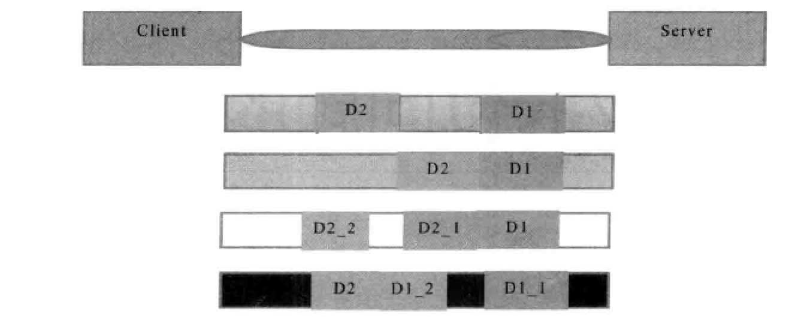
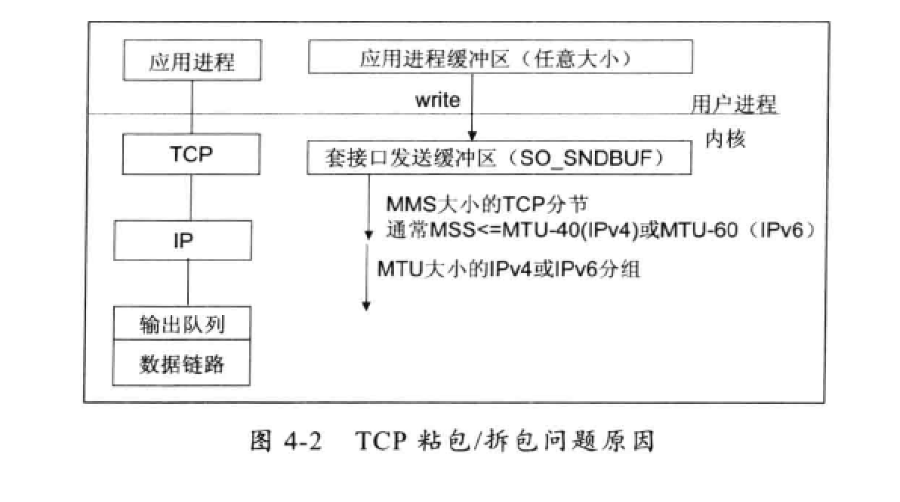
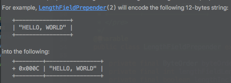
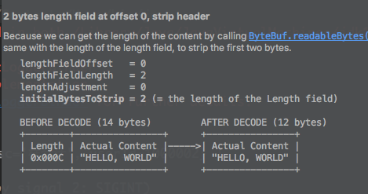
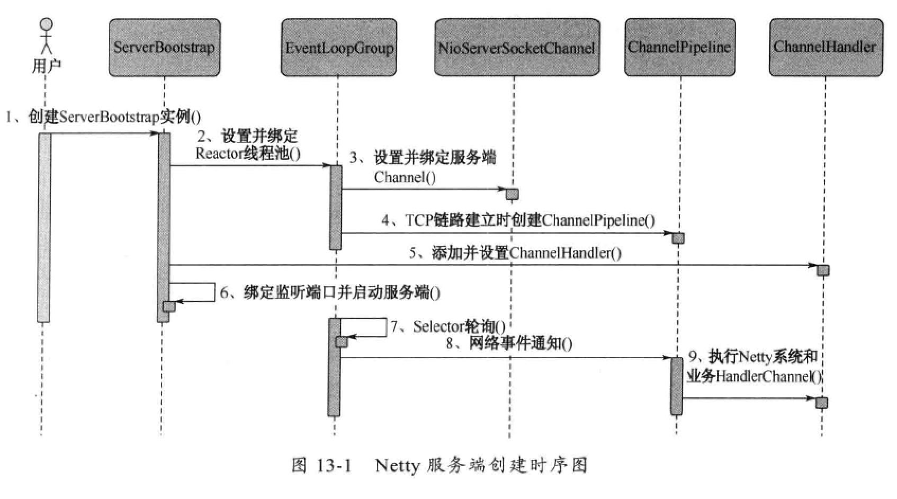

# netty

## netty 优点

* API 使用简单，开发门槛低。
* 功能强大，预置了各种编解码功能，支持多种主流协议；
* 定制能力强，可以通过ChannelHandler对通信框架进行灵活地扩展。
* 性能高，通过与其他业界的NIO框架对比，Netty的综合性能最优。
* 成熟，稳定，Netty 修复了已经发现的所有JDK NIO BUG，业务开发人员不需要再为NIO的BUG而烦恼。
* 社区活跃，迭代周期短，发现的BUG可以被及时修复，同时，更多的新功能会加入。
* 经历了大规模的商业应用考验,质量得到验证。

<<<<<<< HEAD


#### netty 实例代码

TimeServer.java

```

public class TimeServer {

    public void bind(int port) {

        EventLoopGroup bossGroup = new NioEventLoopGroup();
        EventLoopGroup workerGroup = new NioEventLoopGroup();

        try {
            ServerBootstrap b = new ServerBootstrap();
            b.group(bossGroup, workerGroup)
                    .channel(NioServerSocketChannel.class)
                    .option(ChannelOption.SO_BACKLOG, 1024)

                    .childHandler(new ChildChannelHandler());


            //绑定端口，同步等待成功
            ChannelFuture f = b.bind(port).sync();

            //等待服务器jian'ting监听端口关闭
            f.channel().closeFuture().sync();
        } catch (InterruptedException e) {
            e.printStackTrace();
        } finally {
            //优雅退出，释放线程池资源
            bossGroup.shutdownGracefully();
            workerGroup.shutdownGracefully();
        }


    }

    public static class ChildChannelHandler extends ChannelInitializer<SocketChannel> {

        @Override
        protected void initChannel(SocketChannel ch) throws Exception {
            ChannelPipeline pipline = ch.pipeline();
//            pipline.addLast(new DelimiterBasedFrameDecoder(4096, Delimiters.lineDelimiter()));
//            pipline.addLast(new StringDecoder(CharsetUtil.UTF_8));
//            pipline.addLast(new StringEncoder(CharsetUtil.UTF_8));
            pipline.addLast(new TimeServerHandler());
        }
    }

    public static void main(String[] args) {
        int port = 9988;

        new TimeServer().bind(port);

    }
}

```


TimeServerHandler.java

```
public class TimeServerHandler extends SimpleChannelInboundHandler<String> {


    @Override
    protected void channelRead0(ChannelHandlerContext ctx, String msg) throws Exception {
        System.out.println("server receive:  "+msg);
        String currentTime = "QUERY TIME ORDER".equalsIgnoreCase(msg) ? new Date().toString() : "BAD ORDER";

        //耗时
        for(int i=0;i<100000;i++) {

        }
//        ctx.channel().writeAndFlush(currentTime+"\r\n");
        ctx.channel().writeAndFlush(currentTime);

        ctx.channel().close();
        ctx.close();

    }

    @Override
    public void channelReadComplete(ChannelHandlerContext ctx) throws Exception {

        System.out.println("server :  channelReadComplete");

    }

    @Override
    public void exceptionCaught(ChannelHandlerContext ctx, Throwable cause) throws Exception {
        cause.printStackTrace();

        ctx.close();
    }
}
```


TimeClient.java

```
public class TimeClient {
    public void connect(int port, String host) {

        EventLoopGroup group = new NioEventLoopGroup();

        try {
            Bootstrap b = new Bootstrap();
            b.group(group).channel(NioSocketChannel.class)
                .option(ChannelOption.TCP_NODELAY,true)
                    .handler(new ChannelInitializer<SocketChannel>() {
                        @Override
                        protected void initChannel(SocketChannel ch) throws Exception {
                            ChannelPipeline pipline = ch.pipeline();
                            //换行分割
//                            pipline.addLast(new DelimiterBasedFrameDecoder(4096, Delimiters.lineDelimiter()));
//                            pipline.addLast(new StringDecoder(CharsetUtil.UTF_8));
//                            pipline.addLast(new StringEncoder(CharsetUtil.UTF_8));
                            pipline.addLast(new TimeClientHandler());
                        }
                    });

            //发起异步连接操作

            ChannelFuture f = b.connect(host, port).sync();
//            Channel channel = f.channel();
//            BufferedReader br = new BufferedReader(new InputStreamReader(System.in,CharsetUtil.UTF_8));
//
//            for(;;) {
////                channel.writeAndFlush(br.readLine()+"\r\n");
//                channel.writeAndFlush(br.readLine());
//            }

//            f.channel().writeAndFlush("test");
            //等待客户端链路关闭
            f.channel().closeFuture().sync();
        } catch (Exception e) {
            e.printStackTrace();
        } finally {
            System.out.println("退出关闭--->");
            group.shutdownGracefully();
        }
    }

    public static void main(String[] args) {
        int port = 9988;

        System.out.println("-----start:");
        new TimeClient().connect(port, "127.0.0.1");


    }
}
```


TimeClientHandler.java

```
public class TimeClientHandler extends SimpleChannelInboundHandler<String> {
    @Override
    protected void channelRead0(ChannelHandlerContext ctx, String msg) throws Exception {

        System.out.println("client receive : "+msg);
//        ctx.channel().writeAndFlush("QUERY TIME ORDER"+"\r\n");
    }

    @Override
    public void channelActive(ChannelHandlerContext ctx) throws Exception {
        //第一次请求 连接
        System.out.println("client :  channelActive");
//        ctx.channel().writeAndFlush("first--->"+"\r\n");
        String result = "";
        for(int i=0;i<1000;i++) {
            result +="first--->";
        }
        ctx.channel().writeAndFlush(result);

        System.out.println("send ...");


    }

    @Override
    public void channelReadComplete(ChannelHandlerContext ctx) throws Exception {
        System.out.println("client: channelReadComplete");
        ctx.channel().flush();
    }

    @Override
    public void exceptionCaught(ChannelHandlerContext ctx, Throwable cause) throws Exception {
       cause.printStackTrace();
       ctx.close();
    }
}

```


## TCP 粘包/拆包

```
TCP 是一个“流”协议，所谓流，就是没有界限的一串数据，没有分界线，TCP底层并不了解业务数据的具体含义，它会根据TCP缓冲区的实际情况进行包的划分，所以在业务上认为，一个完整的包可能会被TCP 拆分多个包进行发送，也有可能包多个小的包封装成一个大的数据包发送，这就是所谓的TCP粘包和拆包的问题。
```




假设客户端分别发送了两个数据包D1和D2给服务器端，由于服务器端一次读取到的字节数是不确定的，所以可能存在以下4中情况。

1，服务器端分两次读取到了两个独立的数据包，分别是D1和D2，没有粘包和拆包。

2，服务器端一次接收到两个数据包，D1和D2粘合在一起，被称为TCP粘包。

3，服务器端分两次读取到了两个数据包，第一次读取到了完成的D1和D2 包的部分内容，第二次读取到了D2包剩余内容，这被称为TCP拆包。


4，服务器端两次读取到了两个数据包，第一次读取到了D1包的部分内容D1_1,第二次读取到了D1包的剩余内容D1_2和到包的整包。


#### TCP粘包/拆包发生的原因

问题产生的原因有三个，分别如下：

```
1,应用程序write写入的自己大小大于套接口发送缓冲大小；

2，进行MSS大小的TCP分段。

3，以太网帧的payload 大于MTU进行IP分片。
```




#### 粘包问题的解决策略

1，消息定长，例如每个报文的大小固定长度200字节，如果不够，空位补空格。

2，在包尾增加回车换行符进行分割，例如FTP

3,将消息分为消息头和消息体，消息头中包含消息总长度（或者消息体长度）的字段，通常设计思路为消息头的第一个字段使用int32来表示消息的总长度。

4，更复杂的协议。


#### netty 解决粘包拆包问题LineBasedFrameDecoder 和StringDecoder

在handler的channelPipeline 中添加LineBasedFrameDecoder 和StringDecoder,消息加上回车换行符(\r\n)


```
LineBasedFrameDecoder的工作原理是它依次遍历消息中的可读字节，判断看是否有“\n”或者“\r\n”，如果有，就以此为结束位置，从可读索引到结束位置区间的字节就组成了一行.它是以换行符为结束标志的解码器，支持携带结束符或者不携带结束符两种编码方式，同时支持配置单行的最大长度。如果连续读到最大长度后仍然没有发现换行符，就会跑出异常，同时忽略之前读到的异常码流。
```


```
StringDecoder的功能非常简单，就是将接收到的对象换成字符串，然后继续调用后面的Handler.LineBasedFrameDecoder + StringDecoder组合就是按照行切换的文本解码器，它被设计用来支持TCP的粘包和拆包
```


## 分隔符和定长解码器的应用

TCP 以流的方式进行数据传输，上层的应用协议为了对消息进行区分，往往采用如下4中方式：

* 1，消息长度固定，累计读取到长度总和为定长lend的报文后，就认为读取到了一个完整的消息；将计数器置位；将计数器置位，重新开始读取下一个数据报。(FixedLengthFrameDecoder)
* 2，将回车换行符作为消息结束符，例如ftp协议，这种方式在文本协议中应用广泛。(LineBasedFrameDecoder,DelimiterBasedFrameDecoder)
* 3，将特殊的分隔符作为消息的结束标志，回车换行符就是一种特殊的结束分隔符。
  (DelimiterBasedFrameDecoder)
* 4，通过对消息头中定义字段来标识消息的总长度。（LengthFiledPrepender 和 LengthFieldBasedFrameDecoder）


#### DelimiterBasedFrameDecoder实例自定义分隔符

自定义分隔符 $_

server

```Java
public class EchoServer {
    public static void main(String[] args) {
        EventLoopGroup bossGroup = new NioEventLoopGroup();
        EventLoopGroup workerGroup = new NioEventLoopGroup();

        try {
            ServerBootstrap b = new ServerBootstrap();
            b.group(bossGroup,workerGroup)
                    .channel(NioServerSocketChannel.class)
                    .option(ChannelOption.SO_BACKLOG,100)
                    .handler(new LoggingHandler(LogLevel.INFO))
                    .childHandler(new ChannelInitializer<SocketChannel>() {
                        @Override
                        protected void initChannel(SocketChannel ch) throws Exception {
                            ByteBuf delimiter = Unpooled.copiedBuffer("$_".getBytes());
                            ch.pipeline().addLast(new DelimiterBasedFrameDecoder(1024,delimiter));
                            ch.pipeline().addLast(new StringDecoder());
                            ch.pipeline().addLast(new EchoServerHandler());
                        }
                    });

            //绑定端口，同步等待成功
            ChannelFuture f = b.bind(8888).sync();

            //等待服务器关闭
            f.channel().closeFuture().sync();

        } catch (Exception e) {
            e.printStackTrace();

        } finally {
            bossGroup.shutdownGracefully();
            workerGroup.shutdownGracefully();

        }

    }
}

```


serverHandler

```Java
public class EchoServerHandler extends SimpleChannelInboundHandler<String> {
    volatile  int  counter = 0;
    @Override
    protected void channelRead0(ChannelHandlerContext ctx, String msg) throws Exception {

        System.out.println("this is "+ ++counter+ " times receiver client[ "+msg+" ]");
        if("exit".equals(msg)) {
            System.out.println("======================");

            ctx.close();
            return;
        }
        msg += "$_";
        ByteBuf echo = Unpooled.copiedBuffer(msg.getBytes());
        ctx.writeAndFlush(echo);

    }

    @Override
    public void exceptionCaught(ChannelHandlerContext ctx, Throwable cause) throws Exception {
        cause.printStackTrace();
        ctx.close();
    }
}

```


Client

```Java
public class EchoClient
{
    public static void main(String[] args) {
        EventLoopGroup group = new NioEventLoopGroup();

        try{
            Bootstrap b = new Bootstrap();
            b.group(group).channel(NioSocketChannel.class)
                    .option(ChannelOption.TCP_NODELAY,true)
                    .handler(new ChannelInitializer<SocketChannel>() {
                        @Override
                        protected void initChannel(SocketChannel ch) throws Exception {
                            ByteBuf delimiter = Unpooled.copiedBuffer("$_".getBytes());
                            ch.pipeline()
                                    .addLast(new DelimiterBasedFrameDecoder(1024,delimiter))
                                    .addLast(new StringDecoder())
                                    .addLast(new EchoClientHandler());


                        }
                    });

            //发起异步连接
            ChannelFuture f = b.connect("127.0.0.1", 8888).sync();

            //等待客户端lian链路关闭
        f.channel().closeFuture().sync();


        } catch (Exception e){
            e.printStackTrace();
        } finally {
            group.shutdownGracefully();
        }
    }
}

```


ClientHandler

```Java
public class EchoClientHandler extends SimpleChannelInboundHandler<String> {
    private int counter ;
    static final String ECHO_REQ = "Hi , haozi .welcome to netty .$_";


    @Override
    protected void channelRead0(ChannelHandlerContext ctx, String msg) throws Exception {
        System.out.println("This is "+ ++counter+ " tiems receive server : [ "+ msg +" ]");

    }

    @Override
    public void channelActive(ChannelHandlerContext ctx) throws Exception {

        for(int i=0;i<10;i++) {
            ctx.writeAndFlush(Unpooled.copiedBuffer(ECHO_REQ.getBytes()));
        }

//        System.out.println("------->exit");
        ctx.writeAndFlush(Unpooled.copiedBuffer("exit$_".getBytes()));
    }

    @Override
    public void exceptionCaught(ChannelHandlerContext ctx, Throwable cause) throws Exception {
        cause.printStackTrace();
        ctx.close();
    }
}

```


#### FixedLengthFrameDecoder实例自定义分隔符


```Java
public class FixedServer {
    public static void main(String[] args) {

        EventLoopGroup bossGroup = new NioEventLoopGroup();
        EventLoopGroup workderGroup = new NioEventLoopGroup();

        try {
            ServerBootstrap bootstrap = new ServerBootstrap();
            bootstrap.group(bossGroup, workderGroup)
                    .channel(NioServerSocketChannel.class)
                    .handler(new LoggingHandler(LogLevel.INFO))

                    .childHandler(new ChannelInitializer<SocketChannel>() {
                        @Override
                        protected void initChannel(SocketChannel ch) throws Exception {
                            ChannelPipeline pipe = ch.pipeline();
//                            pipe.addLast(new DelimiterBasedFrameDecoder(1024, Unpooled.copiedBuffer(";".getBytes())));
                            pipe.addLast(new FixedLengthFrameDecoder(10));

                            pipe.addLast(new StringDecoder());
                            pipe.addLast(new FixedServerHandler());
                        }
                    });

            ChannelFuture f = bootstrap.bind(8889).sync();

            f.channel().closeFuture().sync();


        } catch (InterruptedException e) {
            e.printStackTrace();
        } finally {
            bossGroup.shutdownGracefully();
            workderGroup.shutdownGracefully();
        }


    }
}

```


```Java
public class FixedServerHandler extends SimpleChannelInboundHandler<String> {
    @Override
    protected void channelRead0(ChannelHandlerContext ctx, String msg) throws Exception {
        System.out.println("server receive [ "+msg+" ]");

        ctx.writeAndFlush(Unpooled.copiedBuffer(("server send : "+ LocalDateTime.now().toString()+"\r\n").getBytes()));
        ctx.channel().writeAndFlush(Unpooled.copiedBuffer("-------------------->\r\n".getBytes()));

        if(msg.contains("exit")) {
            ctx.channel().writeAndFlush(Unpooled.copiedBuffer("即将关闭客户端.....\r\n".getBytes()));
            ctx.channel().close();
        }

        System.out.println("end message");
    }

    @Override
    public void exceptionCaught(ChannelHandlerContext ctx, Throwable cause) throws Exception {
        cause.printStackTrace();
        ctx.close();
    }
}

```


Telnet 127.0.0.1 8889


# netty常用解码器 

## TCP 粘包拆包

#### LineBasedFrameDecoder

```
以分隔符\r \r\n 作为分隔符，如果超出最大值会报出异常 在消息中是没有分隔符，如果没有分割符将缓存起来
```


### DelimiterBasedFrameDecoder

```
自定义分割符，如果超出最大值会报出异常 在消息中是没有分隔符，如果没有分割符将缓存起来
```


#### StringDecoder

```
把消息解码成字符串
```


###FixedLengthFrameDecoder

```
用于固定长度的消息进行自动解码
```


## netty 编解码

#### java 序列化的

* 网路传输
* 对象持久化


#### 编解码框架的优劣

* 是否支持跨语言，支持的语言种类是否丰富
* 编解码的码流大小
* 编解码的性能；
* 类库是否小巧，API使用是否方便
* 使用者需要手工开发的工作量和难度。

在同等情况下，编码后的字节数组越大，存储的时候就越占空间，存储的硬件成本就越高，并且在网络传输时更占带宽，导致系统的吞吐量降低。

```
衡量序列化框架通用性的一个重要指标就是对多语言的支持，因为数据交换的双方很难保证一定采用相同的语言开发，如果序列化框架和某种语言绑定，他就很难跨语言，例如java的序列化机制。
```


### Protobuf

```
它将数据结构以.proto文件进行描述，通过代码生成工具可以生成对应数据结构的POJO对象和Protobuf相关的方法和属性.
```

##### 特点

* 结构化数据存储格式（xml,json等）；
* 搞笑的编码解码性能；
* 语言无关，平台无关，扩展性好；
* 官方支持java,c++ 和Python三种语言


#### Thrift

在多种不同语言之间通信，Thrift可以作为高性能的通信中间件使用，它支持数据（对象）序列化和多种类的RPC服务。Thrift适用于静态的数据交换，需要先确定好他的数据结构，当数据结构发生变化时，必须重新编辑IDL文件，生成代码和编译，这一点根其他IDL工具相比可以视为是Thrift的弱项。Thrift适用于搭建大型数据交换及存储的通用工具，对于大型系统中内部数据传输，相对于JSON 和xml在性能和传输大小都有明显的优势。


##### Thrift 主要由5部分组成

* 语言系统以及IDL编译器：负责由用户给定的IDL文件成相应语言接口代码。
* TProtocal:    RPC的协议层，可以选择多种不同的对象序列化方法，如json和Binary.
* TTransport:   RPC的传输层，同样可以选择不同的传输层实现，如socket,NIO,MemoryBuffer等。
* TProcessor: 作为协议层和用户提供的服务实现之间的纽带，负责调用服务实现的接口。
* TServer：  聚合TProtocol,TTransport和TProcessor等对象.


##### Thrift 支持三种比较典型的编解码方式

* 通用的二进制编解码。
* 压缩二进制编解码。
* 优化的可选字段压缩编解码。


### MessagePack 编解码

```
MessagePack 是一个高效的二进制序列化框架，它像Json一样支持不同语言间的数据交换，但是他的性能更快，序列化之后的码流也更小。
```


##### MessagePack的特点

* 编解码高效，性能高；
* 序列化之后的码流小。
* 支持跨语言。


```
compile 'org.msgpack:msgpack:0.6.12'
```

#### messagepack实例

```Java
// Create serialize objects.
List<String> src = new ArrayList<String>();
src.add("msgpack");
src.add("kumofs");
src.add("viver");

MessagePack msgpack = new MessagePack();
// Serialize
byte[] raw = msgpack.write(src);

// Deserialize directly using a template
List<String> dst1 = msgpack.read(raw, Templates.tList(Templates.TString));
System.out.println(dst1.get(0));
System.out.println(dst1.get(1));
System.out.println(dst1.get(2));

// Or, Deserialze to Value then convert type.
Value dynamic = msgpack.read(raw);
List<String> dst2 = new Converter(dynamic)
    .read(Templates.tList(Templates.TString));
System.out.println(dst2.get(0));
System.out.println(dst2.get(1));
System.out.println(dst2.get(2));
```


#### netty  messagePack实例

把要传递的数据全部封装在CallBack对象用type 字段判断传递的类型，自定义编码解码器

```Java
public class MegpackEncoder extends MessageToByteEncoder<Object> {
    @Override
    protected void encode(ChannelHandlerContext ctx, Object msg, ByteBuf out) throws Exception {
        MessagePack messagePack = new MessagePack();
        byte[] raw = messagePack.write(msg);
        out.writeBytes(raw);
    }
}
```


```Java
public class MsgpackDecoder extends MessageToMessageDecoder<ByteBuf> {


    @Override
    protected void decode(ChannelHandlerContext ctx, ByteBuf msg, List<Object> out) throws Exception {
        System.out.println(" ==================MsgpackDecoder");
        final int length = msg.readableBytes();
        final byte[] array;
        array = new byte[length];
        msg.getBytes(msg.readerIndex(), array, 0, length);
        MessagePack messagePack = new MessagePack();

        CallBackData callBackData =  messagePack.read(array,CallBackData.class);
        out.add(callBackData);
    }
}
```

在decoder 前后添加LengthFieldBasedFrameDecoder  LengthFieldPrepender


server

```Java
public class TimeServer {

    public void bind(int port) {

        EventLoopGroup bossGroup = new NioEventLoopGroup();
        EventLoopGroup workerGroup = new NioEventLoopGroup();

        try {
            ServerBootstrap b = new ServerBootstrap();
            b.group(bossGroup, workerGroup)
                    .channel(NioServerSocketChannel.class)
                    .option(ChannelOption.SO_BACKLOG, 1024)

                    .childHandler(new ChildChannelHandlerMessagePack());


            //绑定端口，同步等待成功
            ChannelFuture f = b.bind(port).sync();

            //等待服务器jian'ting监听端口关闭
            f.channel().closeFuture().sync();
        } catch (InterruptedException e) {
            e.printStackTrace();
        } finally {
            //优雅退出，释放线程池资源
            bossGroup.shutdownGracefully();
            workerGroup.shutdownGracefully();
        }


    }

    public static class ChildChannelHandler extends ChannelInitializer<SocketChannel> {

        @Override
        protected void initChannel(SocketChannel ch) throws Exception {
            ChannelPipeline pipline = ch.pipeline();
//            pipline.addLast(new DelimiterBasedFrameDecoder(4096, Delimiters.lineDelimiter()));
            pipline.addLast(new LineBasedFrameDecoder(1024));
            pipline.addLast(new StringDecoder(CharsetUtil.UTF_8));
            pipline.addLast(new StringEncoder(CharsetUtil.UTF_8));
            pipline.addLast(new TimeServerHandler());
        }
    }


    /**
     * messagepack 支持
     */
    public static class ChildChannelHandlerMessagePack extends ChannelInitializer<SocketChannel>{

        @Override
        protected void initChannel(SocketChannel ch) throws Exception {
            ChannelPipeline pipline = ch.pipeline();
            pipline.addLast("framDecoder",new LengthFieldBasedFrameDecoder(65535,0,2,0,2));

            pipline.addLast("msgpack decode",new MsgpackDecoder());
            //这里设置读取报文的包头长度来避免粘包
            ch.pipeline().addLast("frameEncoder",new LengthFieldPrepender(2));
            pipline.addLast("msgpack encode",new MegpackEncoder());
            pipline.addLast("TimeServerHandlerMesgPack",new TimeServerHandlerMesgPack());

        }
    }

    public static void main(String[] args) {
        int port = 9988;

        new TimeServer().bind(port);

    }
}

```


Serverhandler

```Java
public class TimeServerHandlerMesgPack extends SimpleChannelInboundHandler<CallBackData> {


    @Override
    protected void channelRead0(ChannelHandlerContext ctx, CallBackData msg) throws Exception {

        if(msg.getType() == 1) {
            System.out.println("用户  server receive [ "+msg.getUserInfo()+" ]");
        } else if(msg.getType() == 2) {
            System.out.println("学生  server receive [ "+msg.getStudent()+" ]");
        }


        UserInfo userInfo =  new UserInfo();
        userInfo.setUserId(1000002);
        userInfo.setUserName("李浩");


        CallBackData callBackData =  new CallBackData();
        callBackData.setUserInfo(userInfo);
        callBackData.setType(1);


        ctx.channel().writeAndFlush(callBackData);

    }

    @Override
    public void channelReadComplete(ChannelHandlerContext ctx) throws Exception {

        System.out.println("server :  channelReadComplete");

    }

    @Override
    public void exceptionCaught(ChannelHandlerContext ctx, Throwable cause) throws Exception {
        cause.printStackTrace();

        ctx.close();
    }
}

```


client

```Java
public class TimeClient {
    public void connect(int port, String host) {

        EventLoopGroup group = new NioEventLoopGroup();

        try {
            Bootstrap b = new Bootstrap();
            b.group(group).channel(NioSocketChannel.class)
                .option(ChannelOption.TCP_NODELAY,true)
                    .handler(new ClinetHandlerMessagePack());

            //发起异步连接操作

            ChannelFuture f = b.connect(host, port).sync();

            //等待客户端链路关闭
            f.channel().closeFuture().sync();
        } catch (Exception e) {
            e.printStackTrace();
        } finally {
            System.out.println("退出关闭--->");
            group.shutdownGracefully();
        }
    }


    /**
     * messagepack 支持
     */
    public static class ClinetHandlerMessagePack extends ChannelInitializer<SocketChannel>{

        @Override
        protected void initChannel(SocketChannel ch) throws Exception {
            ChannelPipeline pipline = ch.pipeline();
            pipline.addLast("framDecoder",new LengthFieldBasedFrameDecoder(300,0,2,0,2));


            pipline.addLast("msgpack decode",new MsgpackDecoder());
            //这里设置读取报文的包头长度来避免粘包
            ch.pipeline().addLast("frameEncoder",new LengthFieldPrepender(2));
            pipline.addLast("msgpack encode",new MegpackEncoder());
            pipline.addLast(new EchoClientHanderMesgPack());

        }
    }

    public static void main(String[] args) {
        int port = 9988;

        System.out.println("-----start:");
        new TimeClient().connect(port, "127.0.0.1");


    }
}
```


ClientHandler

```Java
public class EchoClientHanderMesgPack extends SimpleChannelInboundHandler<CallBackData> {
    @Override
    protected void channelRead0(ChannelHandlerContext ctx, CallBackData msg) throws Exception {

        if (msg.getType() == 1) {
            System.out.println("用户  client receive [ " + msg.getUserInfo() + " ]");
        } else if (msg.getType() == 2) {
            System.out.println("学生 client receive [ " + msg.getStudent() + " ]");
        }
    }

    @Override
    public void channelActive(ChannelHandlerContext ctx) throws Exception {

        Student student = new Student(23, "一年级", "小名");
        CallBackData callBackData = new CallBackData();
        callBackData.setType(2);
        callBackData.setStudent(student);

        ctx.channel().writeAndFlush(callBackData);


        System.out.println("send ...");
    }
}
```


decode

```java
ublic class MsgpackDecoder extends MessageToMessageDecoder<ByteBuf> {


    @Override
    protected void decode(ChannelHandlerContext ctx, ByteBuf msg, List<Object> out) throws Exception {
        System.out.println(" ==================MsgpackDecoder");
        final int length = msg.readableBytes();
        final byte[] array;
        array = new byte[length];
        msg.getBytes(msg.readerIndex(), array, 0, length);
        MessagePack messagePack = new MessagePack();

        CallBackData callBackData =  messagePack.read(array,CallBackData.class);
        out.add(callBackData);
    }
}
```


encode

```java
public class MegpackEncoder extends MessageToByteEncoder<Object> {
    @Override
    protected void encode(ChannelHandlerContext ctx, Object msg, ByteBuf out) throws Exception {
        MessagePack messagePack = new MessagePack();
        byte[] raw = messagePack.write(msg);
        out.writeBytes(raw);
    }
}

```


* 在MessagePack编码器之前增加LengthFieldPrepender，它将在ByteBuf之前增加2个字节的消息长度字段

  

  ​

* 在MessagePack 解码器之前增加LengthFieldBasedFrameDecoder,用于处理半包消息，这样后面的MesgpackDecoder接收到的永远是整包消息。




## webSocket

#### Http 协议的主要弊端

* Http 协议为半双工协议。半双工协议指数数据可以在客户端和服务器端两个方向上传输，但是不能同时传输。它意味着在同一时刻，只有一个方向上的数据传送；
* Http 消息冗长而繁琐。Http消息包含消息头，消息体，换行符等，通常情况下采用文本方式传输，相比于其他的二进制通信协议，冗长而繁琐；
* 针对服务器推送的黑客攻击。例如长时间轮询。

```
WebSocket 是html5 开始提供的一种浏览器与服务器间进行全双工通信的网络技术.
```

在WebSocketAPI 中，浏览器和服务器只需要做一个握手的动作，然后，浏览器和服务器之间就形成了一条快速通道，两者就可以相互传送数据了。WebSocket基于Tcp双向全双工进行消息传递，在同一时刻，既可以发送消息，也可以接收消息，相比http的半双工协议，性能得到很大提升。


Websocket 特点

* 单一的tcp连接，采用全双工模式通信
* 对代理，防火墙和路由器透明
* 无头信息，cookie和身份验证；
* 无安全开销
* 通过“ping/pong”帧保持链路激活
* 服务器可以主动传递消息给客户端，不在需要客户端轮询。


#### netty websocket 使用

server

```Java
ublic class WebSocketServer {

    public static void main(String[] args) {
        EventLoopGroup bossGroup = new NioEventLoopGroup();
        EventLoopGroup workerGroup = new NioEventLoopGroup();

        try {
            ServerBootstrap b =  new ServerBootstrap();
            b.group(bossGroup,workerGroup)
                    .channel(NioServerSocketChannel.class)
                    .childHandler(new ChannelInitializer<SocketChannel>() {
                        @Override
                        protected void initChannel(SocketChannel ch) throws Exception {
                            ChannelPipeline pipeline = ch.pipeline();
                            pipeline.addLast("http-codec",new HttpServerCodec());
                            pipeline.addLast("aggregator",new HttpObjectAggregator(65536));
                            pipeline.addLast("http-chunked",new ChunkedWriteHandler());
                            pipeline.addLast("handler",new WebSocketServerProtocolHandler("/ws"));
                            pipeline.addLast("myhandler",new WebSocketServerHandler());


                        }
                    });

            ChannelFuture f = b.bind(8887).sync();

            System.out.println("open yout browser and navigate to ws://127.0.0.1:8887/ws/");
            f.channel().closeFuture().sync();


        } catch (Exception e){
                e.printStackTrace();
        }finally {
            bossGroup.shutdownGracefully();
            workerGroup.shutdownGracefully();
        }

    }
}
```


* HttpServerCodec 将请求和应答消息编码或者解码为http消息
* HttpObjectAggregator 它的目的是将http消息的多个部分组合成一条完整的http消息。
* ChunkedWriteHandler来向客户端发送html5文件，它主要用于支持浏览器和服务器端进行websocket通信
* WebSocketServerProtocolHandler 定义websocket 访问路径


自定义Handler

```Java
public class WebSocketServerHandler extends SimpleChannelInboundHandler<TextWebSocketFrame> {

    private static final Logger logger = Logger.getLogger(WebSocketServerHandler.class.getName());
    @Override
    protected void channelRead0(ChannelHandlerContext ctx, TextWebSocketFrame msg) throws Exception {

        logger.info("服务器收到： "+msg.text());
        ctx.channel().writeAndFlush(new TextWebSocketFrame("服务器时间："+ LocalDateTime.now()));


    }

    @Override
    public void handlerAdded(ChannelHandlerContext ctx) throws Exception {
        //每个channel 都有一个唯一的id
        System.out.println("handlerAdded: "+ctx.channel().id().asLongText());
    }

    @Override
    public void handlerRemoved(ChannelHandlerContext ctx) throws Exception {
        System.out.println("handlerRemoved: "+ctx.channel().id().asLongText());
    }

    @Override
    public void exceptionCaught(ChannelHandlerContext ctx, Throwable cause) throws Exception {
        cause.printStackTrace();
        ctx.close();
    }


}
```


客户端：

```Html
<!DOCTYPE html>
<html lang="en">
<head>
    <meta charset="UTF-8">
    <title>websoket 客户端</title>
</head>
<body>
<form onsubmit="return false">
    <textarea name="message" style="width:400px;height: 200px"></textarea>
    <input type="button" value="发送数据" onclick="send(this.form.message.value)">

    <h3>服务器输出：</h3>
    <textarea id="responseText" style="width: 400px; height: 300px"></textarea>

    <input type="button" onclick="javascript:document.getElementById('responseText').value=''" value="清空内容">
</form>

</body>
<script type="text/javascript">
    var socket;
    if (window.WebSocket) {
        socket = new WebSocket("ws://127.0.0.1:8887/ws")
        var ta = document.getElementById("responseText");

        socket.onmessage = function (event) {
            ta.value = ta.value + "\n" + event.data;
        }

        socket.onopen = function (event) {
            ta.value = "连接开启"
        }

        socket.onclose = function (event) {
            ta.value = ta.value + "\n" + "连接关闭";
        }

    } else {
        alert("浏览器不支持websocket")
    }

    function send(message) {
        if(!window.WebSocket) {
            return;
        }

        if(socket.readyState == WebSocket.OPEN){
            socket.send(message)
        }else{
            alert("连接尚未成功")
        }

    }

</script>
</html>
```


## 服务器端创建过程




* 1, 创建ServerBootstrap实例，ServerBootstrap是netty服务器端启动辅助类，他提供了一系列的方法用户设置服务器端启动相关参数。地城通过Builder模式对各种能力进行抽象和封装，尽量不需要用户跟过多的底层API打交道，以降低用户的开发难度。

* 2，设置绑定Reactor线程池。netty的Reactor线程池是EventLoopGroup，它实际就是EventLoop的数组。EventLoop的职责是处理所有注册到本线程多路复用Selector上的Channel,Selector的轮询操作由绑定的EventLoop线程run方法驱动，在一个循环体内循环执行。值得说明的是，EventLoop的职责不仅仅是处理网路IO事件，用户定义的Task和定时任务Task也统一由EventLoop负责处理，这样线程模型就实现了统一。从调度层面看，也不存在从EventLoop线程中再启动其他类型的线程用于执行另外的任务，这样就避免了多线程并发操作和锁竞争，提升了IO线程的处理和调度性能。

* 3，设置并绑定服务端Channel,作为Nio 服务器端，需要创建ServerSocketChannel，Netty对原生NIO类库进行了封装，对应实现是NioServerSocketChannel.对于用户而言不需要关心服务端Channel的底层实现细节和工作原理，需需要指定具体使用那种服务端的Channel的类型。Netty通过工厂类，利用反射创建NIoServerSocketChannel对象。

* 4, 链路建立的时候创建并初始化ChannelPipeline。ChannelPipeline并不是NIO服务器端必需的，它本质就是一个负责处理网路事件的责任链，负责管理和执行ChannelHandler。网络事件以事件流的形式在ChannelPipeline 中流转，由ChannelPipeline 根据ChannelHander的执行策略调度ChannelHandler的执行。典型的网络事件如下：

   1，链路注册；

  2，链路激活

  3，链路断开

  4，接收到请求消息

  5，请求消息接收并处理完毕

  6，发送消息接收

  7，链路发生异常

  8，发生用户自定义事件


=======
>>>>>>> ab35103c8eb5cb3b6ae9ea9c69c4044ee01ae0a8
