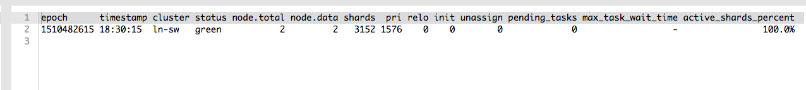
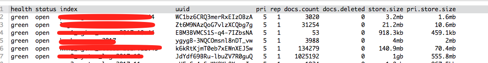

## es核心概念

```
Near Realtime(NRT): 近实时，两个意思，从写入数据到数据可以被搜索到有一个小延迟(大概1秒)；基于es执行搜索和分析可达到秒级。
```

```
Cluster: 集群，包含多个节点，每个节点属于哪个集群是通过配置(集群名称，默认是elasticsearch)来决定的。
```

```
Node:节点，集群中的一个节点，节点也有一个名称（默认是随机分配的），节点名称很重要（在执行运维管理操作的时候），默认节点会去加入一个名称为“elasticsearch”的集群，如果直接启动一堆节点，那么它们会自动组成一个elasticsearch集群，当然一个节点也可以组成一个elasticsearch集群。
```

```
Document&field：文档，es中的最小数据单元，一个document可以是一条客户数据，一条商品分类数据，一条订单数据，通常用JSON数据结构表示，每个index下的type中，都可以去存储多个document。一个document里面有多个field，每个field就是一个数据字段。
```

```
Index：索引，包含一堆有相似结构的文档数据，比如可以有一个客户索引，商品分类索引，订单索引，索引有一个名称。
```

```
Type：类型，每个索引里都可以有一个或多个type，type是index中的一个逻辑数据分类，一个type下的document，都有相同的field，比如博客系统，有一个索引，可以定义用户数据type，博客数据type，评论数据type。
```

```
shard: 单台机器无法存储大量数据，es可以将一个索引中的数据切分为多个shard,分布在多台服务器上存储。有了shard就可以横向扩展，存储更多数据，让搜索和分析等操作分布到多台服务器上去执行，提升吞吐量和性能。每个shard都是一个lucene index。
```

```
replica: 任何一个服务器随时可能故障或宕机，此时shard可能会丢失，此时shard可能会丢失，因此可以为每个shard创建多个replica副本。replica 可以在shard故障时提供备用服务，保证数据不丢失，多个replica还可以提升搜索操作的吞吐量和性能。primary shard（建立索引时一次设置，不能修改，默认5个），replica shard（随时修改数量，默认1个），默认每个索引10个shard，5个primary shard，5个replica shard，最小的高可用配置，是2台服务器。
```


## 查看健康状态

```
GET _cluster/health

{
  "cluster_name": "ln-sw",
  "status": "green",
  "timed_out": false,
  "number_of_nodes": 2,
  "number_of_data_nodes": 2,
  "active_primary_shards": 2116,
  "active_shards": 4232,
  "relocating_shards": 0,
  "initializing_shards": 0,
  "unassigned_shards": 0,
  "delayed_unassigned_shards": 0,
  "number_of_pending_tasks": 0,
  "number_of_in_flight_fetch": 0,
  "task_max_waiting_in_queue_millis": 0,
  "active_shards_percent_as_number": 100
}
```

```
GET /_cat/health?v
```





如何快速了解集群的健康状况？ Green yellow red

* Green： 每个索引的primary shard和replica shard都是active状态的

* Yellow: 每个索引的primary shard都是active状态，但是大部分replica shard不是active状态，处于不可用状态。

* Red:不是所有索引的primary shard都是active状态，部分索引有数据丢失。


## 快速查看集群中有哪些索引

```
GET /_cat/indeces?v
```




#### 索引创建

```
PUT /test_index?pretty

{
  "acknowledged": true,
  "shards_acknowledged": true
}
```


#### 删除索引

```
DELETE /test_index?pretty


{
  "acknowledged": true
}
```


## crud

#### 新增

es会自动建立index和type,不需要提前创建，而且es默认会对document每个field都建立倒排索引，让其可以被索引。

```
PUT /index/type/id
{
  “json数据”
}
```

```
PUT /ecommerce/product/1
{
  "name":"gaolujie yagao",
  "desc":"gaoxiao meibai",
  "price":30,
  "producer":"gaolujie producer",
  "tags":["meibai","fangzhu"]
  
}

------------------------------------------
{
  "_index": "ecommerce",
  "_type": "product",
  "_id": "1",
  "_version": 1,
  "result": "created",
  "_shards": {
    "total": 2,
    "successful": 1,
    "failed": 0
  },
  "created": true
}

```


#### 查询

```
GET /index/type/id

GET ecommerce/product/_search
```

```
GET ecommerce/product/1

------------------------------------------
{
  "_index": "ecommerce",
  "_type": "product",
  "_id": "1",
  "_version": 1,
  "found": true,
  "_source": {
    "name": "gaolujie yagao",
    "desc": "gaoxiao meibai",
    "price": 30,
    "producer": "gaolujie producer",
    "tags": [
      "meibai",
      "fangzhu"
    ]
  }
}

```


#### 替换文档

```
PUT /index/type/id


PUT /ecommerce/product/1
{
    "name" : "jiaqiangban gaolujie yagao"
}

```

替换方式有一个不好，即使必须带上所有field,才能进行信息的修改。


#### 更新文档

```
POST /ecommerce/product/1/_update
{
  "doc": {
    "name": "jiaqiangban gaolujie yagao"
  }
}

----------------------------------------------------
{
  "_index": "ecommerce",
  "_type": "product",
  "_id": "1",
  "_version": 3,
  "result": "noop",
  "_shards": {
    "total": 0,
    "successful": 0,
    "failed": 0
  }
}
```


#### 删除文档

```
DELETE  ecommerce/product/1

{
  "found": true,
  "_index": "ecommerce",
  "_type": "product",
  "_id": "1",
  "_version": 6,
  "result": "deleted",
  "_shards": {
    "total": 2,
    "successful": 1,
    "failed": 0
  }
}
```


## 查询

1、query string search
2、query DSL
3、query filter
4、full-text search
5、phrase search
6、highlight search


#### query string search

```
GET /ecommerce/product/_search

--------------------------------------------------------
{
  "took": 2,
  "timed_out": false,
  "_shards": {
    "total": 5,
    "successful": 5,
    "failed": 0
  },
  "hits": {
    "total": 2,
    "max_score": 1,
    "hits": [
      {
        "_index": "ecommerce",
        "_type": "product",
        "_id": "2",
        "_score": 1,
        "_source": {
          "name": "jiajieshi yagao",
          "desc": "youxiao fangzhu",
          "price": 25,
          "producer": "jiajieshi producer",
          "tags": [
            "fangzhu"
          ]
        }
      },
      {
        "_index": "ecommerce",
        "_type": "product",
        "_id": "3",
        "_score": 1,
        "_source": {
          "name": "zhonghua yagao",
          "desc": "caoben zhiwu",
          "price": 40,
          "producer": "zhonghua producer",
          "tags": [
            "qingxin"
          ]
        }
      }
    ]
  }
}
```

* Took:耗费了几毫秒
* time_out： 是否超时
* _shards: 数据拆成了5个分片，对所有搜索请求，会打到所有的primary shard(或者它的某个replica shard也可以)
* hits.total : 查询结果的数量
* hits.max_score 的含义，就是document对于一个search的相关度的匹配分数，越相关，就越匹配，分数也高
* hits.hits: 包含了匹配搜索的document的详细数据。


####  query DSL

```
DSL: Domain Speified  Language 特定领域的语言
http request body:请求体，可以用json的格式来构建查询语法，比较方便，可以构建各种复杂的语法
```

##### 查询所有

```
GET ecommerce/product/_search
{
  "query": {
    "match_all": {}
  }
}
```


##### 条件搜索排序

```java

//查询名称包含yagao的商品，同时按照价格降序排序
GET ecommerce/product/_search
{
  "query": {
    "match": {
      "name": "yagao"
    }
  },
  "sort": [
    {
      "price": {
        "order": "desc"
      }
    }
  ]
}
```


##### 分页查询

```java
//分页查询商品，总共3条商品，假设每页就显示1条商品，现在显示第2页，所以就查出来第2个商品
GET ecommerce/product/_search
{
  "query": {"match_all": {}},
  "from": 1,
  "size": 1
}
```


##### 显示特定的字段

```java
//指定要查询出来商品的名称和价格就可以
GET ecommerce/product/_search
{
  "query": {
    "match_all": {}
    
  },
  "_source":["price","name"]
}
```


##### query filter

```Java
//搜索商品名称包含yagao，而且售价大于25元的商品
GET ecommerce/product/_search
{
  "query": {
    "bool": {
      "must": [
        {
          "match": {
            "name": "yagao"
          }
        }
      ],
      "filter": {
        "range": {
          "price": {
            "gt": 25
            
          }
        }
      }
    }
  }
}


```


##### full-text search(全文检索)

```
GET /ecommerce/product/_search
{
  "query": {
    "match": {
      "producer": "yagao producer"
    }
  }
}

```


##### phrase search （短语搜索）

```
跟全文索引，相反，全文索引会将输入的搜索串拆解开来，去倒排索引里面去一一匹配，只要能匹配上任意一个拆解后的单词，就可以作为结果返回；
phrase search 要求输入的搜索串，必须在指定的字段文本中，包含一模一样的，才可以算匹配，才能作为结果返回

```

```
GET ecommerce/product/_search
{
  "query": {
    "match_phrase": {
      "producer": "zhonghua producer"
    }
  }
}

```


##### highlight search（高亮搜索结果）

```Java
GET /ecommerce/product/_search
{
  "query": {
    "match": {
      "producer": "producer"
    }
  },
  "highlight": {
    "fields": {
      "producer": {}
    }
  }
}


-----------------------------------------------------------------
{
  "took": 4,
  "timed_out": false,
  "_shards": {
    "total": 5,
    "successful": 5,
    "failed": 0
  },
  "hits": {
    "total": 3,
    "max_score": 0.25811607,
    "hits": [
      {
        "_index": "ecommerce",
        "_type": "product",
        "_id": "2",
        "_score": 0.25811607,
        "_source": {
          "name": "jiajieshi yagao",
          "desc": "youxiao fangzhu",
          "price": 25,
          "producer": "jiajieshi producer",
          "tags": [
            "fangzhu"
          ]
        },
        "highlight": {
          "producer": [
            "jiajieshi <em>producer</em>"
          ]
        }
      },
      {
        "_index": "ecommerce",
        "_type": "product",
        "_id": "1",
        "_score": 0.25811607,
        "_source": {
          "name": "jiaqiangban gaolujie yagao",
          "desc": "gaoxiao meibai",
          "price": 30,
          "producer": "gaolujie producer",
          "tags": [
            "meibai",
            "fangzhu"
          ]
        },
        "highlight": {
          "producer": [
            "gaolujie <em>producer</em>"
          ]
        }
      },
      {
        "_index": "ecommerce",
        "_type": "product",
        "_id": "3",
        "_score": 0.25811607,
        "_source": {
          "name": "zhonghua yagao",
          "desc": "caoben zhiwu",
          "price": 40,
          "producer": "zhonghua producer",
          "tags": [
            "qingxin"
          ]
        },
        "highlight": {
          "producer": [
            "zhonghua <em>producer</em>"
          ]
        }
      }
    ]
  }
}


```

