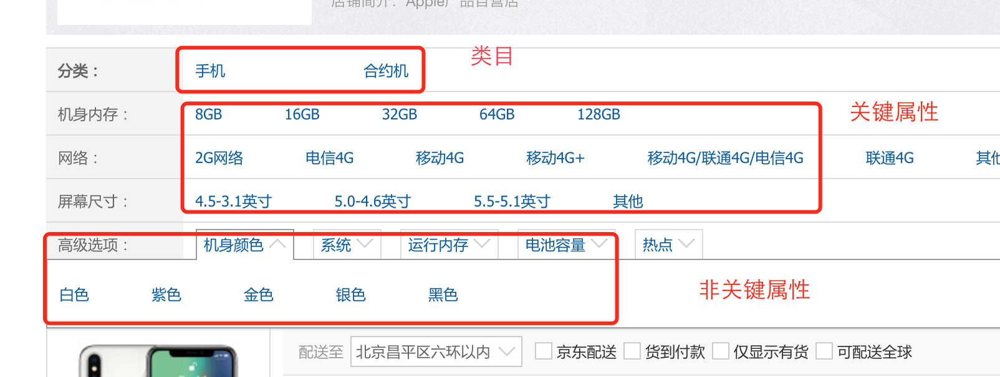
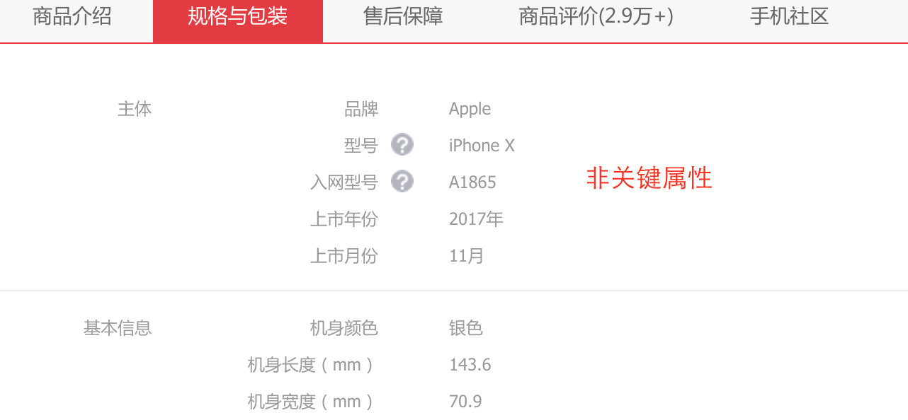
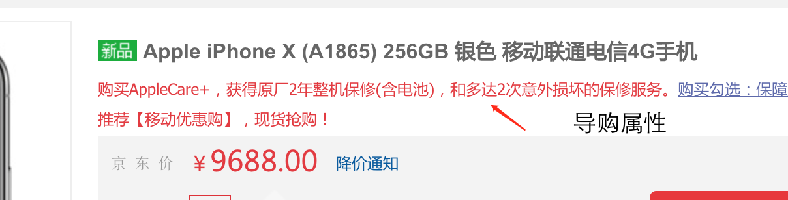

## 业务分析

#### sku

```
Stock Keeping Unit 最小库存单位，最小的商品单位，比如iPhone 7 Plus 128G 银色，就是一个SKU。
```

#### SPU 

```
Standard Product Unit 产品单元组合， 比如iPhone 7 Plus，就是一个SPU，其实类似一个商品的概念
```

一般来说我们的要买一个商品就是指SPU

* 类目： 就是sku所属的分类。

* 属性：关键属性,销售属性，非关键属性，导购属性。

  ```
  关键属性是能唯一确定一个商品的属性，手机关键属性：屏幕尺寸，型号，这个是可以唯一确定一个商品的，也就是一个spu，比如说iPhone 7 plus，7Plush 就是这个型号，这就是关键属性，可以确定一个商品了
  ```


       ```
销售属性，确定一个sku 的属性，比如手机的销售属性就有颜色，内存 ，比如iPhone 7 Plus 128G 土豪金 ，就可以确定一个sku了 ==》 用来定位sku
       ```

```
非关键属性，就是除了关键属性和销售属性之外的其他属性，比如手机就有摄像头 像素，接口类型，等等
```

```
导购属性，可以用来在商品列表中作为筛选条件的
```





上图中的非关键属性  是销售属性








