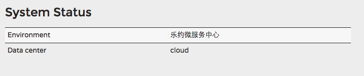

##spring cloud  常见问题


### Eureka

#### Environment 和DataCenter配置

```
eureka.environment: 乐约微服务中心
eureka.datacenter: cloud
```




#### 如何解决 Eureka Server 不剔出已关闭的节点的问题

* server端：

  ```
  eureka.server.enable-self-preservation			（设为false，关闭自我保护主要）
  eureka.server.eviction-interval-timer-in-ms     清理间隔（单位毫秒，默认是60*1000）
  ```

* client 端

  ```
  eureka.client.healthcheck.enabled = true				开启健康检查（需要spring-boot-starter-actuator依赖）
  eureka.instance.lease-renewal-interval-in-seconds =10		租期更新时间间隔（默认30秒）
  eureka.instance.lease-expiration-duration-in-seconds =30  租期到期时间（默认90秒）
  ```

* 示例代码

  ```
  注册中心
  eureka:
      server:
          enableSelfPreservation: false
          evictionIntervalTimerInMs: 4000

  服务提供者
  eureka:
      instance:
          leaseRenewalIntervalInSeconds: 10
          leaseExpirationDurationInSeconds: 30
  ```


#### Eureka 配置 instanceId 显示IP


eureka:
  client:

    serviceUrl:
      defaultZone: http://localhost:8761/eureka/
  instance:
    preferIpAddress: true
    instance-id: ${spring.cloud.client.ipAddress}:${server.port}

### Ribbon


* 自定义配置时，@Configuration和@ComponentScan包不应重叠
* 使用RestTemplate时，想要获得一个List时，应该用数组，而不应该直接用List


### Feign

*  自定义配置时，@Configuration和@ComponentScan包不应重叠
*  @FeignClient所在的接口中，不支持@GetMapping等组合注解
*  使用@PathVariable时，需要指定其value
*  Feign暂不支持复杂对象作为一个参数
