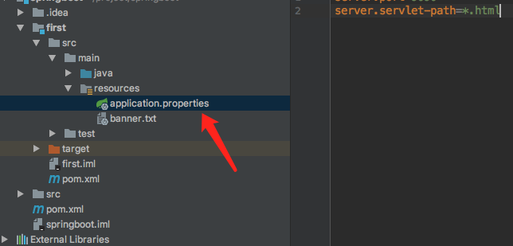
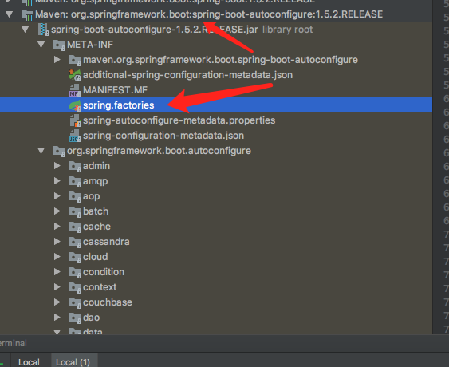
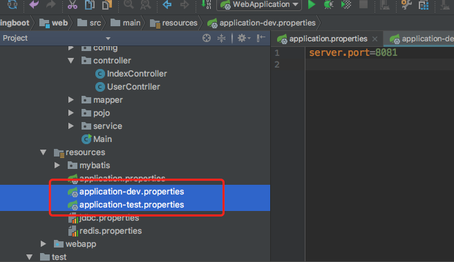
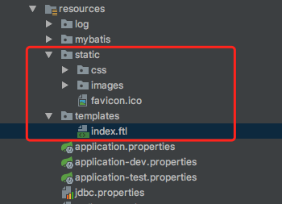

## springboot 启动

* 1，parent pom.xml 设置

  ```Xml
   <parent>
      <groupId>org.springframework.boot</groupId>
      <artifactId>spring-boot-starter-parent</artifactId>
      <version>1.5.2.RELEASE</version>
    </parent>
  ```


* 2，module  pop.xml 增加 spring boot web 支持

  ```Xml
   <dependency>
              <groupId>org.springframework.boot</groupId>
              <artifactId>spring-boot-starter-web</artifactId>
          </dependency>
  ```

  ​

* 3,启动插件

  ```XML
     <plugin>
                      <groupId>org.springframework.boot</groupId>
                      <artifactId>spring-boot-maven-plugin</artifactId>
                  </plugin>
  ```

* 4，启动程序

  ​

  ```Java
  @Controller
  @SpringBootApplication
  @Configuration
  public class HelloApplication {
      @RequestMapping("hello")
      @ResponseBody
      public String hello(){
          return "hello world123！";
      }

      public static void main(String[] args) {
          SpringApplication.run(HelloApplication.class, args);
      }
  }
  ```

* 5,启动

  ```
   mvn spring-boot:run
  ```

  ​

##### 注意

* 1,spring boot 的项目必须要将parent设置为springboot 的parent，该parent包含了大量默认的配置，大大简化了我们的开发
* 2，@SpringBootApplication： Spring Boot 项目的核心注解，主要目的是开启自动配置。
* 3，@Controller：标明这是一个SpringMvc的Controller控制器
* 4，main 方法：在main方法中启动一个应用，即：这个应用的入口


## spring Boot 的核心

#### 入口类和@SpringBootApplication 配置

* Spring Boot的项目一般都会有*Application的入口类，入口类中会有main方法，这是一个标准的Java应用程序的入口方法。

* @SpringBootApplication注解是Spring Boot的核心注解，它其实是一个组合注解：

  ```Java
  @java.lang.annotation.Target({java.lang.annotation.ElementType.TYPE})
  @java.lang.annotation.Retention(java.lang.annotation.RetentionPolicy.RUNTIME)
  @java.lang.annotation.Documented
  @java.lang.annotation.Inherited
  @org.springframework.boot.SpringBootConfiguration
  @org.springframework.boot.autoconfigure.EnableAutoConfiguration
  @org.springframework.context.annotation.ComponentScan(excludeFilters = {@org.springframework.context.annotation.ComponentScan.Filter(type = org.springframework.context.annotation.FilterType.CUSTOM, classes = {org.springframework.boot.context.TypeExcludeFilter.class}), @org.springframework.context.annotation.ComponentScan.Filter(type = org.springframework.context.annotation.FilterType.CUSTOM, classes = {org.springframework.boot.autoconfigure.AutoConfigurationExcludeFilter.class})})
  ```

  1. 在Spring Boot项目中推荐使用@ SpringBootConfiguration替代@Configuration
  2. @EnableAutoConfiguration：启用自动配置，该注解会使Spring Boot根据项目中依赖的jar包自动配置项目的配置项。
  3. @ComponentScan：默认扫描@SpringBootApplication所在类的同级目录以及它的子目录。


#### 关闭自动配置

spring Boot会根据项目中的jar包依赖，自动做出配置，Spring Boot支持的自动配置

我们不想自动配置Solr，想手动配置

```
@Controller
@SpringBootApplication(exclude = {SolrAutoConfiguration.class})
@Configuration
```


​	


#### 自定义Banner

修改启动图案

http://patorjk.com/software/taag/#p=display&h=3&v=3&f=4Max&t=xiao%20haozi%20zi

在resources目录中新建一个banner.txt文件 把生成的字符放入banner.txt文件中 重启spring boot即可

去除启动图案

```Java
public static void main(String[] args) {
//        SpringApplication.run(HelloApplication.class, args);
        SpringApplication application = new SpringApplication(HelloApplication.class);
        application.setBannerMode(Banner.Mode.OFF);
        application.run(args);
    }
```


#### 全局配置文件

Spring Boot项目使用一个全局的配置文件application.properties或者是application.yml，在resources目录下或者类路径下的/config下，一般我们放到resources下。




##### 修改端口号

```
server.port=9090
```

http://127.0.0.1:9090/hello


##### 修改进入DispatcherServlet的规则为：*.html

```
server.servlet-path=*.html
```

http://127.0.0.1:9090/hello.html


#### Xml配置文件

如需要xml 配置可以在main方法 类上面添加@ImportResource

```
@ImportResource("classpath:som-context.xml")
```


#### starter pom

```
starterpom 提供了了简化企业级开发场景的配置
```


#### 日志


Spring Boot对各种日志框架都做了支持，我们可以通过配置来修改默认的日志的配置：

```
logging.level.org.springframework=info
```

格式

`````
 logging.level.*= *# Log levels severity mapping. For instancelogging.level.org.springframework=DEBUG`*
`````


## 默认配置文件





## 自动配置静态资源


#### 进入规则为/

```
如果进入SpringMVC的规则为/时，Spring Boot的默认静态资源的路径为：
spring.resources.static-locations=classpath:/META-INF/resources/,classpath:/resources/,classpath:/static/,classpath:/public/
```


#### main 方法类导入配置文件

```
@PropertySource(value = {"classpath:jdbc.properties","classpath:redis.properties"})
```

```
@ComponentScan(basePackages = "com.leyue.boot.web")
```


#### 自定义消息转换器


自定义消息转化器，只需要在@Configuration的类中添加消息转化器的@bean加入到Spring容器，就会被Spring Boot自动加入到容器中。

```Java
  @Bean
    public StringHttpMessageConverter stringHttpMessageConverter(){
        StringHttpMessageConverter converter  = new StringHttpMessageConverter(Charset.forName("UTF-8"));
        return converter;
}
```


#### 自定义SpringMVC 的配置

* 有些时候我们需要自已配置SpringMVC而不是采用默认，比如说增加一个拦截器，这个时候就得通过继承WebMvcConfigurerAdapter然后重写父类中的方法进行扩展。

````Java
//申明这是一个配置

@Configuration
public class MySrpingMVCConfig extends WebMvcConfigurerAdapter {
    @Override
    public void addInterceptors(InterceptorRegistry registry) {

        HandlerInterceptor handlerInterceptor = new HandlerInterceptor() {
            @Override
            public boolean preHandle(HttpServletRequest request, HttpServletResponse response, Object handler) throws Exception {
                System.out.println("-------自定义拦截器");
                return true;
            }

            @Override
            public void postHandle(HttpServletRequest request, HttpServletResponse response, Object handler, ModelAndView modelAndView) throws Exception {

            }

            @Override
            public void afterCompletion(HttpServletRequest request, HttpServletResponse response, Object handler, Exception ex) throws Exception {

            }


        };

        registry.addInterceptor(handlerInterceptor).addPathPatterns("/**");

    }
}

````


## 配置文件 properties 和YAML

#### 配置文件的生效顺序，会对值进行覆盖

```
1. @TestPropertySource 注解
2. 命令行参数
3. Java系统属性（System.getProperties()）
4. 操作系统环境变量
5. 只有在random.*里包含的属性会产生一个RandomValuePropertySource
6. 在打包的jar外的应用程序配置文件（application.properties，包含YAML和profile变量）
7. 在打包的jar内的应用程序配置文件（application.properties，包含YAML和profile变量）
8. 在@Configuration类上的@PropertySource注解
9. 默认属性（使用SpringApplication.setDefaultProperties指定）
```


#### 配置随机值

```
#随机值
leyue.secret=${random.value}
leyue.uuid =${random.uuid}
```

获取值得时候使用@Value

@Value("${key}")

```Java
    @Value("${leyue.secret}")
    private String secred;

    @Value("${leyue.uuid}")
    private String uuid;
```


#### 属性占位符

* 当application.properties 里的值被使用，他们会被存在Environment过滤，所以你能够引用先前定义的值

  ```

  # 占位符
  leyue.name=www.leyue100.com
  leyue.desc=${leyue.name=} is a domain name
  ```

  ​


#### **Application属性文件，按优先级排序，位置高的将覆盖位置低的**

```
1. 当前目录下的一个/config子目录
2. 当前目录
3. 一个classpath下的/config包
4. classpath根路径（root）

1 > 2 > 3 > 4
```


#### 配置json 数据时间格式

```
# 时间格式化
spring.jackson.date-format=yyyy-MM-dd HH:mm:ss
spring.jackson.time-zone=Asia/Shanghai
```


#### 使用YAML代替Properties

```
	注意写法：冒号后要加个空格
```


## 多环境配置

#### 配置激活选项

```
#多环境配置
spring.profiles.active=test
```

```

```




#### jar 包配置

```
	java -jar myapp.jar --spring.profiles.active=dev
```


## 模板引擎

* FreeMarker
* Thymeleaf
* Velocity (1.4版本之后弃用，Spring Framework 4.3版本之后弃用)
* Groovy
* Mustache

```
注：jsp应该尽量避免使用，原因如下：
jsp只能打包为：war格式，不支持jar格式，只能在标准的容器里面跑（tomcat，jetty都可以） 
内嵌的Jetty目前不支持JSPs
Undertow不支持jsps
jsp自定义错误页面不能覆盖spring boot 默认的错误页面
```


#### FreeMarker

* 1,Pom.xml 

  ```Xml
   <dependency>
              <groupId>org.springframework.boot</groupId>
              <artifactId>spring-boot-starter-freemarker</artifactId>
          </dependency>
          <dependency>
              <groupId>org.webjars</groupId>
              <artifactId>jquery</artifactId>
              <version>2.1.4</version>
          </dependency>
  ```

  ​

* 2,WebController.java

  ```Java
  @Controller
  @RequestMapping("web")
  public class WebController {

      @RequestMapping
      public String index(Model model) {
          model.addAttribute("title","index");
          return "index";
      }

  }

  ```

  ​

* 3 ftl

  ```Html
  <!DOCTYPE html>
  <html>
  <head lang="en">
  	<title>Spring Boot Demo - FreeMarker</title>
  	
  	<link href="/css/index.css" rel="stylesheet" />
  	
  </head>
  <body>
  	<center>
  		
  		<h1 id="title">${title}</h1>
  	</center>
  	
  	<script type="text/javascript" src="/webjars/jquery/2.1.4/jquery.min.js"></script>
  	
  	<script>
  		$(function(){
  			$('#title').click(function(){
  				alert('点击了');
  			});
  		})
  	</script>
  </body>
  </html>
  ```





#### Thymeleaf 模板

* 1，pom.xml

  ```Xml

          <!--freemarker 模板-->
          <dependency>
              <groupId>org.springframework.boot</groupId>
              <artifactId>spring-boot-starter-freemarker</artifactId>
          </dependency>
  ```

  ​

* 2, WebController.java

  ```Java
  @Controller
  @RequestMapping("web")
  public class WebController {

      @RequestMapping
      public String index(Model model) {
          model.addAttribute("title","index");
          return "index";
      }
      @RequestMapping("thymeleaf")
    public String thymeleaf(Model model) {
        model.addAttribute("title","thymeleaf");
        return "thymeleaf";
    }
      }
  ```


3，模板thymeleaf.html

  ```html

<!DOCTYPE html>
<html>
<head lang="en">
	<title>Spring Boot Demo - FreeMarker</title>
	
	<link href="/css/index.css" rel="stylesheet" />
	
</head>
<body>
	<center>
		
		<h1 id="title" th:text="${title}"></h1>
	</center>
	
	<script type="text/javascript" src="/webjars/jquery/2.1.4/jquery.min.js"></script>
	
	<script>
		$(function(){
			$('#title').click(function(){
				alert('点击了');
			});
		})
	</script>
</body>
</html>
  ```


## 错误处理

#### 1，Springboot 将所有的错误默认映射到/error,实现ErrorController

```Java
@Controller
@RequestMapping("error")
public class BaseErrorController implements ErrorController {

    private static final Logger logger = LoggerFactory.getLogger(BaseErrorController.class);

    @Override
    public String getErrorPath() {
        logger.error("错误信息：");
        return "comm/error";
    }

    @RequestMapping
    public String error() {
        return getErrorPath();
    }

}

```


#### 2,添加自定义的错误页面

```
2.1 html静态页面：在resources/public/error/ 下定义
如添加404页面： resources/public/error/404.html页面，中文注意页面编码
2.2 模板引擎页面：在templates/error/下定义
如添加5xx页面： templates/error/5xx.ftl
注：templates/error/ 这个的优先级比较 resources/public/error/高
```


#### 3,使用注解@ControllerAdvice


```Java
/**
 * 异常处理类
 *
 */
@ControllerAdvice
public class ErrorExceptionHandler {
    private static final Logger logger = LoggerFactory.getLogger(ErrorExceptionHandler.class);


    /**
     * 统一异常处理
     *
     * @param exception
     *            exception
     * @return
     */
    @ExceptionHandler({ RuntimeException.class })
    @ResponseStatus(HttpStatus.OK)
    public ModelAndView processException(RuntimeException exception) {
        logger.info("自定义异常处理-RuntimeException");
        ModelAndView m = new ModelAndView();
        m.addObject("roncooException", exception.getMessage());
        m.setViewName("error/500");
        return m;
    }

    /**
     * 统一异常处理
     *
     * @param exception
     *            exception
     * @return
     */
    @ExceptionHandler({ Exception.class })
    @ResponseStatus(HttpStatus.OK)
    public ModelAndView processException(Exception exception) {
        logger.info("自定义异常处理-Exception");
        ModelAndView m = new ModelAndView();
        m.addObject("roncooException", exception.getMessage());
        m.setViewName("error/500");

        return m;
    }


}
```


500.ftl

```Html
<!DOCTYPE html>
<html>
<head lang="en">
	<title>Spring Boot Demo - FreeMarker</title>
</head>
<body>
	<h1>500-系统错误</h1>
	<h1>${roncooException}</h1>
</body>
</html>

```


## 	servlets, Filters, listeners

* CustomServlet.jva

  ```Java
  /**
   * 自定义servlet
   * 

   */
  public class CustomServlet extends HttpServlet {

  	/**
  	 * 
  	 */
  	private static final long serialVersionUID = 1L;

  	@Override
  	protected void doGet(HttpServletRequest request, HttpServletResponse response)
  			throws ServletException, IOException {
  		System.out.println("servlet get method");
  		doPost(request, response);
  	}
    
    	@Override

    	protected void doPost(HttpServletRequest request, HttpServletResponse response)

    			throws ServletException, IOException {

    		System.out.println("servlet post method");

    		response.getWriter().write("hello world");

    	}

    }

  ```


* CustomFilter.java	


  ```java

  /**
   * 自定义filter
   * 
   */
  public class CustomFilter implements Filter {

  	@Override
  	public void init(FilterConfig filterConfig) throws ServletException {
  		System.out.println("init filter");
  	}

  	@Override
  	public void doFilter(ServletRequest request, ServletResponse response, FilterChain chain)
  			throws IOException, ServletException {
  		System.out.println("do filter");
  		chain.doFilter(request, response);
  	}

  	@Override
  	public void destroy() {
  		System.out.println("destroy filter");
  	}

  }
  ```

* CustomListener.java

  ```Java
  /**
   * 自定义listener
   * 
   */
  public class CustomListener implements ServletContextListener {

  	@Override
  	public void contextInitialized(ServletContextEvent sce) {
  		System.out.println("contextInitialized");
  	}

  	@Override
  	public void contextDestroyed(ServletContextEvent sce) {
  		System.out.println("contextDestroyed");
  	}

  }

  ```

  ​

  ​

#### 1.通过注册 ServletRegistrationBean、 FilterRegistrationBean 和 ServletListenerRegistrationBean 获得控制

```Java
@SpringBootApplication
@Configuration
@ComponentScan(basePackages = "com.leyue.boot.web")
@MapperScan(basePackages = "com.leyue.boot.web.mapper",annotationClass = Mapper.class)
public class WebApplication {

    @Bean
    public ServletRegistrationBean servletRegistrationBean() {
        return  new ServletRegistrationBean(new CustomServlet(),"/leyue");
    }

    @Bean
    public FilterRegistrationBean filterRegistrationBean() {
        return new FilterRegistrationBean(new CustomFilter(), servletRegistrationBean());
    }

    @Bean
    public ServletListenerRegistrationBean<CustomListener> servletListenerRegistrationBean() {
        return new ServletListenerRegistrationBean<>(new CustomListener());
    }


}
```


#### 2,通过实现 ServletContextInitializer 接口直接注册


```Java
@SpringBootApplication
@Configuration
@ComponentScan(basePackages = "com.leyue.boot.web")
@MapperScan(basePackages = "com.leyue.boot.web.mapper",annotationClass = Mapper.class)
public class WebApplication implements ServletContextInitializer {


    @Override
    public void onStartup(ServletContext servletContext) throws ServletException {

        servletContext.addServlet("customServlet", new CustomServlet()).addMapping("/leyue2");

        servletContext.addFilter("customFilter", new CustomFilter())
                .addMappingForServletNames(EnumSet.of(DispatcherType.REQUEST), true, "customServlet");


        servletContext.addListener(new CustomListener()); }


}

```


#### 3,注解

* 在 SpringBootApplication 上使用@ServletComponentScan 注解后，直接通过@WebServlet、
  @WebFilter、@WebListener 注解自动注册

  ```Java
  @ServletComponentScan
  @SpringBootApplication
  @Configuration
  @ComponentScan(basePackages = "com.leyue.boot.web")
  @MapperScan(basePackages = "com.leyue.boot.web.mapper",annotationClass = Mapper.class)
  public class WebApplication {  }
  ```


  ```java

  @WebServlet(name="customServlet",urlPatterns = "/leyue3")
  public class CustomServlet extends HttpServlet {
    
  }
  ```

  ​		

  ```Java
  @WebFilter(filterName = "customFilter",urlPatterns = "/leyue3")
  public class CustomFilter implements Filter {
    
  }
  ```

  	

  ```Java
  @WebListener
  public class CustomListener implements ServletContextListener {
    
  }
  ```


## 配置mybatis


#### 基于注解

* 1,application.properties

  ```
  #mysql
  spring.datasource.url=jdbc:mysql://10.211.55.3:3306/oa?useUnicode=true&characterEncoding=UTF-8
  spring.datasource.username=root
  spring.datasource.password=123456
  spring.datasource.driver-class-name=com.mysql.jdbc.Driver
  ```

* 2,pom.xml

  ```Xml
   <dependency>
              <groupId>org.springframework.boot</groupId>
              <artifactId>spring-boot-starter-jdbc</artifactId>
          </dependency>

          <!-- mybatis -->
          <dependency>
              <groupId>org.mybatis.spring.boot</groupId>
              <artifactId>mybatis-spring-boot-starter</artifactId>
              <version>1.1.1</version>
          </dependency>

  ```

* 3,启动类

  ```Java
  @SpringBootApplication
  @Configuration
  @ComponentScan(basePackages = "com.leyue.boot.web")
  @MapperScan(basePackages = "com.leyue.boot.web.mapper",annotationClass = Mapper.class)
  public class WebApplication {
      }
  ```


* 4,Mapper

  ```java

  @Mapper
  public interface ItemsMapper {

      @Select(value = "select * from items where id=#{id,jdbcType=INTEGER}")
      @Result(javaType = Items.class)
      Items selectByPrimaryKey(int id);
  }
  ```

  ​

#### 基于xml

* 1,application.properties  设置mapper.xml 位置

  ```
  # mybatis
  mybatis.mapper-locations=classpath:mybatis/mappers/**/*.xml
  ```

  ​

* 2，appliction

  ```Java
  @SpringBootApplication
  @Configuration
  @ComponentScan(basePackages = "com.leyue.boot.web")
  @MapperScan(basePackages = "com.leyue.boot.web.mapper",annotationClass = Mapper.class)
  public class WebApplication {}
  ```


  


* 3,UserMapper

  ```java

  @Mapper
  public interface UserMapper {

      User getUserById(int id);
  }
  ```

* 4，UserMapper.xml

  ```Xml
  <?xml version="1.0" encoding="UTF-8"?>
  <!DOCTYPE mapper PUBLIC "-//mybatis.org//DTD Mapper 3.0//EN"
          "http://mybatis.org/dtd/mybatis-3-mapper.dtd">
  <mapper namespace="com.leyue.boot.web.mapper.UserMapper">

      <select id="getUserById" parameterType="int" resultType="com.leyue.boot.web.pojo.User">
          SELECT * FROM user WHERE id=#{id}
      </select>

  </mapper>
  ```

  ​


## 跨域问题

* Web 开发经常会遇到跨域问题,解决方案有:jsonp,iframe,CORS 等等

* CORS 与 JSONP 相比
  1、 JSONP 只能实现 GET 请求,而 CORS 支持所有类型的 HTTP 请求。
  2、 使用 CORS,开发者可以使用普通的 XMLHttpRequest 发起请求和获得数据,比起 JSONP 有更好的 错误处理。
  3、 JSONP 主要被老的浏览器支持,它们往往不支持 CORS,而绝大多数现代浏览器都已经支持了 CORS

* 在 spring MVC 中可以配置全局的规则,也可以使用@CrossOrigin 注解进行细粒度的配置

* ​


  ​	

#### 全局配置

```java
@Configuration
public class CustomCorsConfiguration {
    @Bean
    public WebMvcConfigurer corsConfigurer() {
        return new WebMvcConfigurerAdapter() {
            @Override
            public void addCorsMappings(CorsRegistry registry) {
                registry.addMapping("/api/**").allowedOrigins("http://localhost:8080");
            }
        };
    }
}
```

第二种方式：

```java
@Configuration
public class CustomCorsConfiguration2 extends WebMvcConfigurerAdapter {
  @Override
  public void addCorsMappings(CorsRegistry registry) {
     registry.addMapping("/api/**").allowedOrigins("http://localhost:8080");
  }
}

```


#### 在方法上面注解配置

```
@CrossOrigin(origins = "http://localhost:8080")
```


## 文件上传


* 1.html

  ```html
  <!DOCTYPE html>
  <html>
  <head lang="en">
      <title>Spring Boot Demo - FreeMarker</title>

  </head>
  <body>

  <form method="POST" enctype="multipart/form-data" action="/file/upload">
      文件:<input type="file" name="files"/>
      <input type="submit" value="上传"/>
      </form>
  ```


    </body>

    </html>

  ```


* 2,FileController.java

  ```java

@Controller
@RequestMapping("file")
public class FileController {

    private static final Logger logger = LoggerFactory.getLogger(FileController.class);


    @RequestMapping(value = "upload")
    @ResponseBody
    public String upload(@RequestParam("files") MultipartFile file) {
        if (file.isEmpty()) {
            return "文件为空";
        }

        //获取文件名
        String fileName = file.getOriginalFilename();
        logger.info("上传文件名：" + fileName);


        //获取到后缀名
        String sffixName = fileName.substring(fileName.lastIndexOf("."));
        logger.info("上传的后缀名为： " + sffixName);


        //上传文件路径
        String filePath = "/Users/lihao/project/springboot/web/src/main/resources/static/images/upload/";

        //解决中文问题,liunx 下中文路径,图片显示问题
        // fileName = UUID.randomUUID() + suffixName;

        File dest = new File(filePath + fileName);

        //检测是否存在目录
        if (!dest.getParentFile().exists()) {
            try {
                FileUtils.forceMkdir(dest.getParentFile());
            } catch (IOException e) {
                e.printStackTrace();
            }
        }

        logger.info("上传文件路径：" + dest.getAbsolutePath());

        try {
            file.transferTo(dest);
            return "上传成功";
        } catch (IOException e) {
            e.printStackTrace();
        }


        return "上传失败";
    }


    @RequestMapping("show")
    public String show() {
        return "upload/upload";
    }

}
  ```


3,properties 配置

```
spring.http.multipart.enabled=true #默认支持文件上传. 

spring.http.multipart.file-size-threshold=0 #支持文件写入磁盘. 

spring.http.multipart.location= # 上传文件的临时目录 

spring.http.multipart.max-file-size=1Mb # 最大支持文件大小 

spring.http.multipart.max-request-size=10Mb # 最大支持请求大小
```


## spring-data-jpa

http://docs.spring.io/spring-data/jpa/docs/1.10.2.RELEASE/reference/html/


​	

* 1,加载依赖

  ```xml
       <dependency>
              <groupId>org.springframework.boot</groupId>
              <artifactId>spring-boot-starter-data-jpa</artifactId>
          </dependency>
          
             <dependency>
              <groupId>mysql</groupId>
              <artifactId>mysql-connector-java</artifactId>
              <version>5.1.29</version>
          </dependency>
  ```

  ​


* 2,application

  ```
  #jpa
  spring.jpa.hibernate.ddl-auto=update

  #显示sql 语句
  spring.jpa.show-sql=true
  ```

  ​

* 3,bean

  ​


```java
 import javax.persistence.Column;
import javax.persistence.Entity;
import javax.persistence.GeneratedValue;
import javax.persistence.Id;
import java.sql.Date;

@Entity(name="items")
public class Items {

    @Id
    @GeneratedValue
    private int id;

    @Column
    private String name;

    @Column
    private double price;

    @Column
    private String detail;

    @Column
    private String pic;

    @Column
    private Date createtime;
 
 public int getId() {
      return id;
  }

  public void setId(int id) {
      this.id = id;
  }

  public String getName() {
      return name;
  }

  public void setName(String name) {
      this.name = name;
  }

  public double getPrice() {
      return price;
  }

  public void setPrice(double price) {
      this.price = price;
  }

  public String getDetail() {
      return detail;
  }

  public void setDetail(String detail) {
      this.detail = detail;
  }

  public String getPic() {
      return pic;
  }

  public void setPic(String pic) {
      this.pic = pic;
  }

  public Date getCreatetime() {
      return createtime;
  }

  public void setCreatetime(Date createtime) {
      this.createtime = createtime;
  }

  @Override
  public String toString() {
      return "Items{" +
              "id=" + id +
              ", name='" + name + '\'' +
              ", price=" + price +
              ", detail='" + detail + '\'' +
              ", pic='" + pic + '\'' +
              ", createtime=" + createtime +
              '}';
  }
  }
```
* 4，定义接口（继承）JpaRepository

  ```java

  ```

public interface ItemsDao extends JpaRepository<Items,Integer> {

    List<Items> findByName(String s);

    List<Items> findByName(String s, Pageable pageable);
}
  ```


* 5，测试

  ​


​```java
@RunWith(SpringRunner.class)
@SpringBootTest
public class ItemsDaoTest {

    @Autowired
    private ItemsDao itemsDao;
@Test
  public void insert() {

      Items entity = new Items();
      entity.setName("mac");
      entity.setPrice(3000);
      entity.setPic("http://xxx.png");
      entity.setDetail("mac 新款");
      entity.setCreatetime(new Date(System.currentTimeMillis()));

      itemsDao.save(entity);
  }

  @Test
  public void update() {
      Items entity = new Items();
      entity.setId(4);
      entity.setName("联想B460");
      entity.setCreatetime(new Date(System.currentTimeMillis()));
      itemsDao.save(entity);

      System.out.println(entity);

  }
    @Test
  public void delete() {
      itemsDao.delete(4);
  }
  
  @Test
  public void select() {
      Items entity = itemsDao.findOne(1);
      System.out.println(entity);
  }

  @Test
  public void select1() {
      List<Items> entity = itemsDao.findByName("背包");
      System.out.println(entity);
  }
  
    @Test
  //分页
  public void queryForPage() {
      Pageable pageable = new PageRequest(0,2,new Sort(new Sort.Order(Sort.Direction.DESC,"id")));
      List<Items> reult = itemsDao.findByName("笔记本", pageable);
      System.out.println(reult);
  }
  
   }
  ```

 


## redis 使用

#### 1，添加依赖

  ```

    <!--redis-->
        <dependency>
            <groupId>org.springframework.boot</groupId>
            <artifactId>spring-boot-starter-data-redis</artifactId>
        </dependency>
  ```


#### 2,配置文件

```
#redis
spring.redis.host=localhost
spring.redis.port=6379
#spring.redis.password=123456
#spring.redis.database=0
#spring.redis.pool.max-active=8
#spring.redis.pool.max-idle=8
#spring.redis.pool.max-wait=-1
#spring.redis.pool.min-idle=0
#spring.redis.timeout=0
```


#### 3，工具类

```java
@Component
public class RedisComponent {


    @Autowired
   private JedisConnectionFactory redisConnectionFactory;

    @Autowired
    protected StringRedisTemplate stringRedisTemplate;

    private final Logger logger = LoggerFactory.getLogger(RedisComponent.class);

    public void set(String key, String value) {
        //选择库
        redisConnectionFactory.setDatabase(6);

        ValueOperations<String, String> ops = stringRedisTemplate.opsForValue();


        if (!stringRedisTemplate.hasKey(key)) {
            ops.set(key, value);
            logger.info(key + "  保存成功------");
        } else {
            logger.info(key + "  已存在------" + ops.get(key));
        }

    }


    public Object get(String key) {
        redisConnectionFactory.setDatabase(6);

        return stringRedisTemplate.opsForValue().get(key);
    }
}
```


* 选择库

  ```java
  //选择库
  redisConnectionFactory.setDatabase(6);
  ```

  ​


#### 4,测试

```java
@RunWith(SpringRunner.class)
@SpringBootTest
public class RedisTest {

    @Autowired
   private RedisComponent redisComponent;

    @Test
    public void set() {
        redisComponent.set("key1","this key1");
    }
}
```


* 手动配置

  ​


```java
  @Configuration
@PropertySource("classpath:redis.properties")
public class RedisConfig {
    @Autowired
    private Environment env;
  @Bean
  public JedisConnectionFactory redisConnectionFactory() {
      JedisPoolConfig jedisPoolConfig = new JedisPoolConfig();
      JedisConnectionFactory jedisConnectionFactory = new JedisConnectionFactory();
      jedisConnectionFactory.setHostName(env.getProperty("redis.host").trim());
      jedisConnectionFactory.setPort(Integer.parseInt(env.getProperty("redis.port").trim()));
      jedisConnectionFactory.setPassword(env.getProperty("redis.password").trim());
      jedisConnectionFactory.setDatabase(Integer.parseInt(env.getProperty("redis.database").trim()));
      jedisConnectionFactory.setUsePool(true);
      jedisConnectionFactory.setPoolConfig(jedisPoolConfig);
      return jedisConnectionFactory;
  }

  @Bean
  public RedisTemplate<String,String> redisTemplate() {
      RedisTemplate<String, String> redisTemplate = new StringRedisTemplate();
      redisTemplate.setConnectionFactory(redisConnectionFactory());
      redisTemplate.afterPropertiesSet();

      System.out.println("------------------------------------redisTemplate");
      return redisTemplate;
  }
  
    }
```


## MongoDB 使用


#### 1，添加依赖

  ```xml

  <!-- mongodb -->
        <dependency>
            <groupId>org.springframework.boot</groupId>
            <artifactId>spring-boot-starter-data-mongodb</artifactId>
        </dependency>
  ```


#### 2，配置文件

```
# MONGODB (MongoProperties)
#spring.data.mongodb.uri=mongodb://10.10.10.6/leyue
spring.data.mongodb.host=10.10.10.6
spring.data.mongodb.port=27017
spring.data.mongodb.database=leyue
#spring.data.mongodb.authentication-database=
#spring.data.mongodb.database=test
#spring.data.mongodb.field-naming-strategy=
#spring.data.mongodb.grid-fs-database=
#spring.data.mongodb.host=localhost
#spring.data.mongodb.password=
#spring.data.mongodb.repositories.enabled=true
#spring.data.mongodb.username=
```


* 设置打印日志

  ```
   <logger name="org.springframework.data.mongodb.core.MongoTemplate" level="debug"/>
  ```


#### 3, 代码

```java
import com.leyue.boot.web.pojo.User;
import org.springframework.beans.factory.annotation.Autowired;
import org.springframework.data.mongodb.core.MongoTemplate;
import org.springframework.data.mongodb.core.query.Criteria;
import org.springframework.data.mongodb.core.query.Query;
import org.springframework.data.mongodb.core.query.Update;
import org.springframework.stereotype.Component;

import java.sql.Date;

/**
 * Created by lihao on 17/12/5.
 */

@Component
public class MongodbComponent {

    @Autowired
    private MongoTemplate mongoTemplate;


    public void insert(User user) {
        mongoTemplate.insert(user);

    }

    public void updateById(User user){
        Criteria criteria =  Criteria.where("id").in(user.getId());
        Query query = new Query(criteria);


        Update update = new Update();
        update.set("username",user.getUsername());
        update.set("birthday",new Date(System.currentTimeMillis()));
        update.set("address",user.getAddress());

        mongoTemplate.updateMulti(query,update,User.class);
    }


    public User selectById(int id){
        Criteria criteria = Criteria.where("id").in(id);
        Query query = new Query(criteria);
        return mongoTemplate.findOne(query,User.class);
    }

    

    public void deleteById(int id) {
        Criteria criteria = Criteria.where("id").in(id);
        Query query = new Query(criteria);

        mongoTemplate.remove(query,User.class);
    }


}

```


#### 4,测试

```java
@RunWith(SpringRunner.class)
@SpringBootTest
public class MongoTest {

    @Autowired
    private MongodbComponent mongodbComponent;

    @Test
    public void insert() {
        User user = new User();
        user.setId(1);
        user.setUsername("李浩");
//        user.setBirthday(new Date(System.currentTimeMillis()));
        user.setAddress("北京");
        user.setSex(1);

        mongodbComponent.insert(user);
    }
}
```


#### 使用MongoRepository

```java
import com.leyue.boot.web.pojo.User;
import org.springframework.data.domain.Page;
import org.springframework.data.domain.Pageable;
import org.springframework.data.mongodb.repository.MongoRepository;

import java.util.List;


public interface UserMongoDao extends MongoRepository<User,Integer> {

    List<User> findByUsername(String s);

    Page<User> findByUsername(String string, Pageable pageable);
}
```


*  测试

  ```java
      @Test
      public void insert2() {
          User user = new User();
          user.setId(2);
          user.setUsername("李浩2");
  //        user.setBirthday(new Date(System.currentTimeMillis()));
          user.setAddress("北京2");
          user.setSex(2);
          userMongoDao.save(user);

      }

      @Test
      public void find() {
          List<User> results = userMongoDao.findByUsername("李浩");
          System.out.println(results);
      }

      @Test
      public void queryForPage() {
          Pageable pageable = new PageRequest(0,2,new Sort(new Sort.Order(Sort.Direction.DESC,"id")));

          Page<User> result =  userMongoDao.findAll(pageable);

          System.out.println("--------------------------");
          System.out.println(result.getTotalPages());
          System.out.println(result.getContent());
    }      
  ```


## chcache 缓存


#### 1，添加依赖


  ```xml

   <!-- caching -->
        <dependency>
            <groupId>org.springframework.boot</groupId>
            <artifactId>spring-boot-starter-cache</artifactId>
        </dependency>
        <dependency>
            <groupId>net.sf.ehcache</groupId>
            <artifactId>ehcache</artifactId>
        </dependency>
  ```


#### 2,配置文件

```
# cache
spring.cache.type=ehcache
spring.cache.ehcache.config=classpath:cache/ehcache.xml
```

* ehcache.xml

  ```xml
  <ehcache >

      <cache name="leyue"
             eternal="false"
             maxEntriesLocalHeap="0"
             timeToIdleSeconds="50"></cache>

      <!-- eternal:true表示对象永不过期,此时会忽略timeToIdleSeconds和 timeToLiveSeconds属性,默认为false -->

      <!-- maxEntriesLocalHeap:堆内存中最大缓存对象数,0没有限制 -->
      
      <!-- timeToIdleSeconds: 设定允许对象处于空闲状态的最长时间,以秒为 单位。
      当对象自从最近一次被访问后,如果处于空闲状态的时间超过了 timeToIdleSeconds属性值,这个对象就会过期,EHCache将把它从缓存中清空。
       只有当eternal属性为false,该属性才有效。如果该属性值为0,则表示对象可以 无限期地处于空闲状态 -->
  </ehcache>
  ```

  ​

  #### 3,启用注解

  ```java
  @EnableCaching:启用缓存注解
  --------------------------------------
  @EnableCaching
  @ServletComponentScan
  @SpringBootApplication
  @Configuration
  @ComponentScan(basePackages = "com.leyue.boot.web")
  @MapperScan(basePackages = "com.leyue.boot.web.mapper",annotationClass = Mapper.class)
  public class WebApplication {}
  ```


####  4,代码实现


* 接口 UserCache.java

  ```java

  public interface UserCache {

      User selectById(int id);

      String deleteById(int id);

      User updateById(User user);

  }
  ```

* UserCacheImpl.java 实现类

  ​


    @CacheConfig(cacheNames = "leyue")
    @Repository
    public class UserCacheImpl implements UserCache {
    
        private final Logger logger = LoggerFactory.getLogger(UserCacheImpl.class);
    
        @Autowired
        UserService userService;
    
    @Cacheable(key = "#p0")
      @Override
      public User selectById(int id) {
          logger.info("查询功能，缓存查不到，直接读库，然后再缓存,  id = " + id);
          return userService.getUserById(id);
      }
    
      @CacheEvict(key = "#p0")
      @Override
      public String deleteById(int id) {
          logger.info("删除功能，删除缓存,  id = " + id);
          return "清空缓存成功";
      }
      
        @Override
      public User updateById(User user) {
          logger.info("更新功能，然后再缓存,  id = " + user.getId());
          userService.update(user);
    
          return user;
    
      }
        }

#### 5,测试

  ```java

@RestController
@RequestMapping("cache")
public class CacheController {

    @Autowired
    private UserCache userCache;


    @RequestMapping("get")
    public User get(@RequestParam(defaultValue = "1")int id) {
        return userCache.selectById(id);
    }

    @RequestMapping("update")
    public User update(@RequestParam(defaultValue = "1")int id) {
        User user = new User();

        user.setId(id);
        user.setUsername("huahua");
        user.setSex(1);
        user.setAddress("北京");

        userCache.updateById(user);

        return user;

    }


}
  ```


#### 6，注意事项

```
 @Cacheable:  
 		1,先从缓存中查询，如果没有则查询数据库，然后再进行缓存。
 		2,应用到读取数据的方法上,即可缓存的方法,如查找方法:先从缓存中读取,如果没有再调 用方法获取数据,然后把数据添加到缓存中。适用于查找。
 		
 @CacheEvict:   
 	1,清空缓存。
 	2,主要针对方法配置,能够根据一定的条件对缓存进行清空。适用于删除。
 
 @CachePut:   
 	1,更新的时候刷新缓存。
 	2,主要针对方法配置,能够根据方法的请求参数对其结果进行缓存,和 @Cacheable 不同的
是,它每次都会触发真实方法的调用。适用于更新和插入。

@CacheConfig:缓存配置


```


## 调用http 网络请求

#### 1，添加依赖

```
<dependency>
			<groupId>org.apache.httpcomponents</groupId>
			<artifactId>httpclient</artifactId>
</dependency>

```


#### 2，代码实现

```java
@RunWith(SpringRunner.class)
@SpringBootTest
public class HttpResetTest {

    @Autowired
    private RestTemplateBuilder restTemplateBuilder;


    @Test
    public void getForObject() {

        String json = restTemplateBuilder.build().getForObject("http://211.167.232.2:8402/api/search/hospital?limit=2", String.class);

        System.out.println(json);
        System.out.print(restTemplateBuilder);


    }


    @Test
    public void head() {
        String url = "http://211.167.232.2:8402/api/setting/update";
        HttpHeaders headers = new HttpHeaders();
        headers.add("channel", "baJfgkRJWgk");
        headers.add("package", "cn.leyue.ln12320");
        headers.add("appver", "2.30");
        headers.add("os", "android");

//        ResponseEntity<String> result = restTemplate.exchange(url, HttpMethod.GET, new HttpEntity<String>(headers), String.class);


        ResponseEntity<String> result = restTemplateBuilder.build().exchange(url, HttpMethod.GET, new HttpEntity<String>(headers), String.class);


        System.out.println(result.getBody());


    }


    @Test
    public void postAndProxy() {
        String url = "http://211.167.232.2:8402/api/search/hospital?limit=2";
        HttpHeaders headers = new HttpHeaders();
        headers.add("channel", "baJfgkRJWgk");
        headers.add("package", "cn.leyue.ln12320");
        headers.add("appver", "2.30");
        headers.add("os", "android");

//        String result = restTemplateBuilder.build()
//                .postForObject(url,null, String.class);
        String result = restTemplateBuilder.additionalCustomizers(new ProxyCustomizer()).build()
                .postForObject(url, null, String.class);

        System.out.println("--------------------------------------------");
        System.out.println(result);
    }


    static class ProxyCustomizer implements RestTemplateCustomizer {
        @Override
        public void customize(RestTemplate restTemplate) {
            String proxyHost = "58.32.234.26";
            int proxyPort = 80;

            HttpHost proxy = new HttpHost(proxyHost, proxyPort);

            HttpClient httpClient = HttpClientBuilder.create().setRoutePlanner(new DefaultProxyRoutePlanner(proxy) {
                @Override
                public HttpHost determineProxy(HttpHost target, HttpRequest request, HttpContext context)
                        throws HttpException {
                    System.out.println(target.getHostName());
                    return super.determineProxy(target, request, context);
                }
            }).build();
            HttpComponentsClientHttpRequestFactory httpComponentsClientHttpRequestFactory = new HttpComponentsClientHttpRequestFactory(
                    httpClient);
            httpComponentsClientHttpRequestFactory.setConnectTimeout(10000);
            httpComponentsClientHttpRequestFactory.setReadTimeout(60000);

            restTemplate.setRequestFactory(httpComponentsClientHttpRequestFactory);
        }
    }


}
```


**在线代理：**

http://ip.zdaye.com/


## 发送邮件

#### 1，添加依赖

```xml
<!-- mail -->
<dependency>
	<groupId>org.springframework.boot</groupId>
	<artifactId>spring-boot-starter-mail</artifactId>
</dependency>

```


#### 2,配置

```
# mail
spring.mail.host: smtp.exmail.qq.com
spring.mail.username:fengyw@roncoo.com,service@roncoo.com,education@roncoo.com
spring.mail.password:
spring.mail.properties.mail.smtp.auth: true

```


#### 3,代码实现

* LyJavaMailSenderImpl.java

  ```java
  @Configuration
  @EnableConfigurationProperties(MailProperties.class)
  public class LyJavaMailSenderImpl extends JavaMailSenderImpl implements JavaMailSender {

      private ArrayList<String> usernameList;
      private ArrayList<String> passwordList;
      private int currentMailId = 0;

      private final MailProperties properties;
  ```


      public LyJavaMailSenderImpl(MailProperties properties) {
          this.properties = properties;
    
          // 初始化账号
          if (usernameList == null) {
              usernameList = new ArrayList<>();
          }
    
          String[] userNames = this.properties.getUsername().split(",");
          if (userNames != null) {
              for (String user : userNames) {
                  usernameList.add(user);
              }
          }


          // 初始化密码
          if (passwordList == null) {
              passwordList = new ArrayList<String>();
          }
    
          String[] passwords = this.properties.getPassword().split(",");
          if (passwords != null) {
              for (String pw : passwords) {
                  passwordList.add(pw);
              }
          }


      }


      @Override
      protected void doSend(MimeMessage[] mimeMessages, Object[] originalMessages) throws MailException {
    
          super.setUsername(usernameList.get(currentMailId));
          super.setPassword(passwordList.get(currentMailId));


          // 设置编码和各种参数
          super.setHost(this.properties.getHost());
          super.setDefaultEncoding(this.properties.getDefaultEncoding().name());
          super.setJavaMailProperties(asProperties(this.properties.getProperties()));
          super.doSend(mimeMessages, originalMessages);


          // 轮询
          currentMailId = (currentMailId + 1) % usernameList.size();


      }

      private Properties asProperties(Map<String, String> source) {
          Properties properties = new Properties();
          properties.putAll(source);
          return properties;
      }


      @Override
      public String getUsername() {
          return usernameList.get(currentMailId);
      }

  }

  ```

  ​

* LyJavaMailComponent.java

  ```java
  @Component
  public class LyJavaMailComponent {

      private static final String template = "mail/roncoo.ftl";

      @Autowired
      private FreeMarkerConfigurer freeMarkerConfigurer;

      @Autowired
      private LyJavaMailSenderImpl javaMailSender;


      public void sendMail(String email) {
          Map<String, Object> map = new HashMap<String, Object>();
          map.put("email", email);
          map.put("name", "小耗子");

          String text = null;
          try {
              text = getTextByTemplate(template,map);
              send(email,text);
          } catch (IOException e) {
              e.printStackTrace();
          } catch (TemplateException e) {
              e.printStackTrace();
          } catch (MessagingException e) {
              e.printStackTrace();
          }


      }


      private String getTextByTemplate(String template,Map<String,Object> model) throws IOException, TemplateException {

          return FreeMarkerTemplateUtils.processTemplateIntoString(
                  freeMarkerConfigurer.getConfiguration().getTemplate(template),model
          );

      }


      private String send(String email,String text) throws MessagingException, UnsupportedEncodingException {
          MimeMessage message = javaMailSender.createMimeMessage();
          MimeMessageHelper helper = new MimeMessageHelper(message,true,"utf-8");

          InternetAddress from = new InternetAddress();
          from.setAddress(javaMailSender.getUsername());
          from.setPersonal("小耗子","utf-8");

          helper.setFrom(from);
          helper.setTo(email);
          helper.setSubject("测试邮件");
          helper.setText(text,true);
          javaMailSender.send(message);

          return text;


      }


  }
  ```

  ​

* ftl

  ```html
  <!DOCTYPE html>
  <html lang="en">
  <head>
  <meta http-equiv="Content-Type" content="text/html; charset=UTF-8" />
  </head>
  <body>
  	<div style="width: 600px; text-align: left; margin: 0 auto;">
  		<h1 style="color: #005da7;">龙果学院</h1>
  		<div style="border-bottom: 5px solid #005da7; height: 2px; width: 100%;"></div>
  		<div style="border: 1px solid #005da7; font-size: 16px; line-height: 50px; padding: 20px;">
  			<div>${email}，您好！----->${name}</div>
  			<div>
  				这是个测试
  			</div>
  			
  			<div style="border-bottom: 2px solid #005da7; height: 2px; width: 100%;"></div>
  			<div>扫一扫，关注龙果学院微信公共号，里面更多精彩推荐</div>
  			<div>
  				
  			</div>
  			<div>
  				想了解更多信息，请访问 <a href="http://www.roncoo.com">http://www.roncoo.com</a>
  			</div>
  		</div>
  	</div>
  </body>
  </html>

  ```

  ​

* controller

  ```java
    @Autowired
      LyJavaMailComponent lyJavaMailComponent;
  ```


      @RequestMapping("sendMail")
      public String sendMail(String email) {
          lyJavaMailComponent.sendMail(email);
    
          return "sucdess";
      }
  ```

  


#### Spring Session实现集群-redis


#### session集群的解决方案：
  ```

1.扩展指定server
利用Servlet容器提供的插件功能，自定义HttpSession的创建和管理策略，并通过配置的方式替换掉默认的策略。缺点：耦合Tomcat/Jetty等Servlet容器，不能随意更换容器。

2.利用Filter
利用HttpServletRequestWrapper，实现自己的 getSession()方法，接管创建和管理Session数据的工作。spring-session就是通过这样的思路实现的。

Spring Boot中spring session支持方式：
JDBC、MongoDB、Redis、Hazelcast、HashMap

```


#### 1，添加依赖

​```xml
<!-- spring session -->
		<dependency>
			<groupId>org.springframework.session</groupId>
			<artifactId>spring-session</artifactId>
			</dependency>
<!-- redis -->
		<dependency>
			<groupId>org.springframework.boot</groupId>
			<artifactId>spring-boot-starter-redis</artifactId>
		</dependency>					
```


#### 2，配置

```
# spring session使用存储类型
#spring.session.store-type=redis
# spring session刷新模式：默认on-save
#spring.session.redis.flush-mode=on-save
#spring.session.redis.namespace= 
# session超时时间，单位秒
#server.session.timeout=30

#redis
#spring.redis.host=localhost
#spring.redis.port=6379
#spring.redis.password=123456
#spring.redis.database=0
#spring.redis.pool.max-active=8 
#spring.redis.pool.max-idle=8 
#spring.redis.pool.max-wait=-1 
#spring.redis.pool.min-idle=0 
#spring.redis.timeout=0

```


#### 3，测试

```
 @RequestMapping("session")
    public String session(HttpSession httpSession) {

        return httpSession.getId();
    }
```


## 远程调试

#### 远程调试的概念

```
什么是远程调试：本地调用非本地的环境进行调试。
原理：两个VM之间通过socket协议进行通信，然后以达到远程调试的目的。

注意，如果 Java 源代码与目标应用程序不匹配，调试特性将不能正常工作。
```


#### java 启动命令

```
-Xdebug -Xrunjdwp:server=y,transport=dt_socket,address=8000,suspend=n
比如：java -Xdebug -Xrunjdwp:server=y,transport=dt_socket,address=8000,suspend=n –jar  spring-boot-demo-24-1-0.0.1-SNAPSHOT.jar

```


## ide 自动编译

```
   <dependency>
            <groupId>org.springframework.boot</groupId>
            <artifactId>spring-boot-devtools</artifactId>
        </dependency>
```

http://blog.csdn.net/wjc475869/article/details/52442484


#### 测试实例

```Xml
     <!--测试-->
        <dependency>
            <groupId>org.springframework.boot</groupId>
            <artifactId>spring-boot-starter-test</artifactId>
            <scope>test</scope>
        </dependency>
```


```Java
@RunWith(SpringRunner.class)
@SpringBootTest(classes={IndexController.class})
public class IndexControllerTest {

    private MockMvc mvc;

    @Before
    public void setup() {
        this.mvc = MockMvcBuilders.standaloneSetup(new IndexController()).build();
    }


    @Test
    public void contextLoads() throws Exception {
        RequestBuilder request =  get("/index");
        mvc.perform(request).andExpect(status().isOk()).andExpect(content().string("hello world"));
    }


}

```


## 常用注解

@Configuration 和 @Bean 这两个注解实现的：

1、@Configuration 作用于类上，相当于一个xml配置文件；

2、@Bean 作用于方法上，相当于xml配置中的<bean>；


